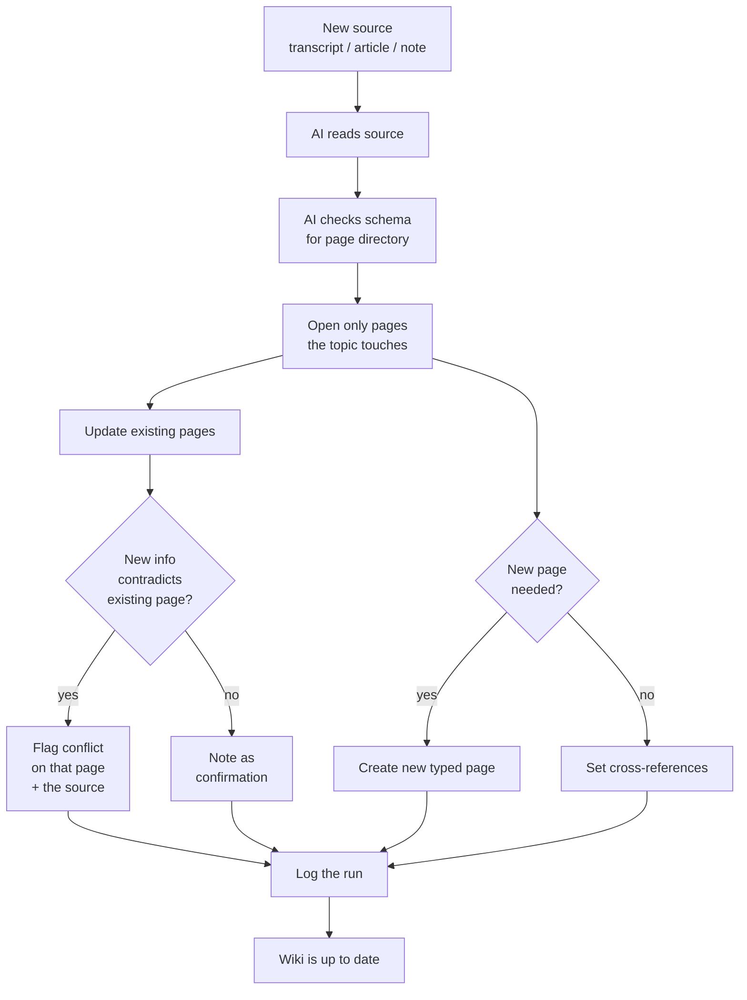

# AI-Curated Knowledge Wiki

**Source:** The Node AI — *My Second Brain* (https://m.youtube.com/watch?v=mHSOsy_usAg) ([[Raw/thenodeai-second-brain-architecture-2026-07-25]])
**Category:** Architecture Pattern
**Status:** Production-validated (52 conflicts flagged on the speaker's real vault in first run)

---

## Overview

A self-curating knowledge wiki that lives as plain Markdown inside the vault, maintained entirely by an AI agent following a fixed schema. The AI reads incoming sources, condenses them into typed pages, cross-links them, and flags every contradiction it finds against the existing wiki. The human is the decider on flagged conflicts, never the writer of the wiki itself. This is the implementation of capability 3 (Stay Clean) in the Second Brain, and the [[Pattern]] the Node AI took from Karpathy's description of "an AI maintaining its own knowledge wiki".

## The hard rules

1. **The human does not touch the wiki folder.** Not a single text in it is from the human.
2. **A schema file lives in the same folder.** Before any wiki work, the AI reads exactly this file and follows what is in it. The schema defines page types, the ingest flow, and the conflict-handling rules.
3. **All pages are cross-linked.** Connections appear as wikilinks, which become clickable links in any viewer (Obsidian, the web app).
4. **The wiki lives in the vault, not outside it.** It is just more Markdown files. The [[Markdown as Single Source of Truth]] rule still applies; the wiki is part of the truth, not a separate store.

## Page types defined by the schema

| Type | Purpose | Example |
|------|---------|---------|
| Source summary | One per external source ingested (article, transcript, PDF). | `sources/2026-07-25-second-brain-architecture.md` |
| Topic page | One per topic that appears in multiple sources. | `topics/second-brain-architecture.md` |
| Person page | One per person mentioned. | `people/patrick.md` |
| Project page | One per project. | `projects/second-brain.md` |
| Synthesis page | Condenses knowledge from multiple topics into a higher-order view. | `synthesis/trust-in-personal-knowledge.md` |

The exact taxonomy is set in the schema file. The Node AI's schema is shareable (linked in the video description) and is the kind of artifact a community can fork.

## The ingest flow

The most decisive thing happens at the contradiction check: on each affected page, the AI checks whether the new information contradicts what is already there. If yes, it flags the conflict on that page and on the source page, and logs it. If no, it notes the new information as a confirmation.

## The 52-conflict result

The Node AI staged a fake contradiction in a fake note as a test; the AI caught all three planted conflicts and also confirmed a fourth harmless statement. Then he ran the ingest on his real vault. Result: **52 conflict points** flagged in his own knowledge, including real contradictions, outdated states, and cases where "should" and "is" were not separated cleanly. The example from the start of the video — a stated target of "viewers watch on average half of every video" coexisting for months with a real-evaluation note showing the actual numbers — was one of the 52.

> These ambiguities and conflicts were there the whole time. They only became visible when a machine read and condensed everything at once.

## The human-decides rule

The AI is explicitly forbidden from resolving conflicts. The system does not overwrite anything. It does not decide who is right. Both statements stand, each with its source, and below them the sentence "Patrick decides". The AI finds the conflicts, but which version stands, the human decides.

When a conflict is flagged, the human's job is to fix the source, not the warning. If the goal is right and the numbers are right, the human edits the source so the relationship is explicit (target next to current status). Then tells the AI "decided. So it stands." The wiki pulls after, the warning disappears, the decision is recorded in the log, and a hidden contradiction becomes a visible work task.

> The most important property of the whole system: it didn't overwrite anything. It didn't simply decide who is right. The AI finds the conflicts, but which version stands, the human decides.

## Logging: the difference between a system you believe and one you verify

Every single run is logged. When did the ingest run? Which source came in? Which pages were changed? What conflicts were found? What decisions were made? The log is the audit trail. It is also the only thing that makes the wiki trustworthy: any flagged conflict can be traced back to the source, the rule, the AI's reasoning, and the human's decision.

> That sounds unspectacular, but that's the difference between a system you have to believe and a system you can verify.

## Where it lives in the architecture

The wiki is the return channel in the architecture diagram. Claude Code does not just read; it also writes, into `09 Wiki/`, under the schema's rules. Every other component (indexer, search, graph) reads the wiki as part of the vault. The web app reads the wiki for the "Read" capability. The wiki is therefore the only place where the AI writes back to the source-of-truth folder — and it does so under strict human-supervised rules.

## Where to invoke the ingest

The ingest can be called from three places:
1. The terminal (CLI invocation)
2. The Claude Code app (TUI)
3. Obsidian with a plugin like Claudian that embeds Claude Code as a sidebar (everything in one window)

It does **not** run from the web app. That is a conscious decision: the web app is a pure read surface (see [[Markdown as Single Source of Truth]]). The "Read" capability is implemented in the app; the "Stay clean" capability is implemented in the wiki ingest flow, which lives in a different surface.

## Key Insights

1. The schema file is the contract. The same schema across all ingest runs is what makes the wiki predictable.
2. The human does not touch the wiki. This is the only way the AI can be held accountable for what is in it.
3. Conflicts are an output, not a bug. The whole point of the wiki is to surface what was previously invisible.
4. The human fixes the source, not the warning. Otherwise the next ingest re-flags the same conflict.
5. The ingest is logged, which makes the wiki auditable, which makes the wiki trustworthy.
6. The wiki is part of the vault, not a separate store. The single-source-of-truth rule still holds.

## Related Concepts

- [[Brain-First Search Ladder]] — rung 2 of the ladder checks the wiki before falling through to search
- [[Markdown as Single Source of Truth]] — the wiki is just more Markdown; the rule still holds
- [[Six-Step AI Build Process]] — the schema file is an output of Step 3 (Specification)
- [[Three Reference Roles]] — the AI-curated wiki is the [[Pattern]] role from Karpathy
- [[Capabilities-First System Design]] — implements capability 3 (Stay clean)

## References

- Raw Article: [[Raw/thenodeai-second-brain-architecture-2026-07-25]]
- Original: https://m.youtube.com/watch?v=mHSOsy_usAg
- Pattern origin: Andrej Karpathy, "LLM Wiki" pattern
