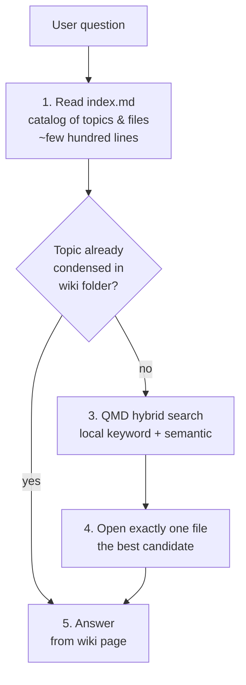
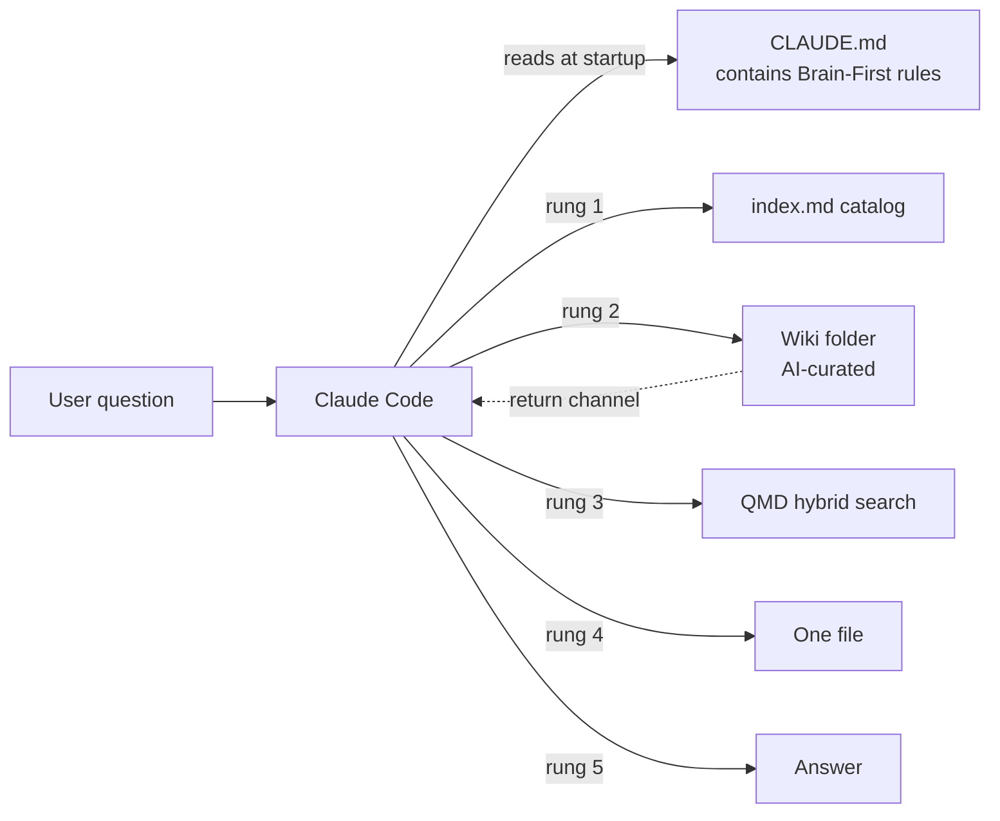

# Brain-First Search Ladder

**Source:** The Node AI — *My Second Brain* (https://m.youtube.com/watch?v=mHSOsy_usAg) ([[Raw/thenodeai-second-brain-architecture-2026-07-25]])
**Category:** Architecture Pattern
**Status:** Production-validated (50% token / 40% time saving in 5-question benchmark)

---

## Overview

A five-rung retrieval rulebook for an AI agent that must consult a personal knowledge base (vault / wiki / second brain) before answering. The AI is forbidden from searching "wildly" or loading chunks of the vault speculatively. Instead, it descends a fixed ladder of increasingly expensive retrieval steps, stopping as soon as it has enough to answer. Encoded in the `CLAUDE.md` of a Claude Code session, this single rule keeps the context window at a few thousand tokens regardless of the vault's total size.

## The five rungs

| Rung | Action | Cost | Why this rung |
|------|--------|------|----------------|
| 1 | Read `index.md` — a small catalog with one row per topic and important file | ~few hundred lines, every time | Cheapest, broadest. Almost always gives the AI the cluster and the right file name. |
| 2 | Check the wiki folder: is the topic already condensed into a wiki page? | One file read | The wiki is the human-curated synthesis. If the answer is already there, no search needed. |
| 3 | QMD hybrid search (local keyword + semantic) | One query, ~2 s of local compute, no API | Falls through to the search when the catalog and wiki are silent. |
| 4 | Open **exactly one file** — the best candidate from rung 3 | One file read | The discipline is "one file, not several". Prevents the AI from "researching" the answer. |
| 5 | Answer | The synthesis itself | The only step the user actually sees. |

## Why a ladder (not just a search)

The trap the ladder prevents is the recursive search loop. Each search step in a normal Claude Code session re-reads the entire previous history. So an unbounded search makes each round more expensive than the last, not less. The Node AI's "most expensive question" — a single line about a fix in a project — cost over half a million tokens without the Brain, because the AI kept searching and each search re-loaded the history. With the Brain, the same question took a third of the tokens because the search ended after two steps.

> The trick is not a larger context window. The trick is a system that does not need one at all.

## The size invariant

The vault can be 2,000 notes / 4,000 files, or it can be 200,000 files. The per-question context contribution from the vault stays in the few-thousand-token range because rungs 1-2 are bounded by the catalog/wiki size, and rungs 3-4 are bounded by the rule "one file, not several". This is what makes the system scale. The vault size does not determine the context size.

## Benchmark results (5 real workday questions)

| Metric | Vanilla Claude Code | With Brain-First | Delta |
|--------|----------------------|------------------|-------|
| Tokens used | baseline | -50% | roughly half |
| Time | baseline | -40% | noticeably faster |
| Correct answers | 5/5 | 5/5 | unchanged |

The Node AI is explicit that this is not a scientific study; it is a practical comparison with his own work questions. For his workflow, the difference was simply clear. He also notes that for trivial questions (where the answer is already in the loaded context), the normal session wins just the same — there is nothing to save. The Brain wins specifically when the answer is deeply buried or split across multiple files.

## Where Brain-First lives in the architecture

The wiki folder is the **return channel** — the AI doesn't just read, it also writes. The wiki is updated through the [[AI-Curated Knowledge Wiki]] ingest flow, with the human as the final decider on any flagged conflicts.

## Implementation in a CLAUDE.md

The exact text is freely available in the video author's community (linked in the original video description). A minimal version is:

> When I ask you a question about my knowledge, follow this ladder:
> 1. Read `index.md` (the catalog).
> 2. Check the wiki folder. If a relevant page exists, prefer it.
> 3. Run QMD with the question. Pick the top result.
> 4. Open exactly one file — the best candidate.
> 5. Answer. Cite the file path.
>
> Do not load multiple files. Do not speculatively read large sections of the vault. Do not re-read the prior conversation except to resolve the current question.

## Key Insights

1. The ladder is a contract that caps the worst-case cost per question at a known small number.
2. The "one file, not several" rule is what stops the compounding cost of recursive searching.
3. The catalog (index.md) is the single most important always-loaded artifact. Keep it small and accurate.
4. The wiki rung is what makes the system *curate itself* — see [[AI-Curated Knowledge Wiki]].
5. The rule is reusable beyond personal knowledge: any "AI over a large corpus" use case benefits from the same ladder.

## Related Concepts

- [[AI-Curated Knowledge Wiki]] — the rung-2 source that makes rung 3 rarely needed
- [[Hybrid Local Search Pattern]] — the rung-3 implementation (QMD)
- [[Markdown as Single Source of Truth]] — the storage model that makes rung-1 catalog practical
- [[Deterministic-First Architecture]] — the rungs themselves are deterministic; AI is rung 5 only

## References

- Raw Article: [[Raw/thenodeai-second-brain-architecture-2026-07-25]]
- Original: https://m.youtube.com/watch?v=mHSOsy_usAg
