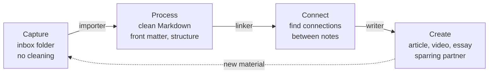

# Capture-Process-Connect-Create Workflow

**Source:** The Node AI — *My Second Brain* (https://m.youtube.com/watch?v=mHSOsy_usAg) ([[Raw/thenodeai-second-brain-architecture-2026-07-25]])
**Category:** Architecture Pattern
**Status:** Production-validated (the speaker's daily workflow)

---

## Overview

The operating loop that turns a folder of files into a thinking partner. Four phases — Capture, Process, Connect, Create — arranged as a *loop*, not a pipeline. The same folder is read and re-read as the loop iterates; new material creates new connections, which create new ideas, which create new material. The four phases correspond to four architectural components, and the AI plays a different role in each: a non-role in Capture, a non-role in Process, a small role in Connect (the last 20%), and a load-bearing role in Create (as a sparring partner, not a ghostwriter).

## The four phases

The arrows form a loop. Every iteration re-uses the same folder; the artefact of one phase is the input of the next.

## Phase 1: Capture

The crucial question is not which tool, but how to *lower the barrier* so low that everything is captured. The rule: **capture first, process later**. Do not clean up while capturing.

A simple inbox folder does the job. An inbox into which anything and everything lands: a transcript, a screenshot, a voice memo, a PDF. As long as it lands in the inbox, the capture is done. The processing happens in the next phase.

The Node AI's hard rule: "if you have to make a decision about where it goes, you've already lost." The decision moves to phase 2; the capture is mechanical.

## Phase 2: Process

The goal: from raw to clean. From inbox to the real folder. The script from phase 1 — the importer — does exactly that. It takes the raw material and turns it into clean Markdown:

- Always the same structure
- Always the same front matter
- Always the same directory structure

You drop a transcript, a PDF, a webpage into a folder and out comes a clean Markdown file. The LLM may be invoked *once per source* here to restructure the content into the standard form, but the per-query path is fully deterministic.

## Phase 3: Connect

Finding links between notes. The script from phase 1 — the linker — does this. It walks the data and finds connections using two strategies:

1. **Embedding-based** — a small local model computes a vector for every chunk. Similar content gets similar vectors. Classical ML, not LLM magic. Costs are in the cent range even for a fully filled Second Brain.
2. **LLM-based** — the LLM is given a chunk and asked to find connections to existing notes. Much more expensive, much more precise. Used for the last 20% where normal code is no longer enough.

The two strategies are not either/or; you combine them. First cheap and fast with embeddings, then targeted with the LLM.

The output of phase 3 is a set of *proposed* links. The links that survive are the ones the user (or the wiki ingest) accepts.

## Phase 4: Create

The actual end product: the article, the video script, the essay. Here, and only here, is the LLM load-bearing. **Claude Code is a sparring partner, not a ghostwriter.** The user brings the intent, the structure, the final voice. The AI brings the candidate phrasing, the alternative framings, the cross-references it just discovered in phase 3.

The output of phase 4 is a finished artefact (a video, a blog post, a strategy document). That artefact may also be *captured* into the inbox as a new source, which then re-enters the loop. This is what makes the loop iterative: the user's finished work is also raw material for the next iteration's connections and creations.

## Why a loop, not a pipeline

A pipeline implies a single direction and a single pass. A loop implies that the same data is read and re-read as new context arrives. The Node AI's framing:

> New material creates new connections, which creates new ideas, which creates new material. A Second Brain is not a filing cabinet, it is a thinking partner. The system is the infrastructure for this thinking.

The system is not a destination; it is a substrate. Every iteration of the loop surfaces a new layer of structure in the same data.

## The role of the AI in each phase

| Phase | AI role | Cost shape |
|-------|---------|------------|
| 1. Capture | None | Free; the inbox is just a folder |
| 2. Process | Optional (one LLM call per source for restructuring) | Negligible; LLM called once, not per query |
| 3. Connect | Small (last 20% of links) | Mostly free; small LLM budget for validation |
| 4. Create | Load-bearing (sparring partner) | Real; this is where the AI is worth its cost |

The [[Deterministic-First Architecture]] rule shows through: only phase 4 is dominantly purple. The other three are dominantly green.

## How the workflow maps to the [[Brain-First Search Ladder]]

When the user asks a question mid-loop, the [[Brain-First Search Ladder]] kicks in. The phases 1-3 outputs (the inbox, the clean Markdown, the links) are exactly the data the ladder reads. The ladder is not a separate system; it is the read-path of the loop.

## The "capture, don't classify" trap to avoid

A common failure mode: trying to file each capture immediately into the right topic folder. This raises the cost of capture, so the user stops capturing. The system atrophies. The fix is the inbox-and-later discipline. The classifier moves from real-time to batch; the human moves from micro-decisions to one batched decision per processing session.

## Key Insights

1. The loop is what makes the system a thinking partner, not a filing cabinet. A pipeline ends; a loop continues.
2. The capture step is the only one that the user must do reliably every day. The other steps can be batched.
3. The AI's load-bearing role is only in phase 4. Phases 1-3 are mostly free.
4. The user's finished work is also raw material for the next iteration. Creation feeds capture.
5. The workflow is the missing piece for most "second brain" implementations. The folder is the easy part; the loop is the hard part.

## Related Concepts

- [[Markdown as Single Source of Truth]] — the loop reads and writes the same plain-Markdown folder
- [[Deterministic-First Architecture]] — phases 1-3 are green; phase 4 is the small purple
- [[Brain-First Search Ladder]] — the read-path of the loop when the user asks a question
- [[AI-Curated Knowledge Wiki]] — phase 2's "clean Markdown" is what the wiki ingest reads
- [[Hybrid Local Search Pattern]] — the rung-3 component used during phase 3

## References

- Raw Article: [[Raw/thenodeai-second-brain-architecture-2026-07-25]]
- Original: https://m.youtube.com/watch?v=mHSOsy_usAg
