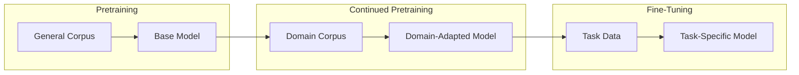
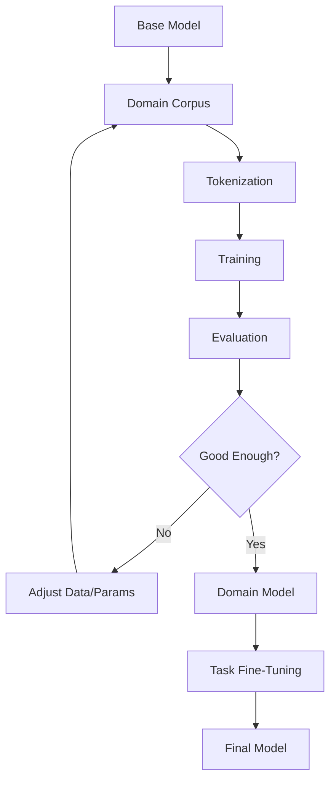

## Overview

**Continued Pretraining (CPT)** is the process of further training a pre-trained language model on a new corpus of text, typically from a specific domain. Unlike fine-tuning, which adapts a model to a specific task, CPT continues the pretraining objective (next-token prediction) on domain-specific data to improve the model's knowledge and capabilities in that domain.

## CPT vs Fine-Tuning

### Key Differences

| Aspect | Continued Pretraining | Fine-Tuning |
|--------|----------------------|-------------|
| **Objective** | Next-token prediction | Task-specific loss |
| **Data** | Unlabeled domain text | Labeled task data |
| **Goal** | Domain knowledge | Task performance |
| **Scope** | Broad domain understanding | Narrow task optimization |
| **Examples** | Medical texts, legal docs | QA pairs, classifications |

## When to Use Continued Pretraining

### Ideal Scenarios

1. **Domain-specific applications**: Medicine, law, finance, scientific research
2. **New knowledge domains**: Emerging fields not well-represented in training data
3. **Language adaptation**: Adapting to new languages or dialects
4. **Style adaptation**: Matching specific writing styles or genres

### When CPT is Better Than Fine-Tuning

- **Broad domain knowledge needed**: When the model needs to understand domain terminology and concepts deeply
- **Limited labeled data**: When you have abundant unlabeled domain text but few labeled examples
- **Multiple downstream tasks**: When you need to support various tasks within a domain
- **Foundation for future fine-tuning**: When building a domain-specific base model

## How Continued Pretraining Works

### The Process

1. **Select a base model**: Start with a strong general-purpose model (e.g., Llama 3, Mistral)
2. **Curate domain corpus**: Gather high-quality, domain-specific text
3. **Continue training**: Train with the same objective (causal LM) but on domain data
4. **Evaluate**: Test on domain-specific benchmarks
5. **Fine-tune (optional)**: Apply task-specific fine-tuning on top

### Training Considerations

### Hyperparameters

| Parameter | Typical Value | Notes |
|-----------|--------------|-------|
| **Learning rate** | $1\\times10^{-5}$ to $5\\times10^{-5}$ | Lower than pretraining |
| **Batch size** | Large (512-2048) | Similar to pretraining |
| **Epochs** | 1-3 | Avoid overfitting |
| **Warmup** | 1-5% of steps | Stabilize early training |
| **Context length** | Match base model | Can extend with techniques |

## Domain Adaptation Strategies

### Progressive Training

Train on progressively more specialized data:

1. **General domain** (e.g., all medical text)
2. **Sub-domain** (e.g., radiology reports)
3. **Task-specific** (e.g., radiology report generation)

### Mixed Training

Combine domain data with general data:

- **Ratio**: 70-90% domain, 10-30% general
- **Purpose**: Preserve general capabilities while learning domain knowledge
- **Risk**: Too much general data dilutes domain learning

### Curriculum Learning

Start with easier examples and progressively increase difficulty:

- **Easy**: Short, simple sentences
- **Medium**: Complex sentences, technical terms
- **Hard**: Rare conditions, edge cases

## Challenges and Solutions

### Catastrophic Forgetting

**Problem**: Model forgets general knowledge while learning domain knowledge

**Solutions**:
- **Mixed training**: Include general data
- **Lower learning rate**: Slower updates preserve existing knowledge
- **LoRA/Adapter**: Only update a subset of parameters
- **Regularization**: Add penalty for deviating from original weights

### Data Quality

**Problem**: Domain data may be noisy, biased, or outdated

**Solutions**:
- **Thorough cleaning**: Remove duplicates, errors, irrelevant content
- **Quality filtering**: Use classifiers to filter low-quality text
- **Diversity checks**: Ensure coverage across sub-domains
- **Temporal filtering**: For time-sensitive domains (e.g., medicine)

## Evaluation

### Domain-Specific Benchmarks

| Domain | Example Benchmarks |
|--------|-------------------|
| **Medical** | PubMedQA, MedQA, MMLU-Medical |
| **Legal** | CaseHold, COLIEE, Legal-MNLI |
| **Scientific** | SciQA, PaperQA, PubMed |
| **Financial** | FiQA, FinQA, Financial-NLI |

### General Capability Preservation

- **MMLU**: General knowledge
- **HellaSwag**: Commonsense reasoning
- **GSM8K**: Math reasoning

## Tools and Resources

- **[Unsloth Continued Pretraining](https://docs.unsloth.ai/basics/continued-pretraining)**: Practical guide for CPT with memory optimization
- **[HuggingFace TRL](https://huggingface.co/docs/trl)**: Training framework with CPT support
- **[Llama-Factory](https://github.com/hiyouga/llama-factory)**: Supports continued pretraining workflows

## Related

- [[supervised-fine-tuning|supervised-fine-tuning]]
- [[lora-qlora|lora-qlora]]
- [[dataset-creation-llm|dataset-creation-llm]]
- [[model-selection-llm|model-selection-llm]]
