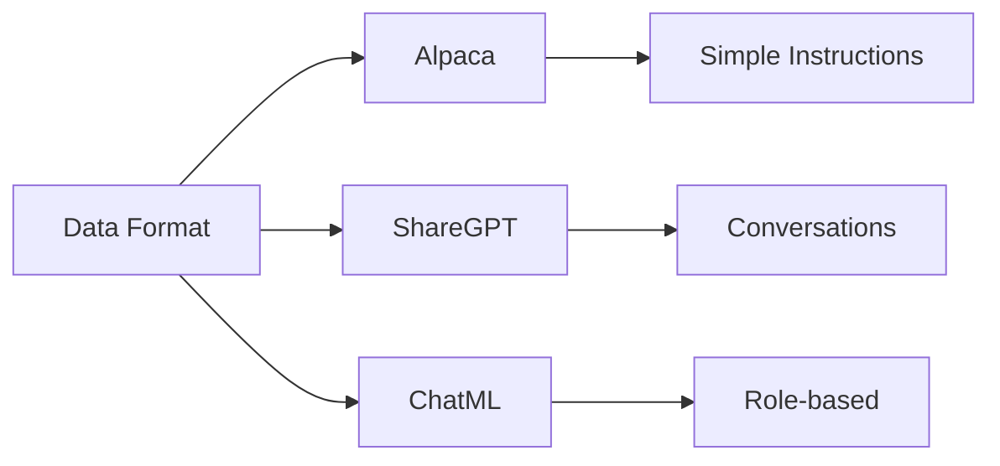
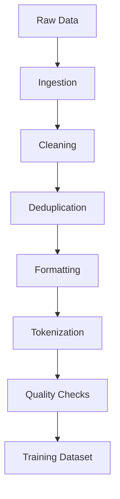

## Overview

**Dataset creation** is the foundation of effective LLM fine-tuning. The quality, diversity, and formatting of training data often matters more than model architecture or hyperparameters. This page covers data formats, curation strategies, synthetic data generation, and tokenization considerations for LLM training.

## Data Formats

### Alpaca Format

The [Alpaca format](https://github.com/tatsu-lab/stanford_alpaca) is one of the most widely used instruction-following formats:

```json
{
  "instruction": "Explain the concept of recursion in programming.",
  "input": "",
  "output": "Recursion is a programming technique where a function calls itself..."
}
```

**When to use**: General instruction tuning, simple Q&A tasks

### ShareGPT Format

The [ShareGPT](https://huggingface.co/datasets/anon8231489123/ShareGPT) format captures multi-turn conversations:

```json
{
  "conversations": [
    {"from": "human", "value": "What is machine learning?"},
    {"from": "gpt", "value": "Machine learning is a subset of AI..."},
    {"from": "human", "value": "Can you give an example?"},
    {"from": "gpt", "value": "Sure! A common example is..."}
  ]
}
```

**When to use**: Multi-turn conversations, chatbot training

### ChatML Format

[ChatML](https://learn.microsoft.com/en-us/azure/ai-services/openai/how-to/chatgpt-markup-language) (Chat Markup Language) uses role-based tags:

```
<|im_start|>system
You are a helpful assistant.<|im_end|>
<|im_start|>user
What is the capital of France?<|im_end|>
<|im_start|>assistant
The capital of France is Paris.<|im_end|>
```

**When to use**: Models that support ChatML (OpenAI, many open models)

### Format Comparison



## Data Curation

### The LIMA Principle

The [LIMA paper](https://arxiv.org/abs/2305.11206) demonstrated that **1,000 high-quality examples outperform 1 million low-quality examples**:

- **Quality over quantity**: Curate carefully, don't just scale
- **Diversity matters**: Cover the target distribution
- **Consistency**: Uniform style and tone
- **Accuracy**: Factually correct outputs

### Data Quality Dimensions

| Dimension | Description | How to Evaluate |
|-----------|-------------|-----------------|
| **Relevance** | Data matches target task | Manual inspection |
| **Accuracy** | Outputs are correct | Expert review, automated checks |
| **Diversity** | Covers edge cases | Statistical analysis |
| **Consistency** | Uniform formatting | Automated validation |
| **Privacy** | No PII leakage | Regex scanning, NER |

### Filtering Strategies

1. **Length filtering**: Remove too-short or too-long examples
2. **Language detection**: Filter non-target languages
3. **Duplicate removal**: Exact and near-duplicate detection
4. **Toxicity filtering**: Remove harmful content
5. **Quality scoring**: Use perplexity or classifier-based scoring

## Synthetic Data Generation

### Methods

**Self-Instruct**: Use an LLM to generate instructions from seed examples


**Distillation**: Generate data from a stronger teacher model
- Use GPT-4/Claude to generate high-quality training data
- Cost-effective for smaller models
- Risk of inheriting teacher biases

**Augmentation Techniques**:
- **Paraphrasing**: Rewriting existing examples
- **Back-translation**: Translate to another language and back
- **Template filling**: Structured generation from templates

### Synthetic Data Best Practices

- **Verify outputs**: Don't trust synthetic data blindly
- **Mix with real data**: 70% real + 30% synthetic is common
- **Diversity checks**: Ensure synthetic data covers edge cases
- **Quality filtering**: Use classifiers to filter low-quality generations

## Tokenization

### Why Tokenization Matters

Tokenization affects:
- **Vocabulary size**: Determines model capacity
- **Sequence length**: More tokens = shorter effective context
- **Multilingual support**: Subword tokenization handles multiple languages
- **Efficiency**: Fewer tokens = faster training

### Common Tokenizers

| Tokenizer | Used By | Vocab Size | Notes |
|-----------|---------|------------|-------|
| **BPE** | GPT-2, RoBERTa | 50K | Byte-pair encoding |
| **SentencePiece** | T5, Llama | 32K | Language-agnostic |
| ** tiktoken** | GPT-3/4 | Various | Fast, efficient |

### Tokenization Considerations

1. **Pre-tokenization**: How text is split before subword tokenization
2. **Special tokens**: <|endoftext|>, padding, etc.
3. **Handling of code**: Whitespace and indentation matter
4. **Multilingual support**: Character coverage

## Data Pipeline Architecture



## Tools and Resources

- **[Unsloth Datasets Guide](https://docs.unsloth.ai/basics/datasets)**: Practical guide for preparing datasets
- **[HuggingFace Datasets](https://huggingface.co/docs/datasets)**: Dataset library and hub
- **[Data Recipes](https://github.com/huggingface/alignment-handbook)**: Curated dataset recipes from HuggingFace
- **[Argilla](https://argilla.io)**: Open-source data curation platform

## Related

- [[supervised-fine-tuning|supervised-fine-tuning]]
- [[reinforcement-learning-grpo|reinforcement-learning-grpo]]
- [[continued-pretraining|continued-pretraining]]
