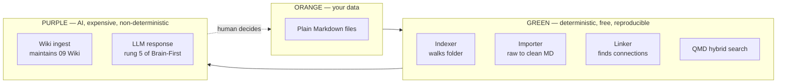

# Deterministic-First Architecture

**Source:** The Node AI — *My Second Brain* (https://m.youtube.com/watch?v=mHSOsy_usAg) ([[Raw/thenodeai-second-brain-architecture-2026-07-25]])
**Category:** Architecture Constraint
**Status:** Production-validated

---

## Overview

The rule that decides which parts of an AI-assisted system are deterministic code and which parts are AI: make the system work *without* the AI first, then add the AI as an upgrade. The result is a colour-coded architecture where the smallest possible region is purple (AI) and the rest is green (deterministic) and orange (data). The rule is also a portability test: the system must work when the next person opens it and has no API key.

## The three-colour rule

The arrows show the data flow. The amount of purple is the budget. If the purple is large, the system is expensive, slow, and brittle. If the purple is small and the green is doing the work, the system is fast, free, and reproducible.

## The rule, stated precisely

> When the next person opens your system and doesn't have an API key, the system should still work. The AI is an upgrade, not a foundation.

This is a falsifiable test, not a slogan. If pulling the AI out breaks the system, the system was architected wrong. If pulling the AI out only removes the "convenience" layer, the system was architected right.

## How the rule plays out in the Second Brain

| Component | Colour | Why |
|-----------|--------|-----|
| Vault folder of plain Markdown files | orange | The data. Survives every tool, every app, every company. |
| Indexer (walks the folder, writes index.md and map file) | green | Deterministic. One pass, identical output every time. Costs nothing. |
| Importer (raw → clean Markdown with front matter) | green | Deterministic. Same input, same output. |
| Linker (walks the data, finds connections) | green | Deterministic. Two strategies: embedding-based and LLM-based. The embedding strategy is fully deterministic (small model, classical ML, cents of compute). The LLM strategy is reserved for the last 20% where deterministic code is no longer enough. |
| QMD hybrid search | green | Local keyword + semantic search. Free, on-device, ~2 s per query. |
| Graph visualization | green | Pure read. Derived from the map file. |
| Wiki ingest (updates `09 Wiki/`, flags conflicts) | purple | The only place AI writes back. The "Stay clean" capability lives here. Under strict schema and human-decides rules. |
| LLM response (Brain-First rung 5) | purple | The final synthesis. Necessary because the answer has to be generated, not retrieved. |

Note the asymmetry: the [[Brain-First Search Ladder]] has 5 rungs. Rungs 1-4 are deterministic (read a file, check a folder, run a search, open one file). Only rung 5 is purple.

## What the rule buys you

1. **Cost predictability.** The cost of the system without the AI is zero. The cost with the AI is bounded by how often the AI is invoked.
2. **Reproducibility.** The same input, the same deterministic output, every time. A test in CI does not need an API key.
3. **Portability.** The system can be moved to a new environment with no setup beyond a folder. The AI is an additional install, not a prerequisite.
4. **Vendor independence.** Any deterministic component can be swapped (QMD for some other search, Obsidian for some other editor) without touching the AI. The AI is not load-bearing.
5. **Composability.** The deterministic layer composes with any AI. The AI layer composes with any deterministic search that exposes a CLI or a library.

## The "Build the deterministic part first" rule of thumb

When planning the system (Step 4 of the [[Six-Step AI Build Process]]), every task should be biased toward deterministic code unless it can be justified as truly requiring understanding. The Node AI's own example: a chunking strategy. He tested three — fixed size, semantic chunking, LLM-based — and landed on a hybrid where the LLM looks at the text and sets natural-break boundaries, but the chunking is then executed deterministically. Even the "AI" part of the pipeline is a one-time analysis, not a per-query inference.

## The "no API key, still works" portability test

Apply this test to every component:

- **Vault folder.** Works with `cat` and `grep`. No API key.
- **Indexer.** Pure script. No API key.
- **QMD.** Local models. No API key.
- **Web app with search box.** Uses the local search. No API key. (The app does borrow QMD's local embedding model, but that runs on-device.)
- **Wiki ingest.** Requires Claude Code. Needs an API key. Falls back to "vault exists, wiki doesn't get updated" — the system still works as a vault, just without the curation.

The system is therefore useful at every level of completeness. The wiki ingest is the cherry, not the cake.

## Key Insights

1. The amount of purple in the architecture is the budget. Minimize it.
2. The "no API key, still works" test is a falsifiable definition of "AI as upgrade, not foundation".
3. Deterministic components are the right place to spend engineering time on quality, because the AI is non-deterministic by nature.
4. The rule composes with [[Markdown as Single Source of Truth]]: deterministic code over plain text is the most portable stack imaginable.
5. Even inside the AI layer, prefer a one-time LLM analysis that produces a deterministic artifact over a per-query LLM call.

## Related Concepts

- [[Markdown as Single Source of Truth]] — the orange layer the green and purple both read
- [[Brain-First Search Ladder]] — rungs 1-4 are green, rung 5 is purple
- [[Capabilities-First System Design]] — the boundary conditions on the list (local, no API key) drive this rule
- [[Six-Step AI Build Process]] — Step 4 (Plan) should bias tasks toward green

## References

- Raw Article: [[Raw/thenodeai-second-brain-architecture-2026-07-25]]
- Original: https://m.youtube.com/watch?v=mHSOsy_usAg
