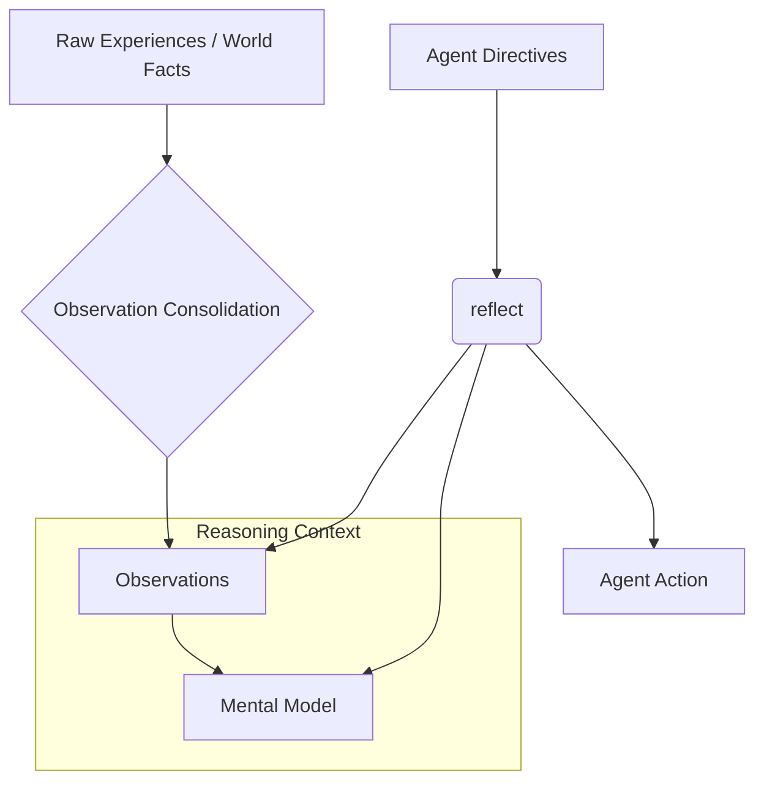

# Hindsight Memory Architecture

The Hindsight system is built to provide AI agents with a persistent, context-aware, and reasoning-capable memory. Its architecture shifts agent interaction from stateless, episodic sessions to a long-term evolution of knowledge.

## Structural Overview
Hindsight manages data via a hierarchical bank structure. Each level of the bank dictates the weight and utility of information during the reasoning phase.

## TEMPR Multi-Strategy Retrieval
The **TEMPR** strategy enables Hindsight to handle complex, heterogeneous queries by executing four distinct search methodologies in parallel.

| Strategy | Description | Best For |
| :--- | :--- | :--- |
| **T**emporal | Analyzes timestamps and relative time markers. | "What did we discuss last spring?" |
| **E**ntity (Graph) | Traverses relationships between entities. | "Who works at Mountain View?" |
| **M**atric (Keyword) | BM25 exact match indexing. | "Find document: Hindsight-v1.2-spec" |
| **P**araphrase (Semantic) | Embedding-based vector similarity. | "How do I setup the memory bank?" |

## Observation Consolidation Pipeline
Raw information is rarely usable as-is. Hindsight applies an automated pipeline to clean and structure data:

1. **Extraction:** Incoming streams (logs, interactions) are parsed.
2. **Deduplication:** Fuzzy matching identifies overlapping or redundant factual claims.
3. **Refinement:** Observations are incrementally updated with new evidence; old sources are preserved for provenance.
4. **Verification:** The system periodically audits consolidated observations against raw evidence to prevent "hallucinated" summary growth.

## Provenance and Integrity
Hindsight tracks the "Chain of Custody" for all knowledge. By logging source URLs, retrieval dates, and original context, it enables agents to provide verifiable citations for their reasoning.

---
See also: [[hindsight-memory-system]], [[tool-calling-llm]]
