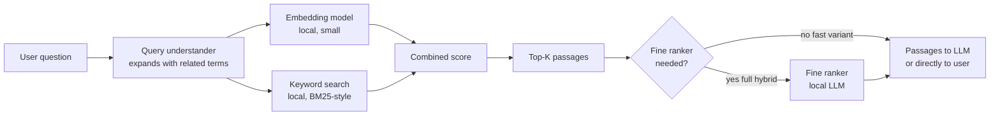

# Hybrid Local Search Pattern

**Source:** The Node AI — *My Second Brain* (https://m.youtube.com/watch?v=mHSOsy_usAg) ([[Raw/thenodeai-second-brain-architecture-2026-07-25]])
**Category:** Architecture Pattern
**Status:** Production-validated (2,000 notes, 4,000 files, on-device)

---

## Overview

A local, hybrid (keyword + semantic) search engine over the vault, combined with a RAG (Retrieval-Augmented Generation) pipeline that grounds the LLM's answer in the retrieved passages. The pattern is the implementation of capability 1 (Find) of the Second Brain and the rung-3 component of the [[Brain-First Search Ladder]]. Everything runs on-device. No API key, no cloud database, no per-query cost beyond compute time.

## The pattern at a glance

The Node AI distinguishes two modes:

- **Fast variant (web app search box):** query understander + embedding + combined score, no fine ranker. ~2 seconds of compute. Used when the human is driving.
- **Full hybrid (Claude Code Brain-First rung 3):** adds the fine ranker on top. Used when the LLM is driving the search and the answer quality matters more than latency.

## Why hybrid (and not just semantic)

Pure semantic search is fuzzy: it finds "things that are about the same topic", but it can miss exact phrases, names, and quotes. Pure keyword search is precise on terms but blind to synonyms and paraphrases. Hybrid combines the two and re-ranks. The Node AI's exact framing: "do you remember ability number 1, finding without the exact word? That's exactly what QMD delivers."

For the Second Brain's actual workload, the hybrid matters because:
- A strategy-document goal ("50% of every video") is best found by exact keyword.
- A vague recall ("what was our subtitle style") is best found by semantic similarity.
- Both queries show up in the same workday, so the engine must handle both.

## The Karpathy framing

> Today's LLMs are like a fresh graduate. They know a lot, but they know nothing about your specific case. RAG is nothing more than giving the graduate your documents before the exam. Without RAG, the LLM answers from its general training, with RAG, it answers from your context. The same model, your data, the difference.

This framing is what makes the architecture feel obvious in retrospect: the LLM is the graduate, the search engine is the librarian, the vault is the library, the human is the examiner. The pipeline just makes that metaphor literal.

## The cost story

| Component | Cost per query | Where it runs |
|-----------|-----------------|----------------|
| Query understander (embedding) | cents per day | local model on the Mac |
| Keyword search | free | local index |
| Fine ranker (when used) | a small LLM call | local model on the Mac |
| LLM answer (rung 5) | API tokens | only when the AI is driving |

The Node AI's specific number: ~2 seconds of processor work per search, no API token consumption. He runs ~100 searches per day, all free. The same searches through a cloud semantic-search service would cost real money per query.

## The two-AI division of labour, generalised

The local search uses a *small* local model (classical ML, embeddings) to do the cheap, fast semantic work. The *big* model (the LLM in rung 5) does the precise generation. The two are decoupled: the small model can run 1,000 times a day, the big model runs only when synthesis is needed.

This generalises beyond search:
- **Summarisation:** the small model extracts candidate sentences; the big model writes the paragraph.
- **Linking:** the small model finds candidate links by vector similarity; the big model validates "is this a real link or just topic overlap?".
- **Ingest:** the small model chunks the source; the big model places each chunk into the right wiki page.

The pattern is always: small-model-ranks, big-model-decides.

## Chunking: the deep rabbit hole

The Node AI tested three chunking strategies and landed on a hybrid:

1. **Fixed-size chunks** (N tokens, hard cut). Simple, but cuts mid-sentence.
2. **Semantic chunking** (chunks split at natural semantic boundaries). Better, but the boundaries are inferred by a model.
3. **LLM-based chunking** (the LLM looks at the text and decides where to break). Best quality, but expensive.

The chosen strategy: an LLM looks at a long text and decides where the natural breaks are, paragraph by paragraph, section by section. The boundaries are set by the LLM, not by a fixed number of tokens. The resulting chunks are then stored as Markdown files with front matter and processed deterministically. The LLM is used once per source, not per query.

The input to the LLM is a QMD file; the output is a clean Markdown file in the folder. The LLM is not writing the content; it is *restructuring* it. That's an important difference: the LLM is doing formatting and metadata, not generating facts.

## Why local (not cloud)

The Node AI's boundary condition: "My notes are my life, projects, finances, personal stuff. Only when Claude Code analyzes content or maintains the wiki are the excerpts selected for that transmitted to the model." The search itself never sends a query to a cloud. The LLM response (rung 5) does, but only with the specific excerpts that the local search already identified.

This is a different privacy model from "send all your notes to a cloud service for indexing". The vault is never sent. The local index is derived from the vault but lives on the disk. The cloud sees only the specific passages that survive the local ranking.

## Key Insights

1. Hybrid (keyword + semantic) is the right default for personal knowledge; the cost of pure-semantic is real and the precision loss of pure-keyword is real.
2. The Karpathy framing — "RAG is giving the graduate your documents before the exam" — is the single line that makes the architecture obvious.
3. The two-AI division of labour (small model for retrieval, big model for generation) is the right cost-shape.
4. The local-first design is what makes the search 100x-a-day-free; per-query API cost would change the usage pattern.
5. The LLM is used once per source for chunking, not per query. The per-query path is fully deterministic.

## Related Concepts

- [[Brain-First Search Ladder]] — rung 3 is the hybrid search
- [[Deterministic-First Architecture]] — the search is the largest deterministic component
- [[Markdown as Single Source of Truth]] — the search reads plain Markdown; no special format
- [[Three Reference Roles]] — QMD is the [[Building Block]] role
- [[Capabilities-First System Design]] — implements capability 1 (Find)

## References

- Raw Article: [[Raw/thenodeai-second-brain-architecture-2026-07-25]]
- Original: https://m.youtube.com/watch?v=mHSOsy_usAg
- QMD: by Tobi Lütke, linked in the video description
