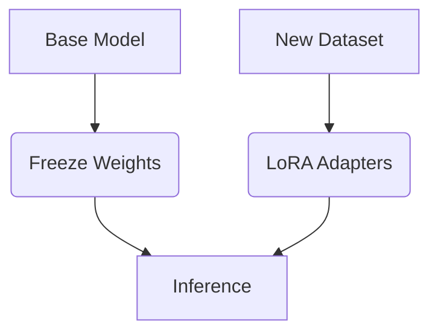

# LLM Training Methods

## Continued Pretraining (CPT)
Instead of fine-tuning on a specific task, CPT involves continuing the base training of a model on a large corpus of text. This is highly recommended when the base model lacks foundational knowledge of a specific syntax (like Rust). 

## Supervised Fine-Tuning (SFT)
SFT trains the model to respond to specific instructions. The model learns the *format* of the interaction (e.g., ChatML, Tool calling).

## Parameter Efficient Fine-Tuning (PEFT)
### LoRA (Low-Rank Adaptation)
Instead of updating all weights in a neural network, LoRA injects trainable low-rank decomposition matrices into the transformer layers. 
- **Benefits**: Massively reduces VRAM requirements, prevents catastrophic forgetting.
- **Implementations**: Unsloth provides highly optimized LoRA implementations capable of 2x faster training.

