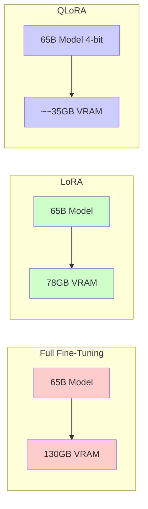

## Overview

**LoRA (Low-Rank Adaptation)** and **QLoRA (Quantized LoRA)** are parameter-efficient fine-tuning (PEFT) techniques that dramatically reduce the memory and compute requirements for adapting large language models (LLMs) to specific tasks. Instead of updating all model parameters, LoRA introduces small, trainable rank-decomposition matrices into the model architecture.

## LoRA (Low-Rank Adaptation)

### Core Idea

Introduced by Hu et al. in 2021 ([LoRA: Low-Rank Adaptation of Large Language Models](https://arxiv.org/abs/2106.09685)), LoRA freezes the pre-trained model weights and injects trainable low-rank matrices into each layer of the transformer architecture.

### Mathematical Formulation

For a pre-trained weight matrix $W_0 \in \mathbb{R}^{d \times k}$, the modified forward pass becomes:

$$h = W_0 x + \Delta W x = W_0 x + BAx$$

Where:
- $B \in \mathbb{R}^{d \times r}$ and $A \in \mathbb{R}^{r \times k}$ are the low-rank matrices
- $r \ll \min(d, k)$ is the rank (typically 4-64)
- $W_0$ remains frozen during training

### Key Properties

| Property | Description |
|----------|-------------|
| **Trainable Parameters** | Only $A$ and $B$ matrices |
| **Storage** | ~0.1-1% of original model size |
| **Inference Overhead** | Minimal (can merge $W = W_0 + BA$) |
| **Rank Selection** | Typically 4-64 depending on task complexity |

### When to Use LoRA

- **Limited GPU memory**: When full fine-tuning is infeasible
- **Multi-task adaptation**: Train separate LoRA adapters for different tasks
- **Rapid experimentation**: Faster iteration on model variants
- **Domain adaptation**: Adapting to new domains without catastrophic forgetting

## QLoRA (Quantized LoRA)

Introduced by Dettmers et al. in 2023 ([QLoRA: Efficient Finetuning of Quantized LLMs](https://arxiv.org/abs/2305.14314)), QLoRA combines 4-bit quantization with LoRA to enable fine-tuning of massive models on consumer hardware.

### Key Innovations

1. **4-bit NormalFloat (NF4) Quantization**
   - Optimal for normally distributed weights
   - Better than standard INT4 quantization

2. **Double Quantization**
   - Quantizes the quantization constants themselves
   - Additional memory savings (~0.4 bits per parameter)

3. **Paged Optimizers**
   - Uses NVIDIA unified memory to avoid OOM errors
   - Automatically pages optimizer states to CPU RAM

### Memory Comparison

### Memory Requirements (Approximate)

| Model Size | Full FT | LoRA (16-bit) | QLoRA (4-bit) |
|-----------|---------|---------------|---------------|
| 7B | ~28GB | ~14GB | ~6GB |
| 13B | ~52GB | ~26GB | ~10GB |
| 30B | ~120GB | ~60GB | ~20GB |
| 65B | ~260GB | ~130GB | ~35GB |

## Unsloth and Dynamic 4-bit Quantization

[Unsloth](https://unsloth.ai) provides optimized implementations that further improve upon QLoRA:

- **Dynamic 4-bit quants**: Automatically adjusts quantization precision per layer
- **2x faster training**: Optimized CUDA kernels for LoRA operations
- **30% less memory**: Additional memory optimizations beyond standard QLoRA
- **No accuracy loss**: Maintains full model quality while using less memory

## Trade-offs and Considerations

### Advantages
- **Massive memory reduction**: Fine-tune 70B models on single GPU
- **Faster training**: Fewer parameters to update
- **Modular adapters**: Swap adapters for different tasks
- **Reduced storage**: Adapter weights are tiny (~10-100MB)

### Limitations
- **Slightly lower accuracy**: May not reach full fine-tuning quality
- **Hyperparameter sensitivity**: Rank and alpha require tuning
- **Not universal**: Some tasks benefit from full fine-tuning
- **Inference complexity**: Must load base model + adapter

## Best Practices

1. **Start with rank=8 or 16**, increase if underfitting
2. **Set alpha = 2x rank** as a rule of thumb
3. **Apply LoRA to attention and linear layers** (not just attention)
4. **Use QLoRA for models > 13B parameters**
5. **Consider full fine-tuning for small models (< 7B)**

## Related

- [[supervised-fine-tuning|supervised-fine-tuning]]
- [[continued-pretraining|continued-pretraining]]
- [[model-selection-llm|model-selection-llm]]
