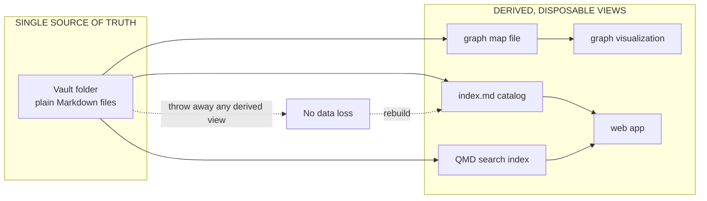

# Markdown as Single Source of Truth

**Source:** The Node AI — *My Second Brain* (https://m.youtube.com/watch?v=mHSOsy_usAg) ([[Raw/thenodeai-second-brain-architecture-2026-07-25]])
**Category:** Architecture Pattern
**Status:** Production-validated (2,000 notes, 4,000 files, multi-vault, multi-year)

---

## Overview

The single most important architecture decision in the Second Brain: **all knowledge lives as plain Markdown files on disk**. Every other component — indexer output, search engine, graph visualization, web app, wiki — is a *derived view* on those files. No component is the source of truth; the folder is. This makes the entire system disposable and replaceable in pieces without losing a single byte of knowledge.

## The derived-view principle

The arrows go one way only: from the folder outward. Nothing writes back to the folder except the human (or, in the wiki sub-folder, the AI agent under explicit human control — see [[AI-Curated Knowledge Wiki]]).

## The three architectural consequences

### 1. Replace any tool, keep the data

The Node AI explicitly calls out: "You could replace Obsidian with Notion, theoretically at least, and the system would still work." The same applies to QMD (swap for any hybrid search), the web app (swap for any other viewer), the indexer (swap for any other walker). Each swap is a self-contained refactor; the knowledge base is untouched.

### 2. Failures don't lose data

The data lives somewhere, the code processes it. If a script crashes, the data is still there. If a tool disappears, the data is still there. If you want to replace a tool, the data is still there. The most destructive class of bug in a knowledge system — a tool upgrade that mangles the corpus — is structurally impossible when there is no tool holding the corpus.

### 3. Long-term portability

> Your data survives every tool, every app, every company. It's a quiet superpower. And I find that very reassuring.

This is not a feature, it is the price of admission. A 5-year-old Markdown file is still readable by a 5-year-from-now text editor. A 5-year-old proprietary knowledge-base format may or may not be.

## What "Markdown" means in practice

The Node AI is precise about what he means: plain text, UTF-8, with optional front matter. Every file in the vault is openable with `cat`. The indexer is the only component that adds structure (it writes `index.md` and a map file), and it does so as new derived files in the same folder, not by modifying the originals.

The same pattern shows up in two external references he studied and rejected (Gbrain, Graphify): both also use Markdown as the single source of truth and the graph as a derived snapshot. The pattern was independently discovered, which is one reason the Node AI adopted it with high confidence.

## Storage and processing are separate

This is the third of the Node AI's three architecture decisions, and it is what makes the derived-view principle safe to live by:

- **Storage layer (orange in his diagrams):** the folder, the Markdown files, plus a redundant copy in cloud sync (Google Drive).
- **Processing layer (green):** two small scripts — the importer (raw → clean Markdown) and the linker (find connections between notes). Both are deterministic code, no AI, fast and free.
- **AI layer (purple):** the AI agent (Claude Code) plus the wiki ingest flow. Used only where understanding is needed.

The colour coding is not decorative; it is the architectural rule: the smallest possible purple, and the AI is an *upgrade* not a *foundation* — see [[Deterministic-First Architecture]].

## Why this matters for an AI-built system specifically

The Node AI's framing: when the next person opens your system and doesn't have an API key, the system should still work. The AI is an upgrade, not a foundation. If the Markdown-as-truth rule is followed, this property is automatic. The system without the AI is "find in a folder of plain text and read it", which works with `grep` and `cat`. The AI is the thing that makes it convenient.

## Key Insights

1. The single source of truth should be openable with `cat` in 10 years. If not, it is not the truth; it is a tool.
2. Every other component is disposable. The cost of a wrong choice is rebuild-time, not data-loss.
3. Derived views must be regenerable from the source in a single pass. If a view requires a one-time migration of the source, it is the source.
4. The pattern was independently discovered by Gbrain and Graphify, which is a strong prior on its correctness.
5. Combined with [[Deterministic-First Architecture]], it gives a "no API key, still works" guarantee that decouples the system's value from any vendor.

## Related Concepts

- [[Deterministic-First Architecture]] — the AI is an upgrade on top of Markdown, not the foundation
- [[Brain-First Search Ladder]] — rung 1 is the index.md that the indexer derives from the vault
- [[AI-Curated Knowledge Wiki]] — the one place where the AI *does* write back to the folder, under hard rules
- [[Capabilities-First System Design]] — capability 5 (the data survives any tool) is implicit in this rule

## References

- Raw Article: [[Raw/thenodeai-second-brain-architecture-2026-07-25]]
- Original: https://m.youtube.com/watch?v=mHSOsy_usAg
