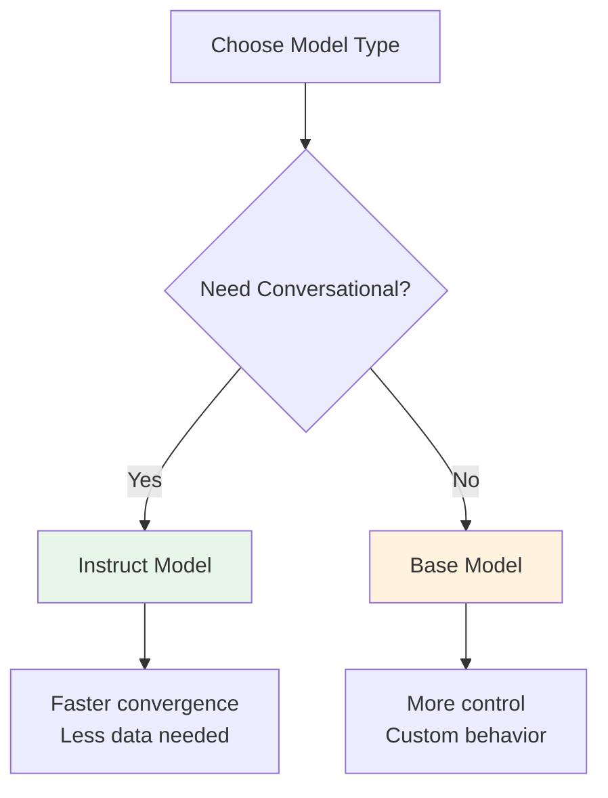
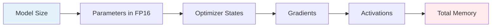
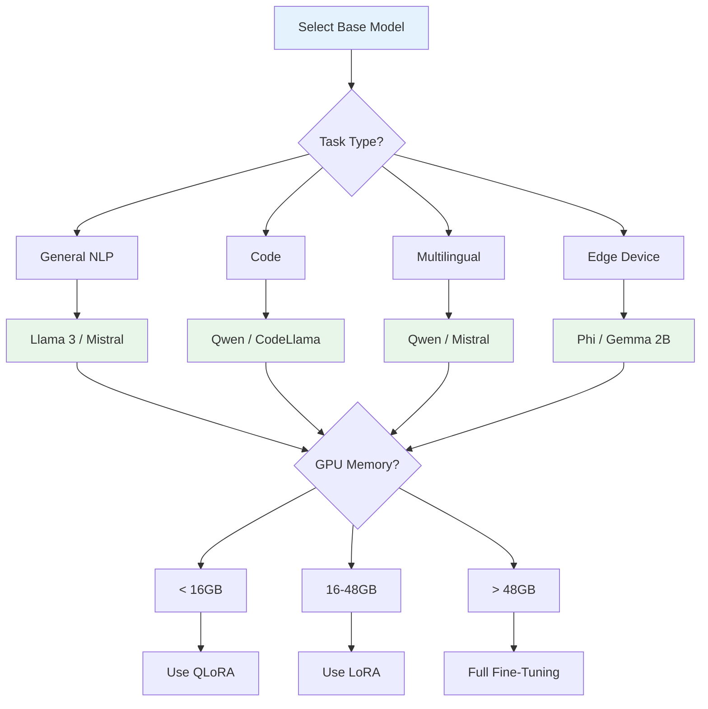

## Overview

Choosing the right base model is one of the most important decisions in LLM fine-tuning. The model you select determines the upper bound of quality, the computational requirements, and the types of tasks your fine-tuned model can perform well. This guide covers the key factors to consider when selecting a base model for fine-tuning.

## Base Models vs Instruct Models

### Base Models (Pre-trained Only)

Base models are trained only on the next-token prediction objective without any instruction tuning:

- **Training**: Massive text corpus (books, web, code)
- **Capability**: Text completion, not conversation
- **Fine-tuning**: Requires more data for instruction following
- **Examples**: Llama-3-base, Mistral-base, Qwen-base

### Instruct Models

Instruct models have already undergone supervised fine-tuning on instruction data:

- **Training**: Base model + SFT on instruction data
- **Capability**: Conversational, follows instructions
- **Fine-tuning**: Less data needed, better starting point
- **Examples**: Llama-3-Instruct, Mistral-Instruct, Qwen-Instruct

### When to Use Each

| Use Case | Recommended | Reason |
|----------|------------|--------|
| **Chatbot** | Instruct | Already conversational |
| **Classification** | Base | No need for conversation |
| **Domain adaptation** | Either | Depends on downstream task |
| **Creative writing** | Base | Less constrained |
| **Code generation** | Instruct (code) | Already understands code |

## Parameter Count Considerations

### Model Size vs Performance

Larger models generally perform better but require more resources:

| Size | Use Case | Fine-tuning Memory |
|------|----------|-------------------|
| **1B-3B** | Edge devices, fast inference | 4-8GB |
| **7B** | General tasks, consumer GPUs | 14-28GB |
| **13B** | Better quality, prosumer GPUs | 26-52GB |
| **30B+** | Best quality, professional GPUs | 60GB+ |
| **70B+** | State-of-the-art, multi-GPU | 140GB+ |

### The "Sweet Spot"

For most fine-tuning tasks, **7B-13B models** offer the best balance:

- **Quality**: Good enough for most applications
- **Speed**: Reasonable training and inference times
- **Cost**: Affordable on consumer hardware
- **Data efficiency**: Don't require massive datasets

## Memory Requirements

### Full Fine-Tuning Memory

Approximate memory requirements:

| Model | FP16 Weights | AdamW States | Total (Full FT) |
|-------|-------------|--------------|-----------------|
| 7B | 14GB | 28GB | ~42GB |
| 13B | 26GB | 52GB | ~78GB |
| 30B | 60GB | 120GB | ~180GB |
| 70B | 140GB | 280GB | ~420GB |

### Quantization Options

Quantization reduces memory requirements at the cost of some accuracy:

| Quantization | Memory Reduction | Typical Accuracy |
|-------------|------------------|-----------------|
| **FP16** | 1x (baseline) | 100% |
| **INT8** | 2x | ~99% |
| **INT4** | 4x | ~95-98% |
| **NF4** | 4x | ~97-99% |

## Popular Base Models

### Open-Weight Models

| Model | Size | License | Strengths |
|-------|------|---------|-----------|
| **Llama 3** | 8B, 70B | Llama 3 | Strong performance, large ecosystem |
| **Mistral** | 7B, 8x7B | Apache 2.0 | Efficient, good for instruction |
| **Qwen** | 7B, 14B, 72B | Various | Strong multilingual, code |
| **Gemma** | 2B, 7B, 27B | Gemma | Google's open models |
| **Phi** | 3B, 4B | MIT | Small, surprisingly capable |

### Proprietary Models

| Model | Access | Notes |
|-------|--------|-------|
| **GPT-4** | API only | Cannot fine-tune weights |
| **Claude** | API only | Cannot fine-tune weights |
| **Gemini** | API only | Limited fine-tuning |

## Choosing a Model: Decision Framework

### Key Questions

1. **What is your task?** Different models excel at different tasks
2. **How much data do you have?** Smaller models need less data
3. **What hardware do you have?** Determines maximum model size
4. **What latency requirements?** Smaller models are faster
5. **What license do you need?** Some models have commercial restrictions

## Quantization for Fine-Tuning

### When to Quantize

- **Limited GPU memory**: Essential for large models on consumer hardware
- **Rapid prototyping**: Faster iteration with lower memory
- **Production deployment**: Smaller models are cheaper to serve

### Quantization Methods

| Method | Description | Best For |
|--------|-------------|----------|
| **QLoRA** | 4-bit base + LoRA | Large models, limited memory |
| **GPTQ** | Post-training quantization | Inference optimization |
| **AWQ** | Activation-aware quantization | Best accuracy/performance |
| **GGUF** | llama.cpp format | CPU inference |

## Best Practices

1. **Start small**: Begin with 7B models, scale up if needed
2. **Use instruct models**: Faster convergence for conversational tasks
3. **Consider the ecosystem**: Community support, pre-trained adapters
4. **Test before committing**: Evaluate on a small dataset first
5. **Monitor license restrictions**: Some models have commercial limitations

## Resources

- **[Unsloth Model Selection Guide](https://docs.unsloth.ai/basics/what-model-should-i-use)**: "What model should I use?"
- **[HuggingFace Model Hub](https://huggingface.co/models)**: Browse available models
- **[LMSYS Chatbot Arena](https://chat.lmsys.org)**: Compare model performance
- **[Open LLM Leaderboard](https://huggingface.co/spaces/HuggingFaceH4/open_llm_leaderboard)**: Benchmark results

## Related

- [[Concepts/lora-qlora|lora-qlora]]
- [[Concepts/supervised-fine-tuning|supervised-fine-tuning]]
- [[Concepts/continued-pretraining|continued-pretraining]]
- [[Concepts/llm-architecture|llm-architecture]]
