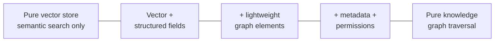

# Multi-Modal Context Composition

**Source:** [[Raw/sedaily-episode-1951-pinecone-nexus-2026]]
**Category:** Architecture Pattern
**Related:** [[Concepts/context-as-materialized-view]]

## Overview

A common mistake in agent architecture is to assume **one representation of knowledge fits all query patterns**. A pure vector index is great for semantic search ("find passages similar to this question") and terrible for exact lookup ("get customer 4711's open tickets"). A pure knowledge graph is great for traversal ("which products depend on component X") and terrible for fuzzy retrieval.

The **multi-modal context composition** pattern says: a single context object can (and usually should) carry **multiple representations of the same underlying knowledge**, each optimised for a different query pattern, plus the **metadata** and **permissions** that travel with the knowledge.

## The five components of a Nexus-style context

| Component | Purpose | Example |
|---|---|---|
| **Vector index** | Similarity search over unstructured content | Embeddings of all support tickets, with metadata |
| **Structured fields / schema** | Fixed schema for known entities | `customer_id`, `account_status`, `open_ticket_count` |
| **Knowledge graph elements** | Relationships between entities — "cheap version of knowledge graphs" | `customer → purchased → product`, `product → uses → component` |
| **Metadata** | Freshness, lineage, semantic-layer references | "Built from `tickets-prod` v2026-09-04; references semantic layer `biz_glossary.v3`" |
| **Permissions** | Access control at personal / department / company level | "Visible to: support-tier-1 agents and above" |

The same information may appear in **multiple modalities** — e.g. a customer record present both as a structured row (for `customer_id` lookups) and as an embedding (for "tell me about similar customers") and as a graph node (for "what other products has this customer touched"). The context object is the unifying container.

## The spectrum view: pure vector ↔ pure KG

The episode's framing: on one end of the spectrum sits a pure vector store; on the other end sits a pure knowledge graph; and everything in between is mixed.

The curator picks where on the spectrum this particular context lives, depending on the query patterns it must serve:

- **Customer support context** → heavy on vector (free-text tickets) + structured (customer fields) + light graph (customer ↔ product).
- **Code-assistant context** → heavy on vector (code chunks) + heavy graph (call graph, type graph) + structured (function signatures).
- **Financial reporting context** → heavy on structured (numbers must be exact) + light vector (notes and explanations) + light graph (entity relationships).

## What "cheap version of knowledge graphs" means

The episode calls the embedded graph elements a "cheap version of knowledge graphs" — explicitly positioning it **inside the context object** rather than as a separate system like [[Entities/arango]]. The reasoning:

- **Latency** — no separate query round-trip to a graph engine.
- **Lineage** — the graph is part of the versioned artifact; it changes when the context version changes.
- **Permissions** — graph elements inherit the context's access control, instead of needing their own.

The trade-off is scale: at some point, an embedded graph is too big to live inside a context, and you graduate to a real graph database alongside the context. The episode does not draw that line.

## Dynamic descriptions

Tool descriptions update with each context version. The agent doesn't just see "here is a context"; it sees "here is context v18, built 3 hours ago from `tickets-prod`, freshness: live, lineage: `git:abc123`, references semantic layer `biz_glossary.v3`". This metadata flows into the agent's tool-discovery and tool-selection step — it's what lets the agent decide whether to trust or skip a context.

## How it relates to context-as-materialized-view

These two patterns are complementary and almost always used together:

- **[[Concepts/context-as-materialized-view]]** answers "context is precomputed and versioned, not re-retrieved" — the *when* of context construction.
- **multi-modal context composition** answers "a context is composed of multiple representations, not a single one" — the *what* of context structure.

Together: precompute a versioned, multi-modal context once, serve it to agents many times.

## When to use

- Any agent context where query patterns are heterogeneous (semantic + exact + relational).
- Domains where the same entity needs to be findable both by similarity and by ID (customer records, products, support tickets, code symbols).
- Cases where freshness and lineage must travel with the data, so the agent can reason about whether to trust it.

## When *not* to use

- Single-query-pattern contexts (e.g. pure semantic-search document retrieval — just use a vector store).
- Cases where the corpus is so large and graph-shaped that an embedded graph is infeasible — query an external graph database instead.

## Source

[[Raw/sedaily-episode-1951-pinecone-nexus-2026]] — Software Engineering Daily Episode 1951, Jörg Schad (Pinecone VP Eng), transcript retrieved 2026-09-05.