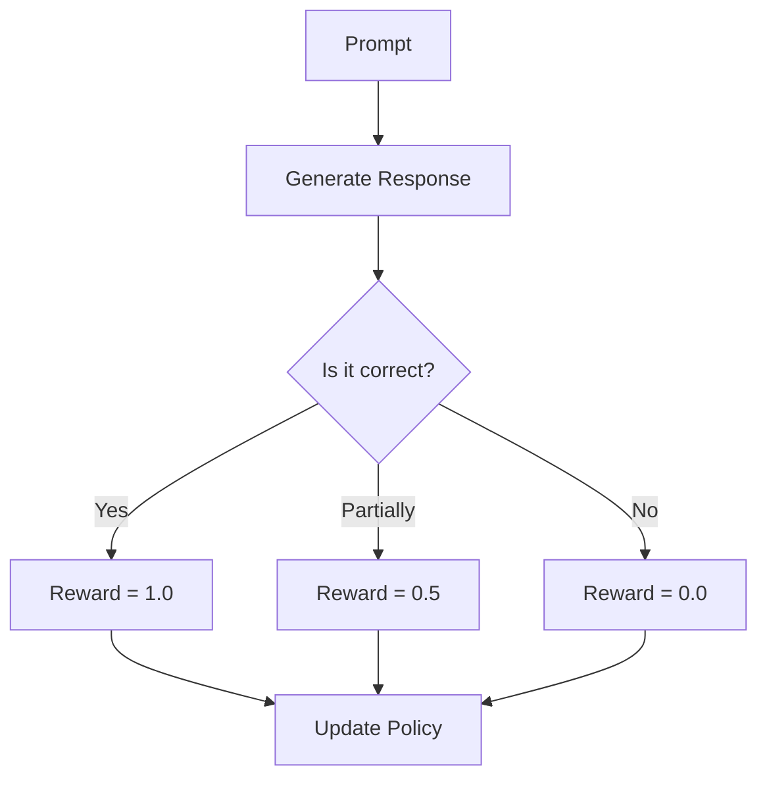

## Overview

**Reinforcement Learning (RL)** for Large Language Models moves beyond supervised fine-tuning by training models to optimize for human preferences, correctness, or other reward signals. Recent advances like **GRPO (Group Relative Policy Optimization)** and **RLVR (Reinforcement Learning with Verifiable Rewards)** have demonstrated that LLMs can achieve remarkable reasoning capabilities through RL alone.

## RL for LLMs: The Big Picture

Traditional LLM training follows a three-stage pipeline:

### Why RL?

- **SFT limitations**: Models learn to imitate patterns but don't optimize for quality
- **Preference alignment**: RL can align models with human values and preferences
- **Emergent reasoning**: RL can elicit reasoning capabilities not present in training data
- **Self-improvement**: Models can learn from their own generated outputs

## RLHF (Reinforcement Learning from Human Feedback)

### The Classic Pipeline

[RLHF](https://rlhfbook.com/) is the dominant paradigm for aligning LLMs with human preferences:

1. **Collect preference data**: Humans rank model outputs (A > B)
2. **Train a reward model**: Learn to predict human preferences
3. **Optimize policy with PPO**: Use PPO to maximize predicted reward

### PPO (Proximal Policy Optimization)

PPO is the standard RL algorithm for RLHF:

$$L^{PPO}(\\theta) = \\mathbb{E}_t \\left[ \\min(r_t(\\theta)\\hat{A}_t, \\text{clip}(r_t(\\theta), 1-\\epsilon, 1+\\epsilon)\\hat{A}_t) \\right]$$

Where $r_t(\\theta)$ is the probability ratio and $\\hat{A}_t$ is the advantage estimate.

### Limitations of RLHF

- **Expensive**: Requires human annotators for preference data
- **Reward hacking**: Models exploit weaknesses in the reward model
- **Brittle**: Sensitive to hyperparameters and training dynamics
- **Preference drift**: Reward models don't generalize well

## GRPO (Group Relative Policy Optimization)

GRPO, popularized by [DeepSeek R1](https://arxiv.org/abs/2501.12948), eliminates the need for a separate reward model by using group-based relative scoring.

### Core Idea

Instead of training a reward model, GRPO:

1. **Generates multiple responses** (a group) for each prompt
2. **Scores each response** using a rule-based or verifiable reward function
3. **Computes relative advantage** within the group
4. **Updates the policy** to favor higher-scoring responses

### Mathematical Formulation

$$\\mathcal{J}_{GRPO}(\\theta) = \\mathbb{E}_{q \\sim P(Q), \\{o_i\\}_{i=1}^G \\sim \\pi_{\\theta_{old}}(\\cdot|q)} \\left[ \\frac{1}{G} \\sum_{i=1}^{G} \\left( \\min\\left(\\frac{\\pi_\\theta(o_i|q)}{\\pi_{\\theta_{old}}(o_i|q)} A_i, \\text{clip}(\\cdot) A_i\\right) - \\beta \\mathbb{D}_{KL}[\\pi_\\theta \\| \\pi_{ref}] \\right) \\right]$$

Where:
- $G$ is the group size (typically 4-16)
- $A_i$ is the relative advantage computed from group scores
- $\\beta$ controls the KL divergence penalty

### Advantages of GRPO

| Aspect | RLHF/PPO | GRPO |
|--------|----------|------|
| **Reward Model** | Required | Not needed |
| **Data Cost** | High (human preferences) | Low (verifiable rewards) |
| **Scalability** | Limited by annotation | Highly scalable |
| **Reward Hacking** | Common | Reduced |
| **Training Stability** | Brittle | More stable |

## RLVR (Reinforcement Learning with Verifiable Rewards)

RLVR extends the GRPO approach by using verifiable reward functions instead of learned reward models.

### Types of Verifiable Rewards

1. **Exact Match**: For math problems, code generation
2. **Unit Tests**: Pass/fail on test cases
3. **Compiler Feedback**: Syntax errors, runtime errors
4. **Formal Verification**: Logical proofs, theorem proving

### DeepSeek R1 Results

The [DeepSeek R1 paper](https://arxiv.org/abs/2501.12948) demonstrated that RL alone can elicit strong reasoning:

- **R1-Zero**: Pure RL without any SFT data
- **Emergent chain-of-thought**: Model learns to think step-by-step
- **Self-verification**: Model checks its own work
- **Competitive with o1**: Matches OpenAI's o1 on many benchmarks

## Reward Functions and Verifiers

### Designing Good Reward Functions

### Common Reward Functions

| Domain | Reward Signal |
|--------|--------------|
| **Math** | Exact match, symbolic equivalence |
| **Code** | Unit test pass rate |
| **Reasoning** | Step correctness, logical consistency |
| **Safety** | Harmlessness score, refusal rate |

## Training Considerations

### Hyperparameters

- **KL penalty ($\\beta$)**: 0.01-0.1, prevents divergence from base model
- **Group size**: 4-16, larger groups provide better advantage estimates
- **Learning rate**: Typically lower than SFT ($1\\times10^{-6}$ to $5\\times10^{-6}$)
- **Training steps**: Often 100-500 steps sufficient

### Best Practices

1. **Start with a strong base model**: RL amplifies both good and bad behaviors
2. **Use verifiable rewards when possible**: More reliable than learned rewards
3. **Monitor for reward hacking**: Watch for degenerate strategies
4. **Combine with SFT**: RL after SFT typically works better than RL alone

## Key Resources

- **[RLHF Book](https://rlhfbook.com/)** by Nathan Lambert: Comprehensive guide to RL for LLMs
- **[DeepSeek R1 Paper](https://arxiv.org/abs/2501.12948)**: Demonstrates pure RL for reasoning
- **[Unsloth RL Guide](https://docs.unsloth.ai/basics/reinforcement-learning)**: Practical implementation guide
- **[PPO Paper](https://arxiv.org/abs/1707.06347)**: Original PPO algorithm

## Related

- [[supervised-fine-tuning|supervised-fine-tuning]]
- [[lora-qlora|lora-qlora]]
- [[dataset-creation-llm|dataset-creation-llm]]
