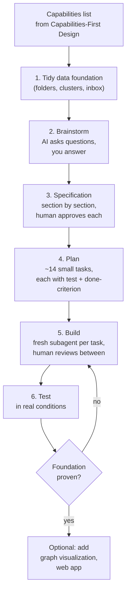

# Six-Step AI Build Process

**Source:** The Node AI — *My Second Brain* (https://m.youtube.com/watch?v=mHSOsy_usAg) ([[Raw/thenodeai-second-brain-architecture-2026-07-25]])
**Category:** Architecture Pattern
**Status:** Production-validated (sourced from the Superpowers skill for Claude Code)

---

## Overview

A six-step engineering workflow that forces both human and AI to do the thinking before the building. Step 1 has nothing to do with AI at all. Step 2 inverts the usual AI role (the AI asks, you answer). Step 3 produces a written contract. Step 4 turns the contract into a testable plan. Only Step 5 produces code. Step 6 validates it. The discipline is shipped as a reusable Claude Code skill called **Superpowers**.

## The six steps

## Step-by-step detail

### Step 1 — Tidy the data foundation (no AI required)

Before anything is built, restructure the existing data. For the Second Brain: a clear cluster structure, workflow folders for Inbox / Daily Notes / Templates, and topic clusters for Content / Business / Community / Personal / Knowledge. Every note has one and only one place.

> The best search in the world still just finds your chaos faster in a mess. And if a topic lives in five different places, no system in the world can build trust out of that. Order in the data is not a side step. It is the foundation on which everything else stands.

This step is the cheapest possible foundation. Use Claude Code to suggest the clusters, then decide what goes where yourself.

### Step 2 — Brainstorm (AI asks, you answer)

Invert the usual role. Do NOT say "build me a Second Brain". Instead, Claude Code asks you questions, one at a time: What is the purpose? What is the data basis? What must it be able to do? What must it explicitly NOT be able to do? At the end Claude Code proposes two or three approaches with pros and cons, and you decide. **This step produces zero code, not a single file.**

The most important decision in this step is the one that prevents scope creep: the system works on the complete existing workspace as it is. No migration. No new format. No "first let me move everything over".

### Step 3 — Specification (the contract)

Everything that was decided in brainstorming goes in writing into a specification document, section by section, with explicit human approval at each section. The specification is the contract. If a question of dispute comes up during building, what applies? Not your memory, not the AI's interpretation. What is written in the specification applies. May sound bureaucratic; saves exactly the discussion that otherwise costs hours.

From the first brainstorming question to the start of building took ~30 minutes. The process is not a bureaucratic drag; it is the turbo because everything runs more smoothly afterwards.

### Step 4 — Plan (tasks with tests and done-criteria)

From the spec, Claude Code breaks the work into small tasks. For the Second Brain there were 14 core tasks. Each task has two things:
- A test
- A binary completion criterion

Not "build the search", but "the search returns this file for this example question". Until then, the task is not done. The criteria make review mechanical and unambiguous.

### Step 5 — Build (fresh subagent per task)

For each task, deploy a fresh subagent: a separate Claude Code instance that gets exactly this one task plus the context it needs and nothing else. Then review the result. Only then does the next task start. The human role is to look at results, not read code: does the test run, does it do what the criterion says? The AI writes every single line; the human signs the whole thing off.

### Step 6 — Test (in real conditions)

What you don't test, you can very easily talk yourself into believing is fine. Run a practical comparison in the actual workflow before declaring the system done. (See [[Brain-First Search Ladder]] for the speed-test results from the Second Brain: 50% fewer tokens, 40% less time on 5/5 questions correct.)

## Where the discipline comes from

Steps 2-5 come from a finished skill package for Claude Code called **Superpowers**. A skill is a set of working instructions that you give Claude Code once and that then applies to every project. At its core, Superpowers does exactly one thing: it forces the AI into an engineering process. Claude Code is not allowed to just start writing code. It must first ask questions, write the decisions into a document, make a plan with small testable tasks, and only then build. At each transition you sit as the checkpoint. Without your approval it simply cannot move on.

Even if you use a different tool, the pattern stays transferable: **first decide, then put it in writing, then have it built in small steps.**

## Why four of six steps precede code

The biggest risk in AI projects is not bad code, it is the AI building the wrong thing at full speed, convincingly and completely off-target for hours. A process that puts 4/6 of the work before any code exists eliminates the chance to drift far from the target. Each step's output constrains the next step's range of motion.

## Key Insights

1. The process is the source of the result, not the AI capability. Same model, different process, very different outcome.
2. "Fresh subagent per task" prevents context pollution and makes each task's scope auditable.
3. The "done-criterion" is the single most important rule in the process. Without it, every step feels finished.
4. The brainstorming-to-build time of 30 minutes is real because the AI is doing most of the writing; the human only has to decide.
5. The skill is reusable. Install Superpowers once and every project starts with this discipline.

## Related Concepts

- [[Capabilities-First System Design]] — produces the input (capabilities list) that Step 2 reasons about
- [[Three Reference Roles]] — used during Step 2 (Brainstorming) to evaluate which external ideas to absorb
- [[Brain-First Search Ladder]] — output of this process for the Second Brain's Find capability
- [[Deterministic-First Architecture]] — Step 4 should bias task design toward deterministic code over AI

## References

- Raw Article: [[Raw/thenodeai-second-brain-architecture-2026-07-25]]
- Original: https://m.youtube.com/watch?v=mHSOsy_usAg
- Superpowers skill: linked in the video description
