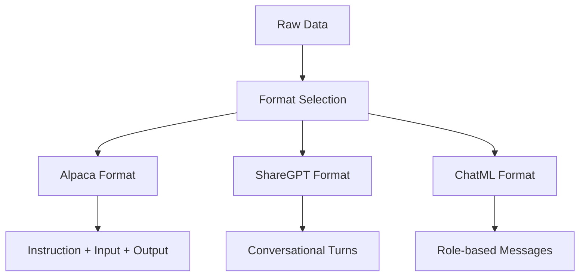
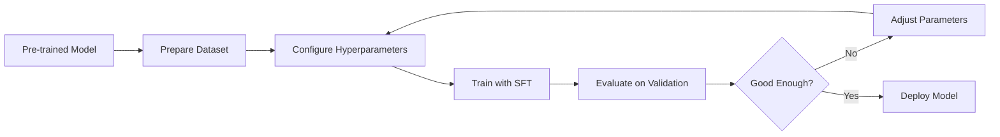

## Overview

**Supervised Fine-Tuning (SFT)** is the process of adapting a pre-trained language model to perform specific tasks by training it on labeled input-output pairs. It is the most common and straightforward approach to fine-tuning LLMs, forming the foundation for instruction-tuned models like ChatGPT, Claude, and Llama-Instruct.

## How SFT Works

SFT treats fine-tuning as a standard supervised learning problem:

1. **Start with a pre-trained base model** (e.g., Llama 3, Mistral, Qwen)
2. **Prepare a dataset** of (input, output) pairs formatted as conversations
3. **Train the model** to minimize the cross-entropy loss on the output tokens
4. **Evaluate** on held-out validation data

### Training Objective

Given an input sequence $x$ and target output $y$, SFT optimizes:

$$\\mathcal{L} = -\\sum_{t=1}^{T} \\log P(y_t | y_{<t}, x; \\theta)$$

Where only the target tokens $y_t$ contribute to the loss (not the input tokens).

## Dataset Requirements

### Data Format

Common formats include [Alpaca](https://github.com/tatsu-lab/stanford_alpaca), [ShareGPT](https://huggingface.co/datasets/anon8231489123/ShareGPT), and [ChatML](https://learn.microsoft.com/en-us/azure/ai-services/openai/how-to/chatgpt-markup-language):

### Quality Over Quantity

Research from [HuggingFace TRL documentation](https://huggingface.co/docs/trl/sft_trainer) and the [LIMA paper](https://arxiv.org/abs/2305.11206) shows that **data quality matters more than quantity**:

- **LIMA**: 1,000 carefully curated examples outperformed models trained on millions of lower-quality examples
- **Data diversity**: Cover the target task distribution broadly
- **Human-verified outputs**: Prefer human-written or carefully reviewed responses
- **Consistent formatting**: Uniform structure across all examples

### Dataset Size Guidelines

| Task Type | Typical Dataset Size |
|-----------|---------------------|
| Simple classification | 100-1,000 examples |
| Instruction following | 1,000-10,000 examples |
| Complex reasoning | 10,000-50,000 examples |
| Domain adaptation | 50,000-500,000 examples |

## Hyperparameters

### Learning Rate

The learning rate is the most critical hyperparameter for SFT:

- **Typical range**: $1\\times10^{-5}$ to $5\\times10^{-5}$
- **Rule of thumb**: Start with $2\\times10^{-5}$ for 7B models
- **Scale with model size**: Larger models need lower learning rates
- **Use cosine decay**: Start high, decay to near-zero

### Batch Size

- **Larger is generally better** for gradient stability
- **Typical sizes**: 32-128 (effective batch size)
- **Gradient accumulation**: Simulate larger batches when GPU memory is limited

### Epochs

- **Overfitting is common** in SFT
- **Typical range**: 1-3 epochs
- **Early stopping**: Monitor validation loss and stop when it plateaus
- **One epoch is often sufficient** for large, diverse datasets

### Warmup Steps

- **Purpose**: Stabilize early training
- **Typical**: 10% of total steps or 100-500 steps
- **Linear warmup**: Gradually increase LR from 0 to target

## Evaluation Metrics

### Automatic Metrics

| Metric | Description | Best For |
|--------|-------------|----------|
| **Perplexity** | $\\exp(-\\text{avg loss})$ | Overall model quality |
| **BLEU** | N-gram overlap with references | Translation, generation |
| **ROUGE** | Recall-oriented overlap | Summarization |
| **Exact Match** | String equality | QA, classification |

### Human Evaluation

- **Helpfulness**: Does the response address the user's need?
- **Honesty**: Is the information accurate and truthful?
- **Harmlessness**: Does the response avoid harmful content?

### Benchmark Suites

- **MT-Bench**: Multi-turn conversation quality
- **AlpacaEval**: Instruction-following evaluation
- **MMLU**: Massive Multitask Language Understanding

## Training Pipeline

## Common Pitfalls

1. **Overfitting**: Training too long on small datasets
2. **Catastrophic forgetting**: Losing general capabilities
3. **Format sensitivity**: Models become sensitive to prompt formatting
4. **Bias amplification**: Existing biases in training data get amplified

## Tools and Frameworks

- **[HuggingFace TRL](https://huggingface.co/docs/trl)**: Comprehensive SFT trainer with LoRA/QLoRA support
- **[Unsloth](https://unsloth.ai)**: 2-5x faster SFT training with memory optimization
- **[Axolotl](https://github.com/OpenAccess-AI-Collective/axolotl)**: YAML-configured fine-tuning
- **[Llama-Factory](https://github.com/hiyouga/llama-factory)**: Unified framework for LLM fine-tuning

## Related

- [[lora-qlora|lora-qlora]]
- [[reinforcement-learning-grpo|reinforcement-learning-grpo]]
- [[dataset-creation-llm|dataset-creation-llm]]
- [[continued-pretraining|continued-pretraining]]
