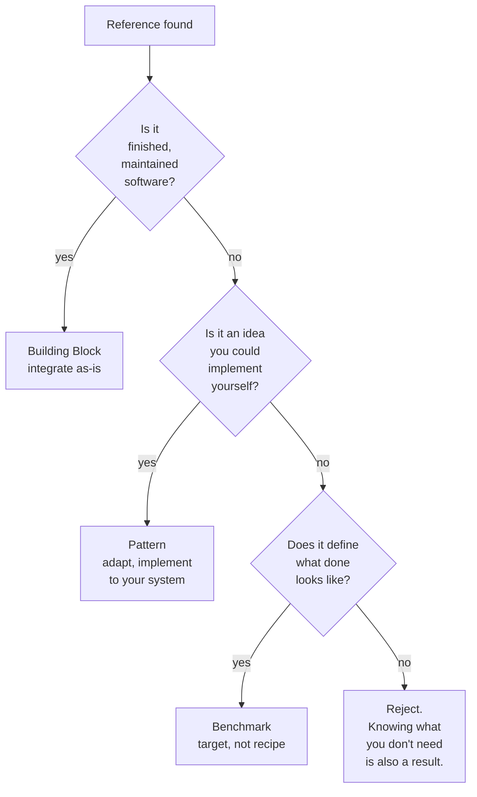

# Three Reference Roles

**Source:** The Node AI — *My Second Brain* (https://m.youtube.com/watch?v=mHSOsy_usAg) ([[Raw/thenodeai-second-brain-architecture-2026-07-25]])
**Category:** Architecture Pattern
**Status:** Production-validated

---

## Overview

A typology of external references that classifies them by what you actually take from them, not by what they are. The same reference can be evaluated against all three roles; usually exactly one applies. The three roles are **Building Block**, **Pattern**, and **Benchmark**. Knowing the role of each reference before you start prevents the most common AI-build failure: copying a foreign solution to a foreign problem and shipping a slightly worse version of someone else's tool.

## The three roles

| Role | What you take | Example in the Second Brain | Lesson |
|------|---------------|------------------------------|--------|
| **Building Block** | The finished, maintained software itself, integrated as-is | QMD — local hybrid search by Tobi Lütke (Shopify founder). Installed as a plugin, integrated, ready to use. | Don't build anything yourself that already exists as a maintained, finished piece. Every hour you don't put into your own search, you put into what makes your system special. |
| **Pattern** | An idea only, not a tool. You implement it yourself, fitting your system. | Karpathy's description of an AI-maintained knowledge wiki. The AI writes and updates Markdown pages, reads a small index first, runs check rules against contradictions and orphaned pages. A few paragraphs, not a program. | Patterns are the highest-leverage reference because they map to your system, not to the reference's context. |
| **Benchmark** | Neither code nor concept. A target definition of "done" — usually a visual. | Mockup images of the target look, generated with AI: separated knowledge worlds with distinct colors, clear hierarchy, hover-only connections. | "Make it nice" is a guessing game for the AI. "Here is what it looks like when it's done" is a job with a template. |

## The three questions

The Node AI's transferable rule: for every project of your own, ask:

1. **What do I take over ready-made?** (Building Block)
2. **Which patterns do I adapt?** (Pattern)
3. **What do I actually measure to decide whether the result is good enough?** (Benchmark)

The answers drive Step 2 (Brainstorming) of the [[Six-Step AI Build Process]] and constrain Step 4 (Plan).

## Reference evaluation decision tree

## Discarding is a research result

The most under-appreciated part of the typology: references you study and explicitly reject. The Node AI looked at two more projects (Gbrain and Graphify), took no code from either, but their pattern of "Markdown as the single source of truth, the graph is only a derived snapshot" secured one of the most important architecture decisions.

> Knowing what you don't need also gives you the confidence to stick with your own approach when things get difficult later on. Discarding is also a research result.

A research log should record not just what you took, but what you looked at and decided not to take, and why.

## How the roles play out across the four capabilities

| Capability | Likely role(s) |
|------------|----------------|
| Find | Building Block (QMD) + Pattern (hybrid search architecture) |
| Read | Building Block (Obsidian) + Benchmark (side-by-side UX mockup) |
| Stay clean | Pattern (Karpathy's AI-maintained wiki) + Benchmark (target conflict-detection rate) |
| Overview | Benchmark (graph mockup) + Building Block (graph rendering lib) |

Mixing roles is normal and expected; the discipline is in being explicit about which role each reference is playing.

## Key Insights

1. The role determines what to copy. Copying a Building Block's architecture, or a Benchmark's color scheme, is a mis-read of the role.
2. Patterns are the highest-leverage reference because they survive the reference's context, platform, and codebase.
3. A Benchmark can be as concrete as a screenshot. Verbal targets ("make it nicer") are useless to an AI.
4. Studying and rejecting a reference is a first-class research result; it must be logged.
5. The three questions (take over, adapt, measure) are a complete pre-build checklist.

## Related Concepts

- [[Six-Step AI Build Process]] — Step 2 (Brainstorming) is where the three questions are asked
- [[Capabilities-First System Design]] — the role of a reference depends on which capability it serves
- [[Visual Specification by Mockup]] — the Benchmark role, applied to UI/UX work
- [[AI-Curated Knowledge Wiki]] — the Pattern role, applied to capability 3 (Stay clean)

## References

- Raw Article: [[Raw/thenodeai-second-brain-architecture-2026-07-25]]
- Original: https://m.youtube.com/watch?v=mHSOsy_usAg
