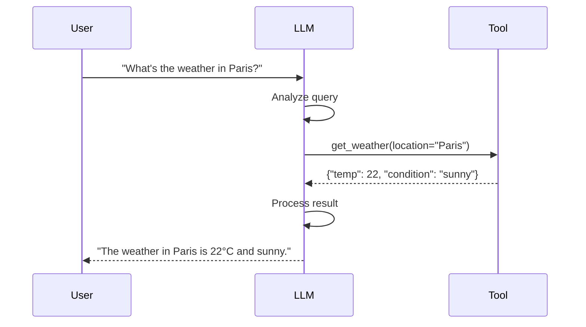
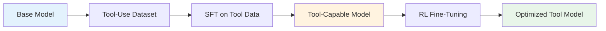
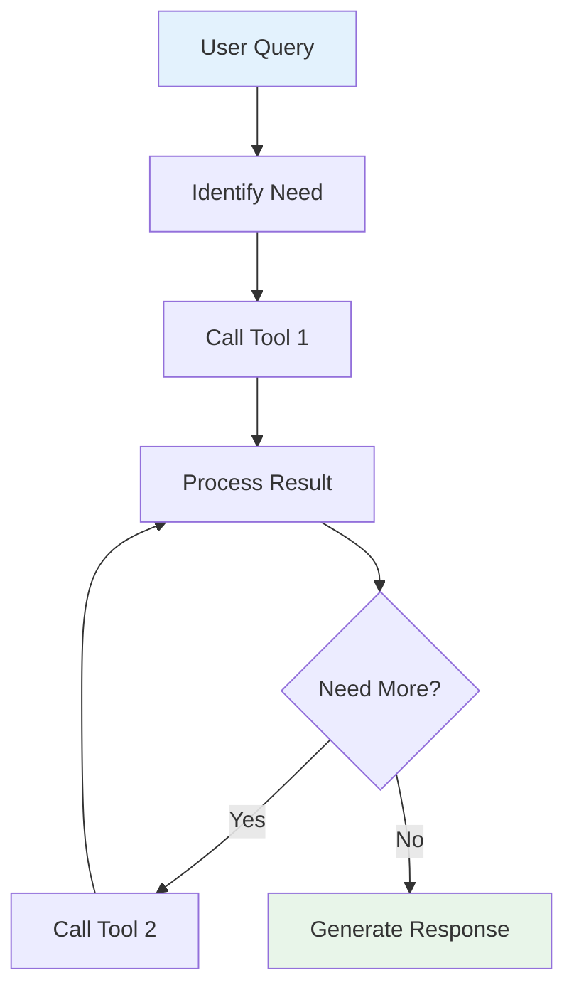
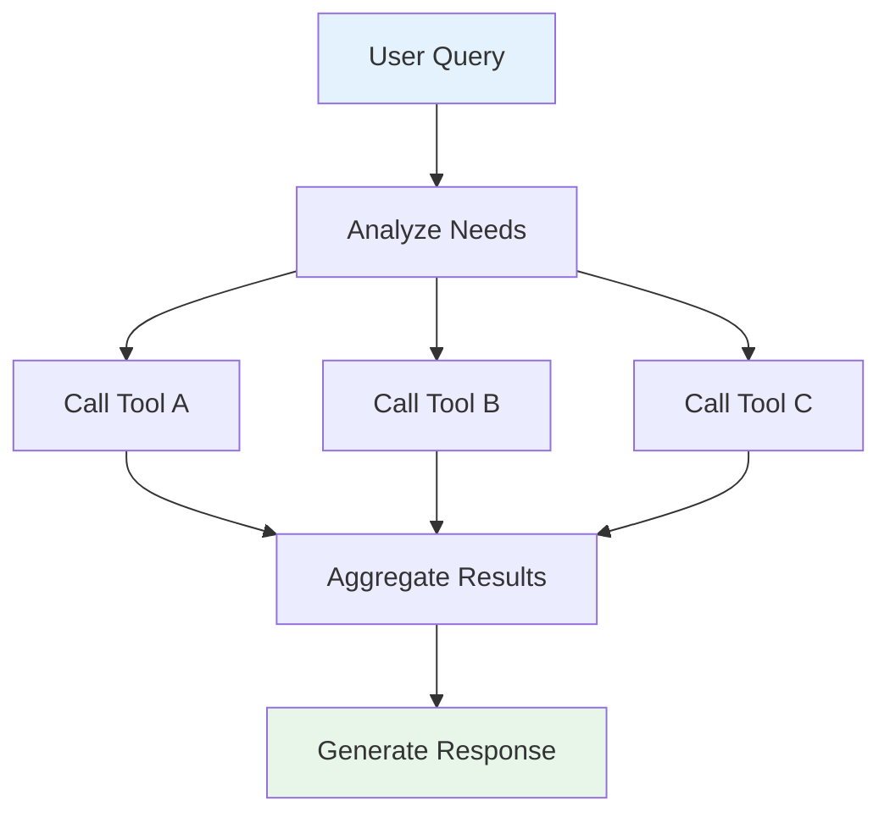

## Overview

**Tool calling** (also known as function calling) enables LLMs to interact with external systems, APIs, and tools. Instead of generating text in isolation, the model can request specific actions—like querying a database, calling an API, or running code—and incorporate the results into its response. This capability is fundamental to building agentic systems and extending LLM capabilities beyond text generation.

## What is Tool Calling?

Tool calling allows an LLM to:

1. **Recognize when a tool is needed** based on the user's query
2. **Generate structured parameters** for the tool invocation
3. **Receive the tool's output** and incorporate it into the response



## Function Calling Formats

### OpenAI Function Calling Spec

The [OpenAI function calling specification](https://platform.openai.com/docs/guides/function-calling) is the de facto standard:

```json
{
  "tools": [
    {
      "type": "function",
      "function": {
        "name": "get_weather",
        "description": "Get current weather for a location",
        "parameters": {
          "type": "object",
          "properties": {
            "location": {
              "type": "string",
              "description": "City and country"
            }
          },
          "required": ["location"]
        }
      }
    }
  ]
}
```

### JSON Mode

Some models support JSON mode for structured output:

```json
{
  "response": {
    "tool": "get_weather",
    "parameters": {
      "location": "Paris, France"
    }
  }
}
```

### Native Tool Formats

Different models use different native formats:

| Model | Format |
|-------|--------|
| **OpenAI** | JSON function schema |
| **Anthropic** | XML tool definitions |
| **Google** | Function declarations |
| **Llama** | Special tokens (e.g., `<|python_tag|>`) |
| **Qwen** | JSON with special tokens |

## Training Models for Tool Use

### Data Requirements

Training a model for tool calling requires:

1. **Tool definitions**: Descriptions of available tools and their parameters
2. **Conversation data**: Examples of when and how to call tools
3. **Tool outputs**: Results from tool executions
4. **Final responses**: How to incorporate tool results

### Training Approaches



### Key Training Considerations

- **Tool coverage**: Train on diverse tool types (APIs, databases, code execution)
- **Error handling**: Include examples of failed tool calls and recovery
- **Parameter validation**: Teach models to validate parameters before calling
- **Multi-tool sequences**: Chain multiple tool calls for complex tasks
- **Refusal training**: Teach when NOT to use tools (e.g., harmful requests)

## Model Requirements

### Capabilities Needed

For effective tool calling, models need:

1. **Structured output generation**: Produce valid JSON/XML
2. **Intent recognition**: Understand when tools are needed
3. **Parameter extraction**: Extract correct values from user input
4. **Context understanding**: Maintain context across tool calls
5. **Error handling**: Handle failed or unexpected tool outputs

### Model Size Considerations

| Size | Tool Calling Ability |
|------|---------------------|
| **< 7B** | Basic tool use, limited reliability |
| **7B-13B** | Good tool use with proper training |
| **> 30B** | Excellent tool use, complex multi-step reasoning |

## Tool Calling Patterns

### Single Tool Call

Simplest pattern: one tool, one response

### Multi-Tool Chaining

Complex workflows require chaining multiple tools:



### Parallel Tool Calls

Some queries require multiple independent tools:



## Best Practices

### Tool Design

1. **Clear descriptions**: Tools need explicit, detailed descriptions
2. **Specific parameters**: Avoid ambiguous parameter types
3. **Error handling**: Define expected error formats
4. **Rate limiting**: Handle API rate limits gracefully
5. **Timeouts**: Set reasonable timeouts for tool execution

### Training Data

1. **Diverse examples**: Cover many tool types and use cases
2. **Edge cases**: Include error conditions and recovery
3. **Negative examples**: Show when NOT to use tools
4. **Real-world data**: Use actual API responses when possible

### Evaluation

- **Tool selection accuracy**: Does the model choose the right tool?
- **Parameter accuracy**: Are parameters correctly extracted?
- **Success rate**: Do tool calls succeed?
- **Latency**: How long do multi-step workflows take?

## Tools and Resources

- **[Unsloth Tool Calling Guide](https://docs.unsloth.ai/basics/tool-calling)**: Practical guide for training models with tool capabilities
- **[OpenAI Function Calling Docs](https://platform.openai.com/docs/guides/function-calling)**: Official documentation
- **[LangChain](https://langchain.com)**: Framework for building tool-using applications
- **[Functionary](https://github.com/meetkai/functionary)**: Open-source models trained for function calling

## Related

- [[ai-agents|ai-agents]]
- [[reinforcement-learning-grpo|reinforcement-learning-grpo]]
- [[supervised-fine-tuning|supervised-fine-tuning]]
