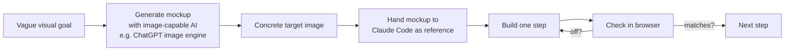

# Visual Specification by Mockup

**Source:** The Node AI — *My Second Brain* (https://m.youtube.com/watch?v=mHSOsy_usAg) ([[Raw/thenodeai-second-brain-architecture-2026-07-25]])
**Category:** Architecture Pattern
**Status:** Production-validated

---

## Overview

For any visual target in an AI-assisted build, generate a concrete image first and hand the image to the AI as the reference. Verbal descriptions ("denser, 3D, more depth, less glow") are a guessing game for the model. A mockup is a falsifiable target. The mockup is the third of the [[Three Reference Roles]] — the Benchmark — applied specifically to visual work.

## The failure mode

The Node AI's iteration loop, before he switched to mockups:

1. Describe in text: "Make it denser, 3D, more depth, less glow."
2. Claude Code delivers "but something off".
3. "No, do it like this and that."
4. Something else again.
5. Repeat until annoyed; the result still isn't right.

The cost is not just time, it is also that the AI's output is constrained by the vocabulary the human uses. If the human can't articulate the difference between "what I want" and "what I got", the AI has no signal to converge on.

## The fix

The mockup is one-shot generated in a separate conversation. From the resulting image, the human can extract specific properties (clusters spatially separated, connections only on hover, sphere size scales with content) and pass them as the reference, not as prose.

## The two-AI division of labour

The Node AI's setup:

- **ChatGPT image engine** — generates the mockup. Strong at producing a finished visual from a structured prompt.
- **Claude Code** — implements the mockup as a real running UI. Strong at recreating something specific from a reference.

Each AI is used for what it is best at. The output of one is the input of the other. The two-AI handoff is what makes the visual specification portable and reproducible: any image-generation model can stand in for ChatGPT, any coding model that accepts image references can stand in for Claude Code.

## Properties extracted from a single mockup

The Node AI's starting prompt, for context:

> "I need a graph view for my Second Brain. Up to ten main clusters, each with its own color. Clearly separated and visually higher quality than the Obsidian Graph."

The mockups that came back gave him, concretely:
- Spatially separated clusters (so contents don't mix)
- Hover-only connection visibility (so the graph isn't noisy)
- Sphere size proportional to content volume
- A ring structure option for a "system overview" view (Claude Code MD in the center, knowledge and project structure around it, external services outside)
- A detail-window-on-click UX (borrowed from his existing app)

Each of these properties is a falsifiable target. Each can be checked off in the browser.

## The "one step, one check" loop

The build loop after the mockup is in place:

1. Claude Code implements one step.
2. Human checks in the browser whether the result matches the target image.
3. Only after approval does the next step start.

The best example in the video is the "layers view". One mockup from the ChatGPT history, one implementation step, one browser check, approval, done. Total time: a few minutes for the view that the AI had previously failed to produce after many text iterations.

## Generalising beyond visuals

The discipline generalises. For any "X" target in an AI build:

| Target | "Image" version |
|--------|-----------------|
| Visual look | Mockup image (this concept) |
| Token budget per query | Numeric cap stated in the spec |
| Conflict-detection rate | Target metric stated in the spec |
| Latency | SLO stated in the spec |
| Coverage of capability tests | Concrete test cases with expected outputs |

The rule: "Make it X" is a guess. "Here is what X looks like" is a job with a template. The mockup is the most concrete form of "here is what X looks like", and it is the one that produces the biggest speedup for the least effort.

## Key Insights

1. Verbal descriptions of visual targets are a guessing game; the AI has no signal to converge on.
2. Generate the mockup in a separate conversation with an image-capable model, then hand the image to the implementation model.
3. The mockup is the Benchmark role of a reference; it is what "done" looks like.
4. The build loop after the mockup is "one step, one check, one approval". No big-bang "build the whole thing".
5. The discipline generalises to any target: a "concrete image" can be a number, a test case, or a behavioural spec.

## Related Concepts

- [[Three Reference Roles]] — the mockup is the Benchmark
- [[Six-Step AI Build Process]] — Step 3 (Specification) should include the mockup, not just text
- [[Deterministic-First Architecture]] — a concrete target is easier to evaluate deterministically

## References

- Raw Article: [[Raw/thenodeai-second-brain-architecture-2026-07-25]]
- Original: https://m.youtube.com/watch?v=mHSOsy_usAg
