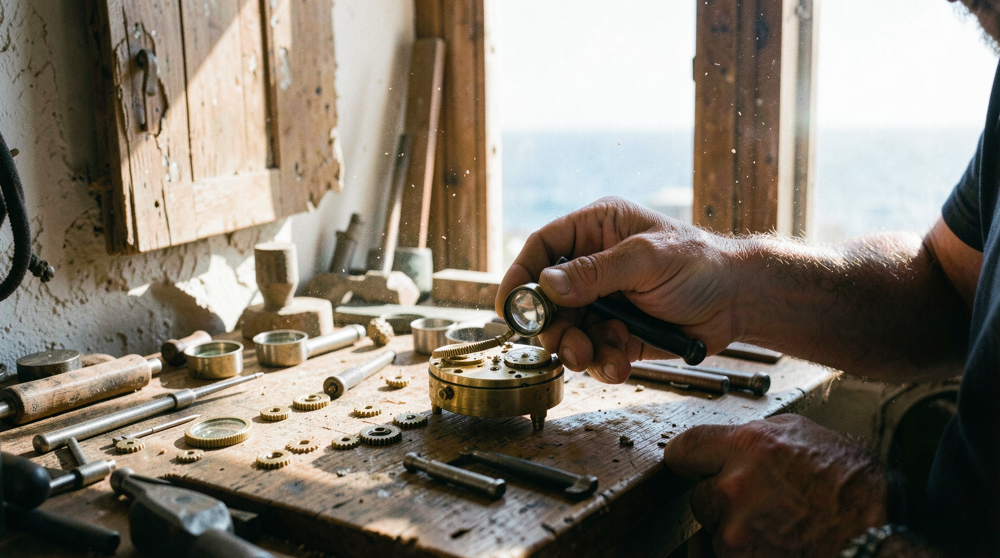

# ArtisanWorkshop

## artisanworkshop_00053

**Prompt:** A cinematic, ultra-realistic 35mm film still of a secluded, sun-drenched coastal workshop in the Mediterranean. An elderly clockmaker is meticulously crafting a delicate mechanical marine chronometer on a cluttered oak workbench. Through the large open doorway, a shimmering azure sea meets a bright, cloudless sky. Dust motes dance in the warm, golden afternoon sunlight filtering through the space. Tactile textures of worn brass, aged wood, weathered skin, and salty air. Sharp focus on the clockwork components, soft depth-of-field, authentic vintage film grain, high-quality optical glass rendering, warm ambient color palette.

---

## artisanworkshop_00054

**Prompt:** A cinematic, ultra-realistic 35mm film still of a secluded, sun-drenched coastal workshop in the Mediterranean. An elderly clockmaker is meticulously crafting a delicate mechanical marine chronometer on a cluttered oak workbench. Through the large open doorway, a shimmering azure sea meets a bright, cloudless sky. Dust motes dance in the warm, golden afternoon sunlight filtering through the space. Tactile textures of worn brass, aged wood, weathered skin, and salty air. Sharp focus on the clockwork components, soft depth-of-field, authentic vintage film grain, high-quality optical glass rendering, warm ambient color palette.

---

## artisanworkshop_00055

**Prompt:** An authentic, candid 35mm film photograph of a dusty, sun-drenched artisan watchmaker's workshop in Greece. An aged man with weathered, detailed hands uses a tiny loupe to inspect the movement of a brass marine chronometer on a solid oak workbench. The workspace is cluttered with specialized steel tools, magnifying lenses, and small, scattered cogwheels, showing realistic, un-perfect wear and tear. Sunlight streams through a textured, unevenly painted wooden doorway, casting soft, hazy shadows across the room and highlighting dancing dust particles in the air. Outside, the Mediterranean sea is visible as a blurry, bright, azure streak. Captured with a vintage 50mm f/1.8 lens; slight natural film grain, authentic color temperature shift of early afternoon light, no unnatural smoothing, physical textures, and organic light falloff.

---

## artisanworkshop_00056

**Prompt:** An authentic, candid 35mm film photograph of a dusty, sun-drenched artisan watchmaker's workshop in Greece. An aged man with weathered, detailed hands uses a tiny loupe to inspect the movement of a brass marine chronometer on a solid oak workbench. The workspace is cluttered with specialized steel tools, magnifying lenses, and small, scattered cogwheels, showing realistic, un-perfect wear and tear. Sunlight streams through a textured, unevenly painted wooden doorway, casting soft, hazy shadows across the room and highlighting dancing dust particles in the air. Outside, the Mediterranean sea is visible as a blurry, bright, azure streak. Captured with a vintage 50mm f/1.8 lens; slight natural film grain, authentic color temperature shift of early afternoon light, no unnatural smoothing, physical textures, and organic light falloff.

---

