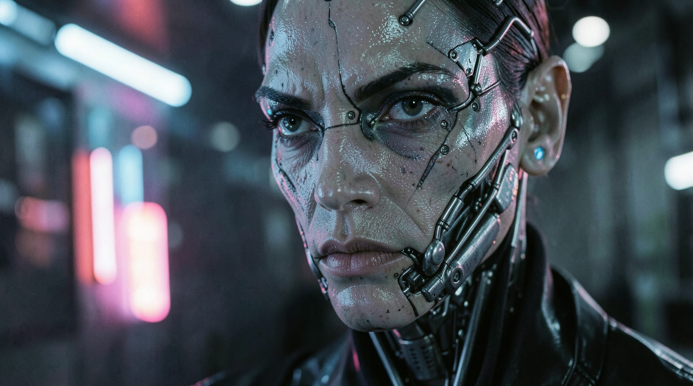
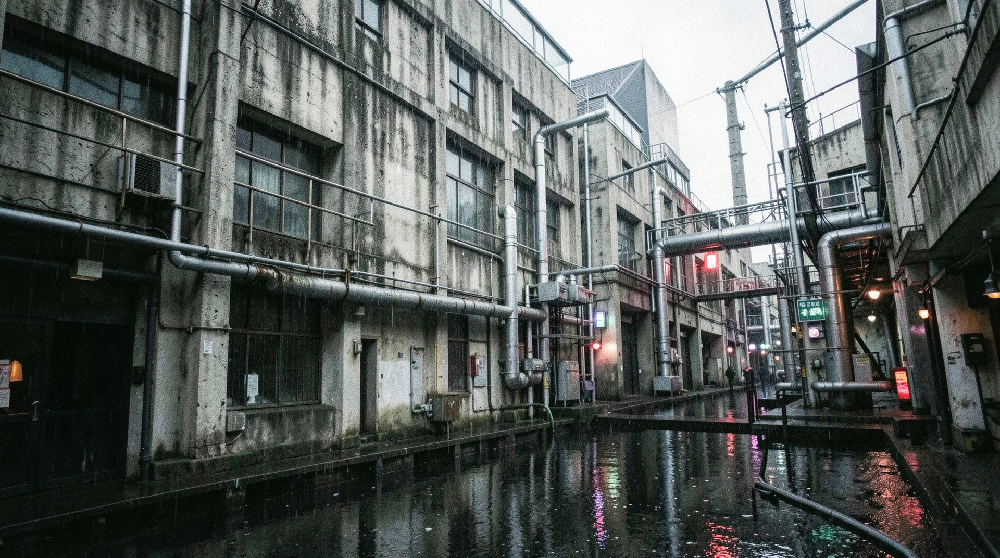
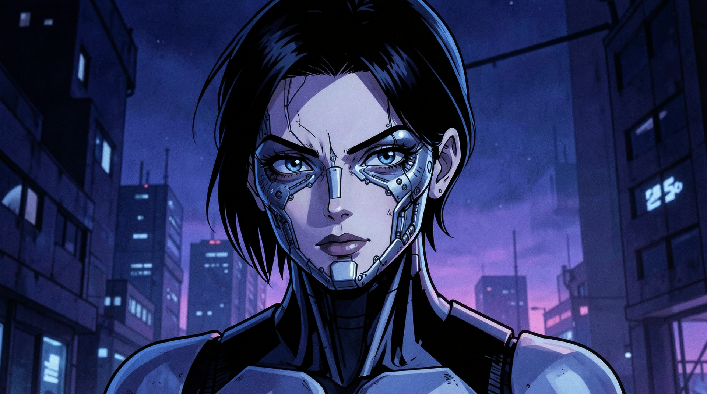
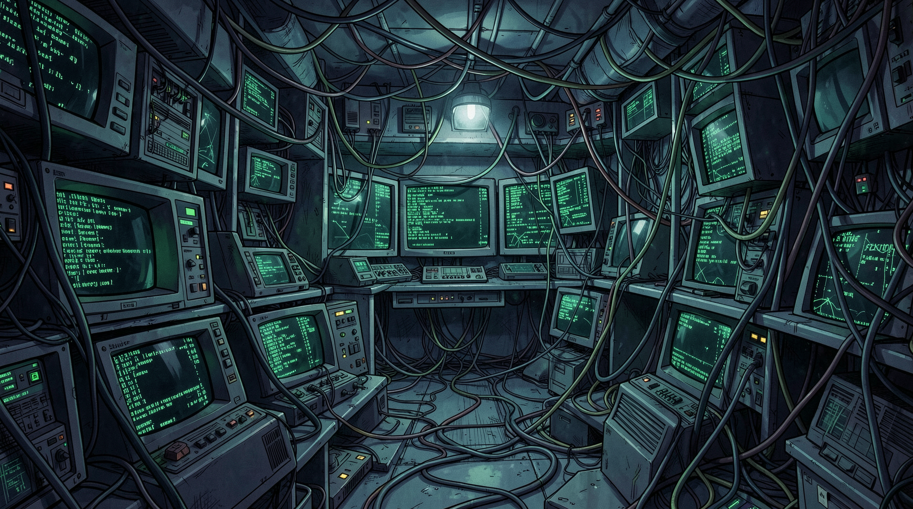

# GITSAnime

## gitsanime_00105

**Prompt:** A wide-angle 35mm film shot of a rainy neon-drenched city in the style of 1995 Ghost in the Shell. Detailed mechanical street-level structures, dark blue and vibrant purple night light, complex wiring and conduit textures. High fidelity, cinematic lighting, authentic film grain, no digital smoothing.

---

## gitsanime_00106

**Prompt:** Close-up portrait of a cybernetic character in the style of Ghost in the Shell. Intricate facial mechanical details, synthetic skin textures, soft atmospheric neon light reflecting on surfaces. Introspective mood, high fidelity, 35mm film aesthetic, focus on mechanical realism.

---

## gitsanime_00107

**Prompt:** A candid street-level shot of a canal-side warehouse district in the style of 1995 Ghost in the Shell. Weathered brutalist concrete, dense pipes and mechanical infrastructure, rain-slicked surfaces, desaturated color palette with intense neon pops. Authentic film grain, high detail.

---

## gitsanime_00108

**Prompt:** 1995 Ghost in the Shell anime style, rainy night in a futuristic cyberpunk city, neon signs reflecting on wet asphalt, intricate mechanical buildings, moody atmosphere, cel-shaded with high-quality painted backgrounds, iconic 90s anime aesthetic.

---

## gitsanime_00109

**Prompt:** 1995 Ghost in the Shell anime style, portrait of a cyborg woman with intricate mechanical facial details, deep blue and purple night lighting, clean lines, high-contrast, iconic 90s anime aesthetic, artistic background.

---

## gitsanime_00110

**Prompt:** 1995 Ghost in the Shell anime style, a quiet canal-side warehouse district, rusted pipes and dense machinery, muted color palette with brilliant neon lights, highly detailed hand-painted background style, cinematic composition.

---

## gitsanime_00111

**Prompt:** 1995 Ghost in the Shell anime style, a high-tech hacker den filled with obsolete monitors and tangled fiber-optic cables, dark room with glowing green code on screens, iconic 90s anime aesthetic, hand-painted background style.

---

## gitsanime_00113

**Prompt:** 1995 Ghost in the Shell anime style, interior of a crowded futuristic transport ship, commuters in trench coats, soft overhead fluorescent lighting, detailed mechanical seating, high-quality cel-shaded anime style.

---

## gitsanime_00114

**Prompt:** 1995 Ghost in the Shell anime style, exterior view of a massive corporate arcology structure piercing the clouds, sun setting behind it, intricate structural designs, hand-painted atmosphere, artistic 90s anime aesthetic.

---

