# Nature

## Flux2 Klein 00128

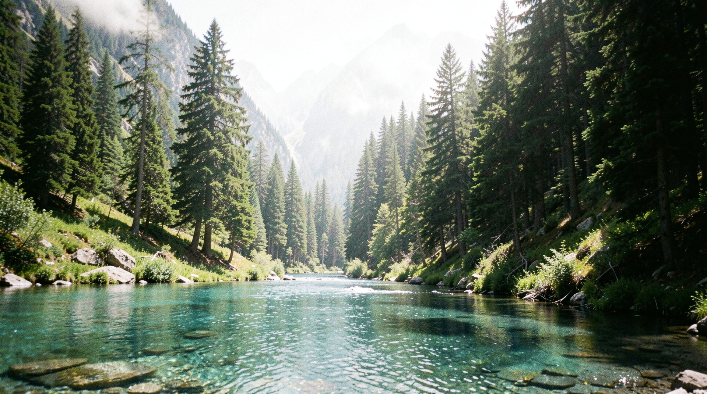

**Prompt:** A candid 35mm photograph of a lush alpine valley with pristine clear water in the foreground and towering pine trees. Natural daylight with soft lens softness at the periphery. Authentic film grain, subtle atmospheric haze.

---

## Alpine Valley

**Prompt:** A candid 35mm photograph of a lush alpine valley with pristine clear water in the foreground and towering pine trees. Natural daylight with soft lens softness at the periphery. Authentic film grain, subtle atmospheric haze.

---

## Dawn Mist Forest

**Prompt:** A candid 35mm photograph of an ancient temperate rainforest at dawn, thick morning mist weaving between towering cedar and douglas fir trunks. Diffuse flat daylight filtering through canopy gaps, moss-covered fallen logs in foreground. Subtle lens vignetting, authentic fine film grain (ISO 100), cool color temperature.

---

## Golden Hour Desert

**Prompt:** A candid 35mm photograph of a vast desert basin at golden hour, long shadows stretching across rippled sand dunes. Warm directional sunlight creating dramatic texture on sand ridges, sparse creosote bushes catching the light. Lens flare artifacts, chromatic aberration at edges, authentic film grain (ISO 200), warm color science.

---

## Large Format Glacier

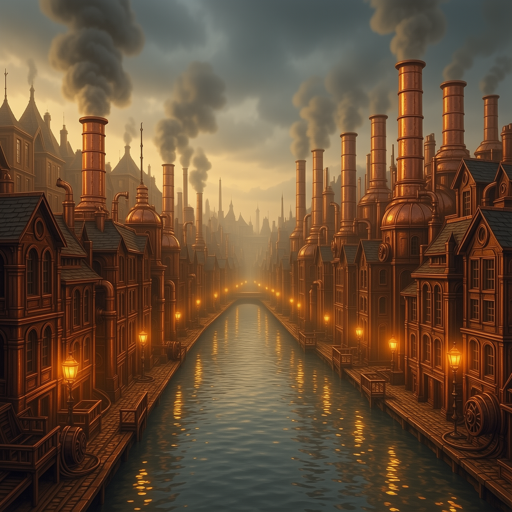

**Prompt:** An 8x10 large format photograph (Sinar P2, 300mm f/5.6 Schneider) of a tidewater glacier calving into fjord, massive ice blocks suspended mid-air. Kodak Ektar 100, f/32, 1/8s, Scheimpflug tilt for infinite depth of field. Extreme resolution capturing individual ice crystals, cyan glacial ice translucency, zero lens distortion, contact-print tonal gradation.

---

## Macro Dew Web

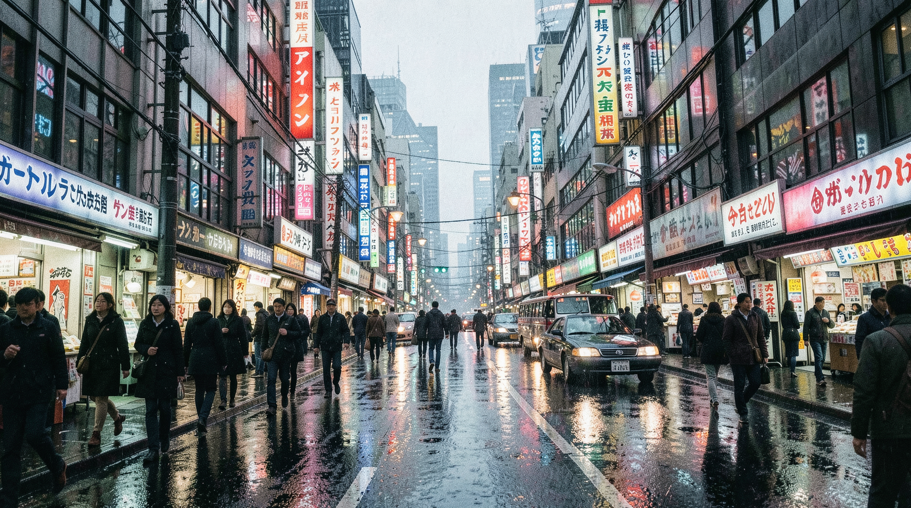

**Prompt:** A 5:1 macro photograph (Canon MP-E 65mm f/2.8, full-frame) of a single dew-laden spider silk strand at sunrise, each droplet acting as a miniature lens refracting the background forest. Fujichrome Provia 100F, ring flash at 1/4 power, f/11, focus-stacked 12 frames. Razor-thin plane of focus, spherical aberration bokeh balls, interference colors in water droplets, zero diffraction softening.

---

## Medium Format Wetlands

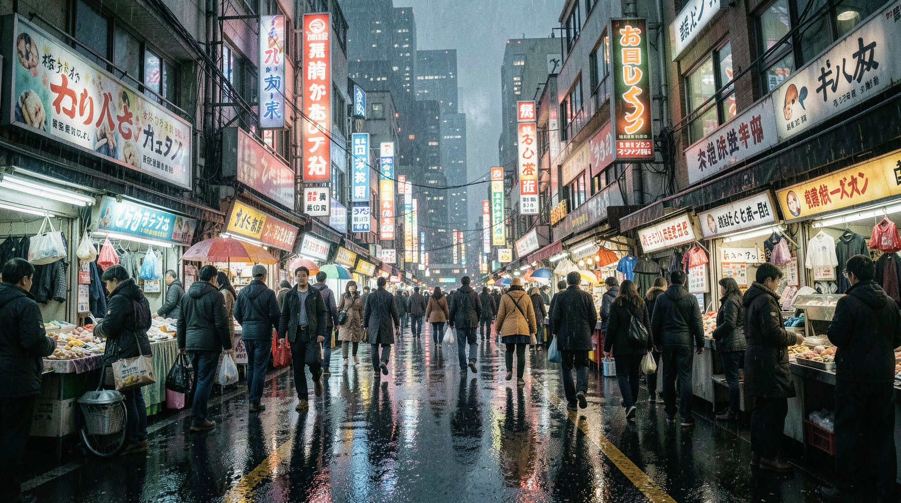

**Prompt:** A 6x7 medium format photograph (Pentax 67, 90mm f/2.8) of a pristine wetland at blue hour, still water mirroring silhouetted cattails and distant treeline. Fujifilm Velvia 50 slide film, tripod-mounted, 4-second exposure. Deep saturated greens and blues, negligible grain, exceptional corner-to-corner sharpness, subtle graduated ND filter transition at horizon.

---

## Night Starry Mountains

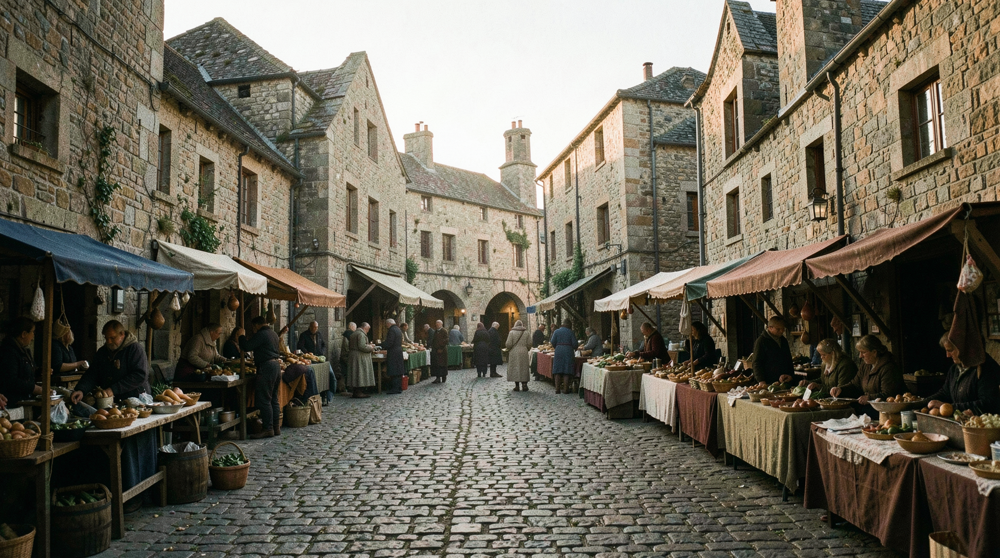

**Prompt:** A candid 35mm photograph of high alpine peaks under pristine night sky, Milky Way arching overhead with dense starfields. Snow-capped summits illuminated only by starlight and faint airglow, dark pine silhouettes at treeline. Natural vignetting, soft lens aberrations at periphery, authentic fine film grain pushed to ISO 1600, deep cyan-blue color science.

---

## Stormy Coast

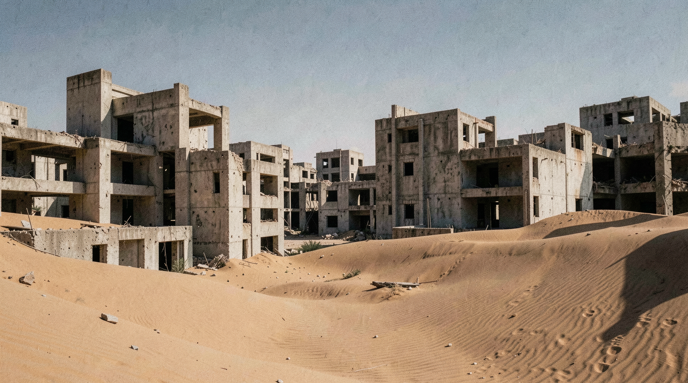

**Prompt:** A candid 35mm photograph of a rugged coastal cliff during an approaching storm, dark bruised clouds boiling over churning slate-gray ocean. Wind-whipped spray catching diffused light, wet basalt rocks glistening in foreground. Heavy atmospheric haze, moisture on lens elements, authentic coarse film grain (ISO 400), desaturated moody palette.

---

## Ultrawide Volcanic Vent

**Prompt:** A candid 14mm f/2.8 ultra-wide photograph (full-frame, Nikon Z 14-24mm) of an active volcanic fumarole field at twilight, steam plumes glowing with sulfur yellow against deep indigo sky. ISO 3200, 15s, foreground basalt texture exaggerated by perspective distortion. Chromatic aberration at extreme corners, coma on star points, authentic high-ISO luminance noise.

---

## Fall 00001

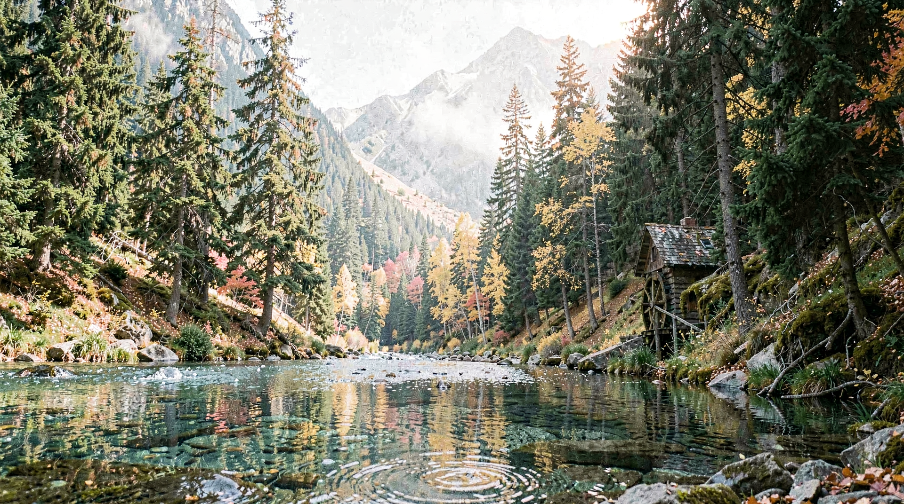

**Prompt:** A candid 35mm photograph of an alpine watermill at autumn, gold and red forest canopy, moody overcast sky, fallen leaves around the mill. Authentic fine film grain, cool color temperature.

---

## Img2Img 00001

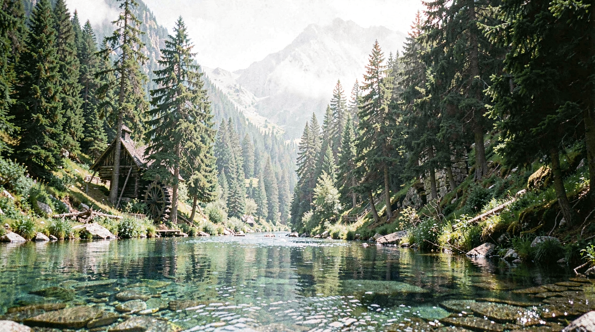

**Prompt:** A candid 35mm photograph of an alpine watermill in a serene landscape. Base reference image used for seasonal variations. Natural light, film grain.

---

## Spring 00001

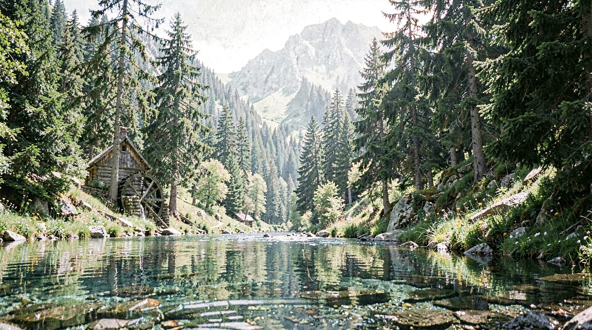

**Prompt:** A candid 35mm photograph of an alpine watermill at spring, fresh green meadow with blooming wildflowers in the foreground. Soft natural daylight, pristine clear stream, subtle atmospheric haze, film grain.

---

## Summer 00001

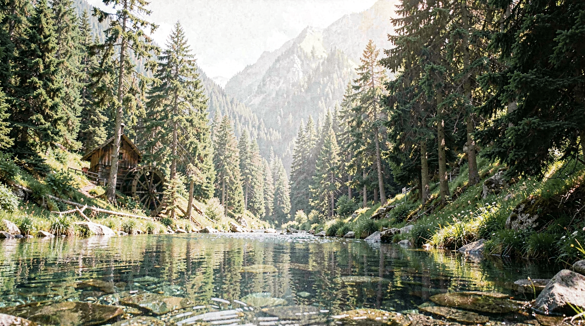

**Prompt:** A candid 35mm photograph of an alpine watermill at summer, vibrant lush greenery, high mountain sun with dramatic shadows, clear blue sky. Authentic film grain, crisp details.

---

## Winter 00001

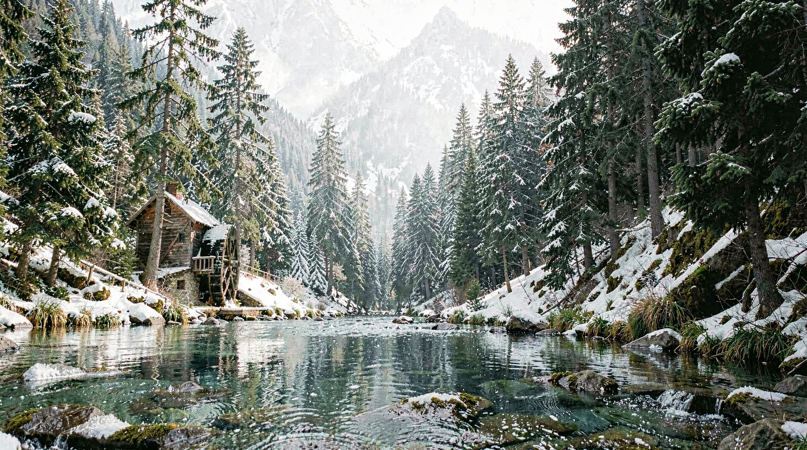

**Prompt:** A candid 35mm photograph of an alpine watermill in winter, heavy snow cover on roofs and surrounding pines, soft diffused winter light. Authentic film grain, subtle blue-tinted shadows.

---

## Technical Configuration

- **Workflow File:** `api/Flux.2Klein4B_T2I.json`
- **Model (UNET):** `flux-2-klein-4b.safetensors`
- **Model (CLIP):** `qwen_3_4b.safetensors` (Flux 2 type)
- **Model (VAE):** `flux2-vae.safetensors`
- **Architecture:** Flux.2 Klein 4B distilled
- **Sampler:** `euler`
- **Scheduler:** `Flux2Scheduler`
- **Steps:** 4 (fixed)
- **Resolution:** 1920×1080 (4B variant) or 1024×1024 (9B variant)
- **CFG Scale:** 1
- **Prompt Injection:** Node `76` (PrimitiveStringMultiline)
- **Tokyo Method:** Applied via photographic prompts focusing on 35mm candid composition, lens softness, and authentic film grain constraints.
