# Nature

## Nature Scenery 00130
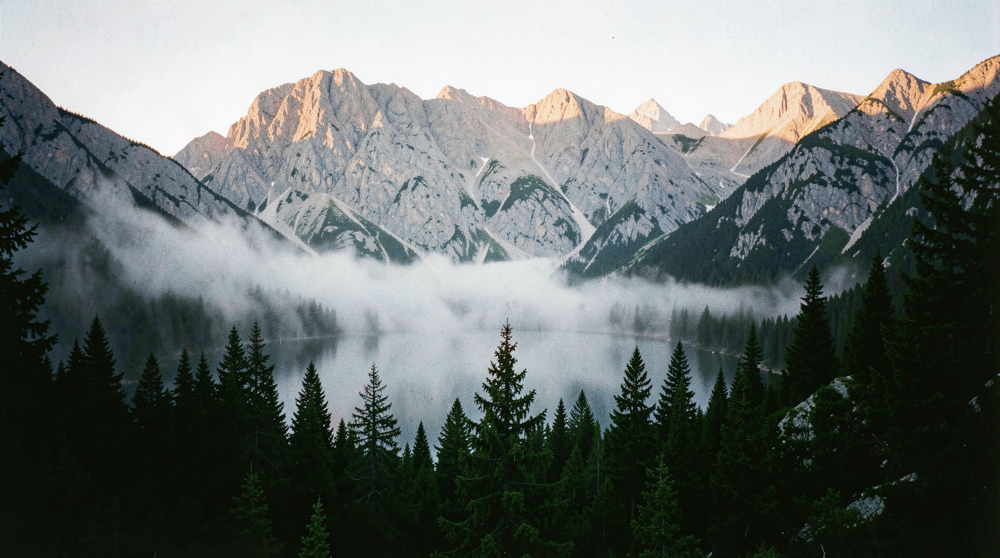
**Prompt:** A serene, high-altitude alpine landscape, jagged mountain peaks, calm reflective lake, low-hanging mist, golden hour light, high contrast, 35mm film aesthetic, tactile grain.

---

## Nature Scenery 00129
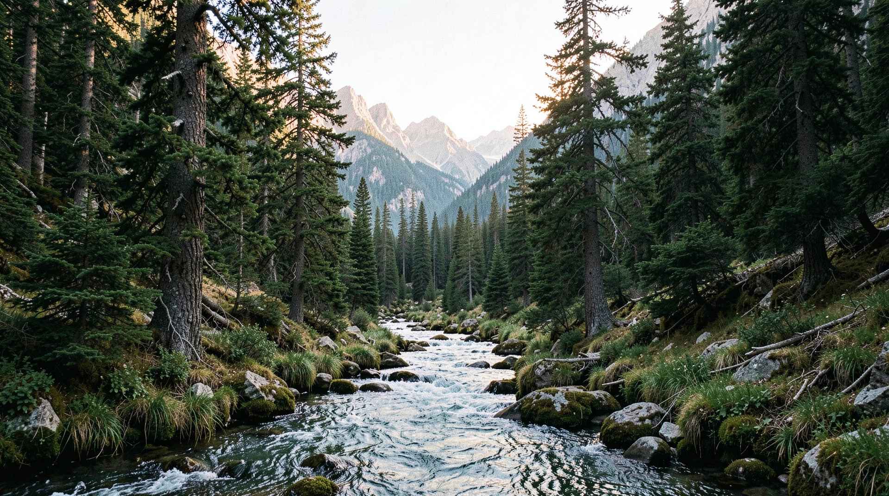
**Prompt:** hyper-realistic raw majestic alpine valley at dawn, pristine mountain stream, ancient pine trees, soft natural morning light, authentic 35mm film grain, high detail, optical lens falloff, raw tactile texture

---

## Flux2 Klein 00128

**Prompt:** A candid 35mm photograph of a lush alpine valley with pristine clear water in the foreground and towering pine trees. Natural daylight with soft lens softness at the periphery. Authentic film grain, subtle atmospheric haze.

---

## Pine Forest Twilight

**Prompt:** hyper-realistic raw dense ancient pine forest at twilight, dappled moonlight through mist, authentic film grain, high detail, optical lens falloff, raw tactile texture

---

## Arctic Glacier
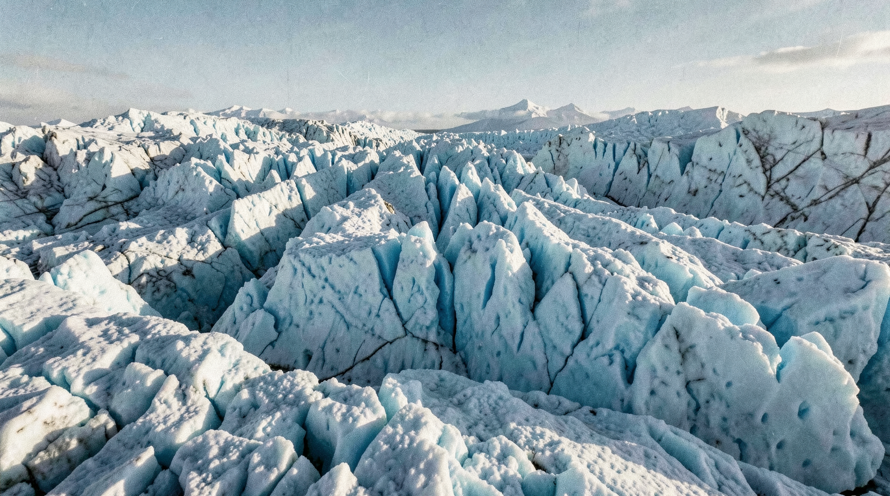
**Prompt:** hyper-realistic raw desolate jagged arctic glacier landscape, blue ice textures, sharp morning light, authentic film grain, high detail, raw tactile texture

---

## Stormy Coastal Cliff

**Prompt:** hyper-realistic raw sun-drenched coastal cliff overlooking a stormy ocean, salty mist, dramatic lighting, authentic film grain, high detail, raw tactile texture

---

## Abandoned Desert City

**Prompt:** hyper-realistic raw abandoned desert city, weathered brutalist concrete structures, shifting sands, harsh midday sun, authentic film grain, high detail, raw tactile texture

---

## Fall 00001

**Prompt:** A candid 35mm photograph of an alpine watermill at autumn, gold and red forest canopy, moody overcast sky, fallen leaves around the mill. Authentic fine film grain, cool color temperature.

---

## Img2Img 00001

**Prompt:** A candid 35mm photograph of an alpine watermill in a serene landscape. Base reference image used for seasonal variations. Natural light, film grain.

---

## Spring 00001

**Prompt:** A candid 35mm photograph of an alpine watermill at spring, fresh green meadow with blooming wildflowers in the foreground. Soft natural daylight, pristine clear stream, subtle atmospheric haze, film grain.

---

## Summer 00001

**Prompt:** A candid 35mm photograph of an alpine watermill at summer, vibrant lush greenery, high mountain sun with dramatic shadows, clear blue sky. Authentic film grain, crisp details.

---

## Winter 00001

**Prompt:** A candid 35mm photograph of an alpine watermill in winter, heavy snow cover on roofs and surrounding pines, soft diffused winter light. Authentic film grain, subtle blue-tinted shadows.

---

## flux2_klein_00103_

**Prompt:** A massive stone head floating in the middle of a calm desert ocean, surrealist art, minimalist horizon, deep blue sky, artistic masterpiece.

---

## flux2_klein_00083_
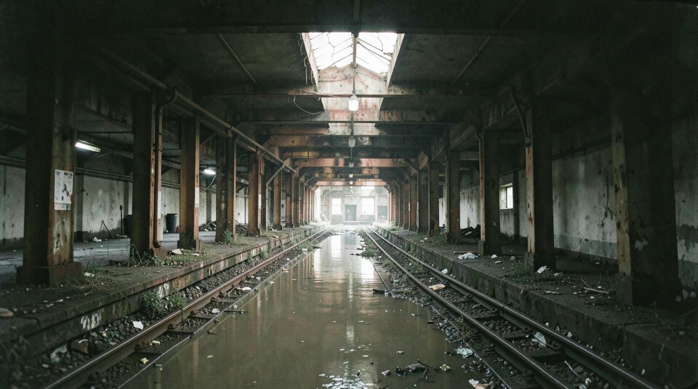
**Prompt:** A 35mm film photograph of a deserted, derelict subway station. Flooded tracks reflect rusted structural beams. Faint, natural light filters from a single cracked skylight above. Muted tones, authentic film grain, high detail, tactile texture.

---

## flux2_klein_00075_

**Prompt:** hyper-realistic raw abandoned desert city, weathered brutalist concrete structures, shifting sands, harsh midday sun, authentic film grain, high detail, raw tactile texture

---

## flux2_klein_00086_
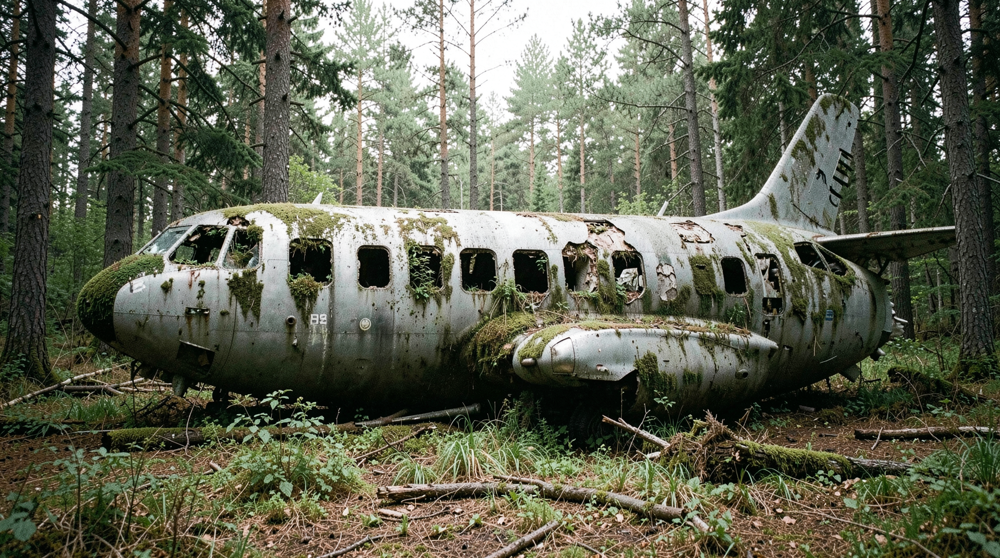
**Prompt:** A street-level 35mm photograph of a crashed, long-forgotten commercial airliner sitting in the middle of a forest clearing. Moss-covered fuselage, trees growing through broken windows. Natural diffuse daylight, authentic film grain, high detail, tactile wear.

---

## flux2_klein_00088_
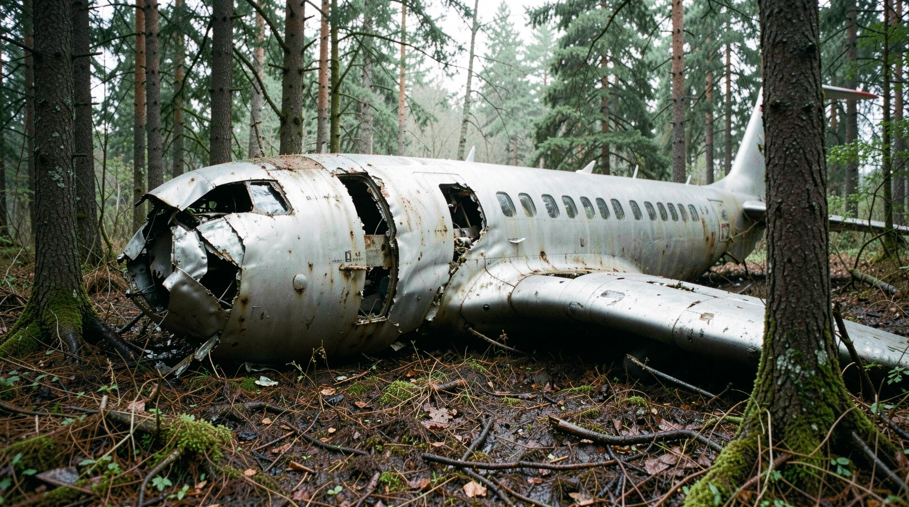
**Prompt:** A street-level 35mm film photograph of a crashed commercial airliner sitting in a forest clearing. The metal fuselage is dented and torn at the edges where trees have pushed through, showing sharp metal deformation and oxidation. The plane is physically settled deep into the damp, uneven forest floor, not floating. Diffuse, overcast natural light. Authentic forest floor textures, natural wear and tear, high detail, raw tactile metal surfaces.

---

## flux2_klein_00117_
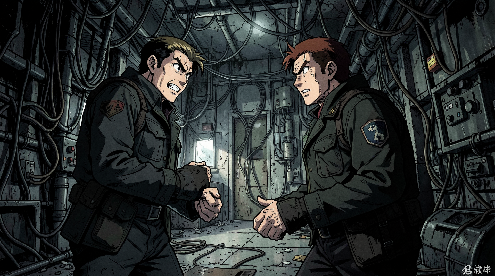
**Prompt:** 1988 Akira anime style, an intense standoff in an abandoned research facility, complex wiring and machinery, gritty atmospheric lighting, high-contrast cel-shaded shadows, signature Katsuhiro Otomo character designs.

---

## flux2_klein_00070_

**Prompt:** hyper-realistic raw desolate jagged arctic glacier landscape, blue ice textures, sharp morning light, authentic film grain, high detail, raw tactile texture

---

## flux2_klein_00092_
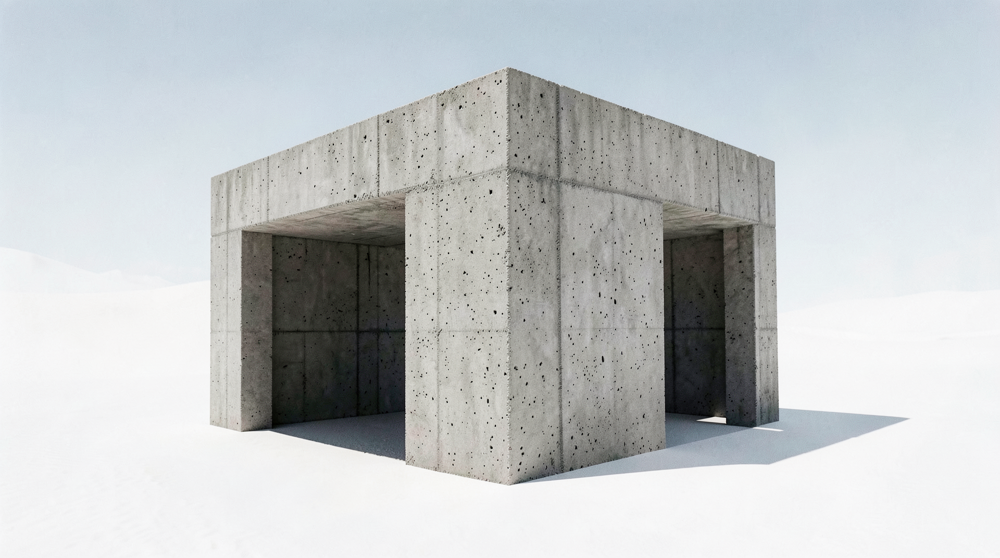
**Prompt:** A 35mm photograph of a clean, minimalist concrete brutalist structure isolated in a featureless white desert. Raw concrete (béton brut) shows physical pores and casting lines. Extreme, sharp sun-shadows. No digital enhancement, high-detail tactile concrete, authentic grain.

---

## flux2_klein_00068_
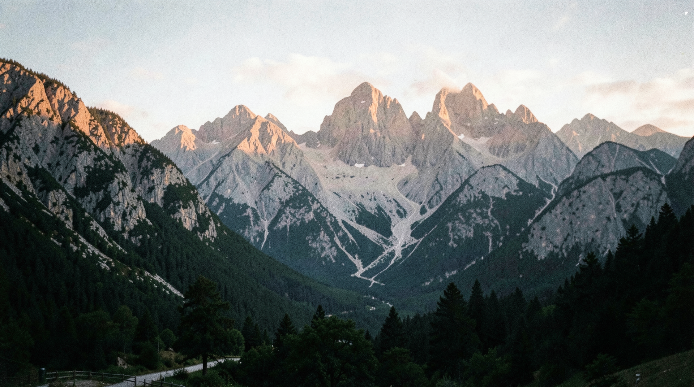
**Prompt:** hyper-realistic raw nature scenery, 35mm film, majestic mountains at dawn, soft diffused morning light, authentic film grain, high detail, optical lens falloff, raw tactile texture

---

## flux2_klein_00069_
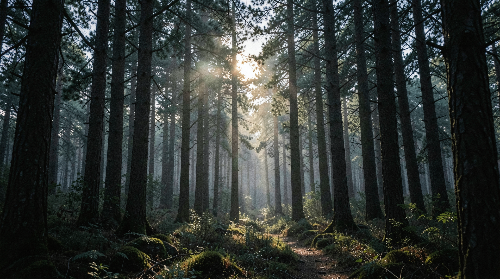
**Prompt:** hyper-realistic raw dense ancient pine forest at twilight, dappled moonlight through mist, authentic film grain, high detail, optical lens falloff, raw tactile texture

---

## flux2_klein_00072_
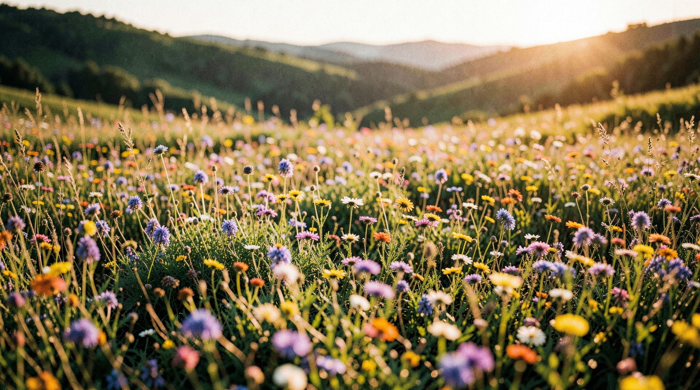
**Prompt:** hyper-realistic raw vibrant wildflower meadow in a rolling valley, golden hour, soft focus depth of field, authentic film grain, high detail, raw tactile texture

---

## flux2_klein_00071_
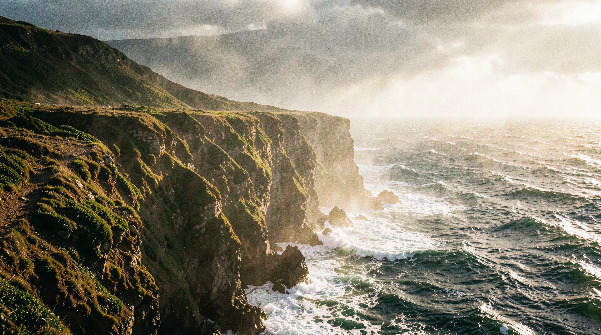
**Prompt:** hyper-realistic raw sun-drenched coastal cliff overlooking a stormy ocean, salty mist, dramatic lighting, authentic film grain, high detail, raw tactile texture

---

## flux2_klein_00115_
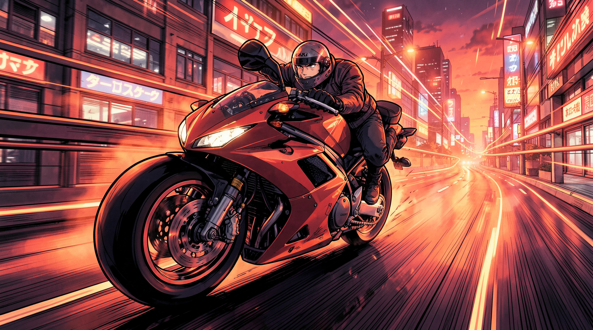
**Prompt:** 1988 Akira anime style, high-speed motorcycle chase on a neon-lit futuristic highway, dynamic motion lines, Katsuhiro Otomo's signature mechanical detail, vibrant red and orange color palette, classic cel-shaded anime aesthetic.

---

## flux2_klein_00046_

**Prompt:** A raw, uncurated 35mm film photograph of a dense forest where the tree trunks are revealed to be giant, clockwork brass gears and rusted pistons. The transition between wood bark and metallic machinery is seamless, showing authentic rust and grease stains at the mechanical joints. The 'foliage' above is a mixture of green leaves and metallic cog-shaped leaves, all swaying in the wind with mechanical synchronicity. The light is diffused, filtered through a heavy fog, creating a cool, damp atmosphere that makes the metal look genuinely cold to the touch. Technical markers: slight peripheral softness of a vintage prime lens, fine-grain ISO 400 film, and natural, flat light falloff. The scene prioritizes physical realism, treating the clockwork forest as a plausible, tangible environment.

---

## flux2_klein_00045_

**Prompt:** A raw, uncurated 35mm film photograph of a dense forest where the tree trunks are revealed to be giant, clockwork brass gears and rusted pistons. The transition between wood bark and metallic machinery is seamless, showing authentic rust and grease stains at the mechanical joints. The 'foliage' above is a mixture of green leaves and metallic cog-shaped leaves, all swaying in the wind with mechanical synchronicity. The light is diffused, filtered through a heavy fog, creating a cool, damp atmosphere that makes the metal look genuinely cold to the touch. Technical markers: slight peripheral softness of a vintage prime lens, fine-grain ISO 400 film, and natural, flat light falloff. The scene prioritizes physical realism, treating the clockwork forest as a plausible, tangible environment.

---

