# Nature

## Flux2 Klein 00128

**Prompt:** A candid 35mm photograph of a lush alpine valley with pristine clear water in the foreground and towering pine trees. Natural daylight with soft lens softness at the periphery. Authentic film grain, subtle atmospheric haze.

---

## Flooded City Street

**Prompt:** A candid, street-level 35mm film photograph of a flooded city street. Abandoned rusted cars are half-submerged in water, with moss and vines creeping over the metal. Low contrast, flat daylight, authentic film grain, high detail, optical lens falloff.

---

## Pine Forest Twilight

**Prompt:** hyper-realistic raw dense ancient pine forest at twilight, dappled moonlight through mist, authentic film grain, high detail, optical lens falloff, raw tactile texture

---

## Arctic Glacier

**Prompt:** hyper-realistic raw desolate jagged arctic glacier landscape, blue ice textures, sharp morning light, authentic film grain, high detail, raw tactile texture

---

## Stormy Coastal Cliff

**Prompt:** hyper-realistic raw sun-drenched coastal cliff overlooking a stormy ocean, salty mist, dramatic lighting, authentic film grain, high detail, raw tactile texture

---

## Tokyo Market Crowded

**Prompt:** hyper-realistic raw street level view of a bustling futuristic Tokyo market, rain-slicked neon streets with people walking on sidewalks and cars driving on the street, cinematic cyberpunk, authentic film grain, high detail, optical lens falloff, raw tactile texture

---

## Tokyo Market

**Prompt:** hyper-realistic raw street level view of a bustling futuristic Tokyo market, rain-slicked neon streets, cinematic cyberpunk, authentic film grain, high detail, optical lens falloff, raw tactile texture

---

## Medieval Village Dawn

**Prompt:** hyper-realistic raw medieval European village square at dawn, stone architecture, market stalls opening, soft natural morning light, authentic film grain, high detail, raw tactile texture

---

## Abandoned Desert City

**Prompt:** hyper-realistic raw abandoned desert city, weathered brutalist concrete structures, shifting sands, harsh midday sun, authentic film grain, high detail, raw tactile texture

---

## Skyscraper Interior

**Prompt:** hyper-realistic raw modern glass and steel skyscraper interior looking out over a sprawling coastal metropolis at dusk, warm interior lighting, authentic film grain, high detail, raw tactile texture

---

## Fall 00001

**Prompt:** A candid 35mm photograph of an alpine watermill at autumn, gold and red forest canopy, moody overcast sky, fallen leaves around the mill. Authentic fine film grain, cool color temperature.

---

## Img2Img 00001

**Prompt:** A candid 35mm photograph of an alpine watermill in a serene landscape. Base reference image used for seasonal variations. Natural light, film grain.

---

## Spring 00001

**Prompt:** A candid 35mm photograph of an alpine watermill at spring, fresh green meadow with blooming wildflowers in the foreground. Soft natural daylight, pristine clear stream, subtle atmospheric haze, film grain.

---

## Summer 00001

**Prompt:** A candid 35mm photograph of an alpine watermill at summer, vibrant lush greenery, high mountain sun with dramatic shadows, clear blue sky. Authentic film grain, crisp details.

---

## Winter 00001

**Prompt:** A candid 35mm photograph of an alpine watermill in winter, heavy snow cover on roofs and surrounding pines, soft diffused winter light. Authentic film grain, subtle blue-tinted shadows.

---

## 1995 GITS Rooftop
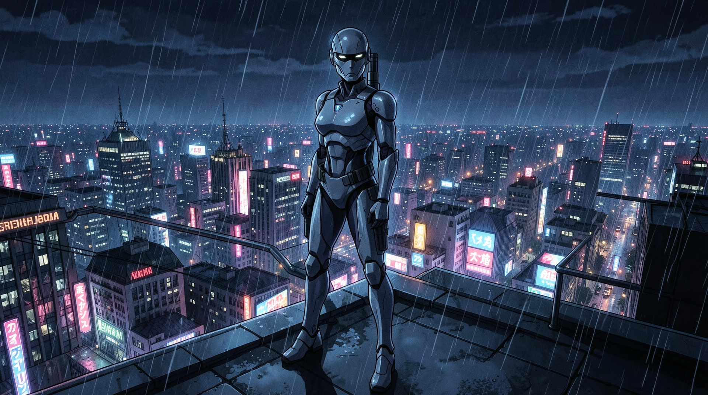
**Prompt:** 1995 Ghost in the Shell anime style, a lone cyborg operative standing on a rainy skyscraper rooftop, looking over a sprawling cityscape at night, cinematic composition, deep shadows and glowing neon, iconic 90s anime aesthetic.

---

- **Workflow File:** `api/Flux.2Klein4B_T2I.json`
- **Model (UNET):** `flux-2-klein-4b.safetensors`
- **Model (CLIP):** `qwen_3_4b.safetensors` (Flux 2 type)
- **Model (VAE):** `flux2-vae.safetensors`
- **Architecture:** Flux.2 Klein 4B distilled
- **Sampler:** `euler`
- **Scheduler:** `Flux2Scheduler`
- **Steps:** 4 (fixed)
- **Resolution:** 1920×1080 (4B variant) or 1024×1024 (9B variant)
- **CFG Scale:** 1
- **Prompt Injection:** Node `76` (PrimitiveStringMultiline)
- **Tokyo Method:** Applied via photographic prompts focusing on 35mm candid composition, lens softness, and authentic film grain constraints.

## flux2_klein_00060_

**Prompt:** An authentic, medium-format film still of a rain-slicked city street at night in a vibrant film noir style. A detective in a dark trench coat stands under a glowing, intense crimson and deep azure neon sign of a jazz club. The pavement is wet, reflecting the colorful, distorted neon lights into long, shimmering streaks. Heavy mist hangs in the air, catching the light beams from a passing yellow taxi. High-contrast lighting, sharp focus on the detective's silhouette, dramatic deep shadows, rich color palette, natural 35mm film grain, cinematic anamorphic lens flare, sharp edge definition, physical texture on wet asphalt, no airbrushed skin, authentic night-time color depth.

---

## flux2_klein_00059_
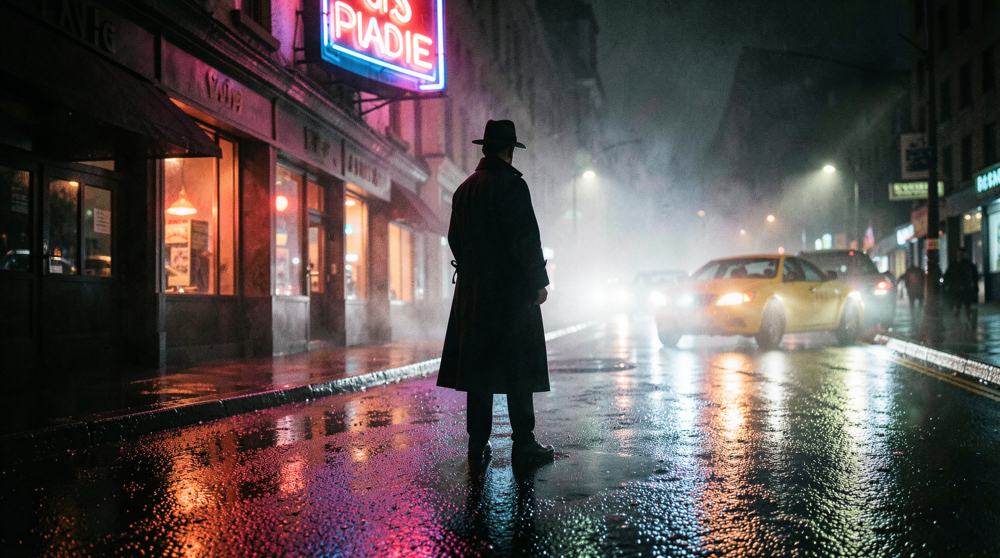
**Prompt:** An authentic, medium-format film still of a rain-slicked city street at night in a vibrant film noir style. A detective in a dark trench coat stands under a glowing, intense crimson and deep azure neon sign of a jazz club. The pavement is wet, reflecting the colorful, distorted neon lights into long, shimmering streaks. Heavy mist hangs in the air, catching the light beams from a passing yellow taxi. High-contrast lighting, sharp focus on the detective's silhouette, dramatic deep shadows, rich color palette, natural 35mm film grain, cinematic anamorphic lens flare, sharp edge definition, physical texture on wet asphalt, no airbrushed skin, authentic night-time color depth.

---

## flux2_klein_00066_
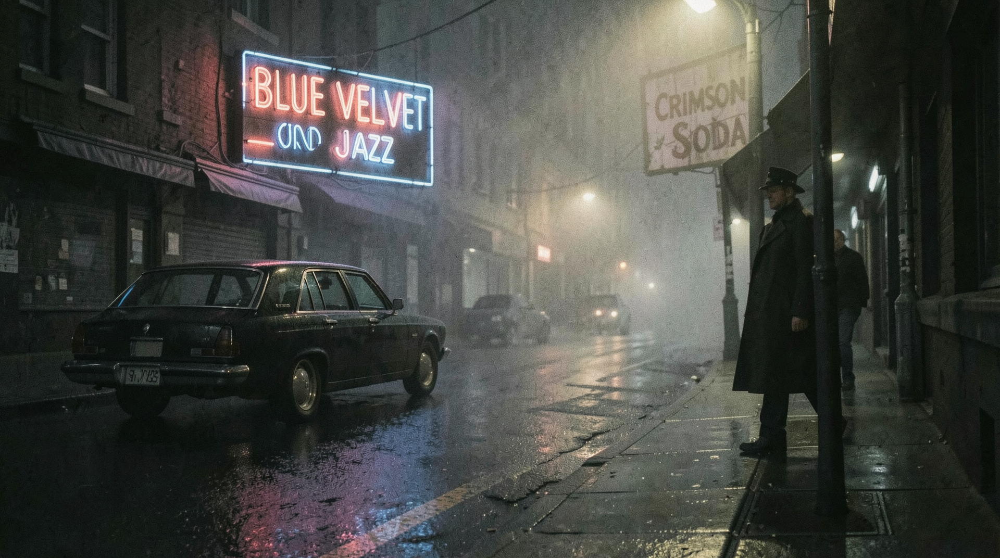
**Prompt:** A moody, authentic, medium-format film still of a rain-slicked, gloomy city street at night in a classic, muted-tone film noir style. A detective in a dark trench coat stands on the sidewalk on the right, barely illuminated by a dim streetlamp. A vintage black sedan is parked quietly on the left side of the street, showing matte textures rather than gloss. In the background, a worn, flickering crimson and deep azure neon sign of a jazz club displays the text 'BLUE VELVET JAZZ' in slightly dim, humored neon tubing. Beside it, a faded billboard features the text 'CRIMSON SODA'. The pavement is wet but not overly reflective, matte textures predominant. Heavy mist, low-contrast, deep moody shadows, desaturated color palette with deliberate color pops, authentic natural film grain, no digital over-sharpening, professional cinematic lighting, legible but aged text, clear spatial layout.

---

## flux2_klein_00065_

**Prompt:** A moody, authentic, medium-format film still of a rain-slicked, gloomy city street at night in a classic, muted-tone film noir style. A detective in a dark trench coat stands on the sidewalk on the right, barely illuminated by a dim streetlamp. A vintage black sedan is parked quietly on the left side of the street, showing matte textures rather than gloss. In the background, a worn, flickering crimson and deep azure neon sign of a jazz club displays the text 'BLUE VELVET JAZZ' in slightly dim, humored neon tubing. Beside it, a faded billboard features the text 'CRIMSON SODA'. The pavement is wet but not overly reflective, matte textures predominant. Heavy mist, low-contrast, deep moody shadows, desaturated color palette with deliberate color pops, authentic natural film grain, no digital over-sharpening, professional cinematic lighting, legible but aged text, clear spatial layout.

---

## flux2_klein_00054_

**Prompt:** A cinematic, ultra-realistic 35mm film still of a secluded, sun-drenched coastal workshop in the Mediterranean. An elderly clockmaker is meticulously crafting a delicate mechanical marine chronometer on a cluttered oak workbench. Through the large open doorway, a shimmering azure sea meets a bright, cloudless sky. Dust motes dance in the warm, golden afternoon sunlight filtering through the space. Tactile textures of worn brass, aged wood, weathered skin, and salty air. Sharp focus on the clockwork components, soft depth-of-field, authentic vintage film grain, high-quality optical glass rendering, warm ambient color palette.

---

## flux2_klein_00053_

**Prompt:** A cinematic, ultra-realistic 35mm film still of a secluded, sun-drenched coastal workshop in the Mediterranean. An elderly clockmaker is meticulously crafting a delicate mechanical marine chronometer on a cluttered oak workbench. Through the large open doorway, a shimmering azure sea meets a bright, cloudless sky. Dust motes dance in the warm, golden afternoon sunlight filtering through the space. Tactile textures of worn brass, aged wood, weathered skin, and salty air. Sharp focus on the clockwork components, soft depth-of-field, authentic vintage film grain, high-quality optical glass rendering, warm ambient color palette.

---

## flux2_klein_00062_

**Prompt:** An authentic, medium-format film still of a rain-slicked city street at night in a vibrant, color-rich film noir style. A detective in a dark trench coat stands clearly separated from a parked vintage black sedan, with ample space between them to avoid any visual merging. In the background, a glowing crimson and deep azure neon sign of a jazz club explicitly displays the text 'BLUE VELVET JAZZ' in clear, sharp neon tubing. Beside it, a large billboard features a stylized graphic for a classic soda brand with the legible text 'CRIMSON SODA' in bold lettering. The pavement is wet, reflecting the colorful neon lights into distinct, shimmering streaks. Heavy mist hangs in the air, catching the light beams from a single yellow taxi. High-contrast lighting, sharp focus on the detective's silhouette, dramatic deep shadows, rich color palette, natural 35mm film grain, cinematic anamorphic lens flare, sharp edge definition, physical texture on wet asphalt, no airbrushed skin, legible text, clear object separation.

---

## flux2_klein_00061_
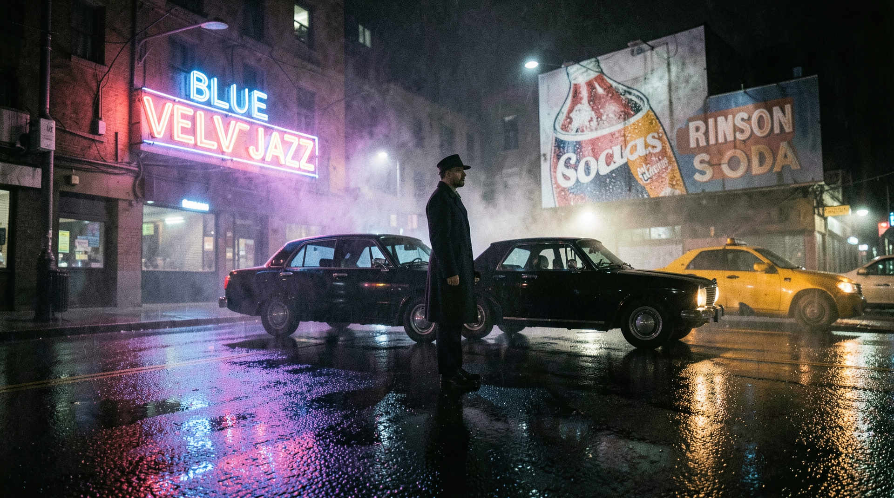
**Prompt:** An authentic, medium-format film still of a rain-slicked city street at night in a vibrant, color-rich film noir style. A detective in a dark trench coat stands clearly separated from a parked vintage black sedan, with ample space between them to avoid any visual merging. In the background, a glowing crimson and deep azure neon sign of a jazz club explicitly displays the text 'BLUE VELVET JAZZ' in clear, sharp neon tubing. Beside it, a large billboard features a stylized graphic for a classic soda brand with the legible text 'CRIMSON SODA' in bold lettering. The pavement is wet, reflecting the colorful neon lights into distinct, shimmering streaks. Heavy mist hangs in the air, catching the light beams from a single yellow taxi. High-contrast lighting, sharp focus on the detective's silhouette, dramatic deep shadows, rich color palette, natural 35mm film grain, cinematic anamorphic lens flare, sharp edge definition, physical texture on wet asphalt, no airbrushed skin, legible text, clear object separation.

---

## flux2_klein_00103_

**Prompt:** A massive stone head floating in the middle of a calm desert ocean, surrealist art, minimalist horizon, deep blue sky, artistic masterpiece.

---

## flux2_klein_00079_

**Prompt:** A candid, street-level 35mm film photograph of a flooded city street. Abandoned rusted cars are half-submerged in water, with moss and vines creeping over the metal. Low contrast, flat daylight, authentic film grain, high detail, optical lens falloff.

---

## flux2_klein_00096_
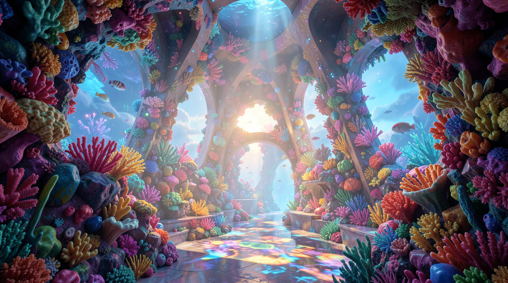
**Prompt:** A gorgeous interior of a room made of giant coral reefs, ethereal light, vibrant colors, artistic surrealism, breathtaking architectural design.

---

## flux2_klein_00104_
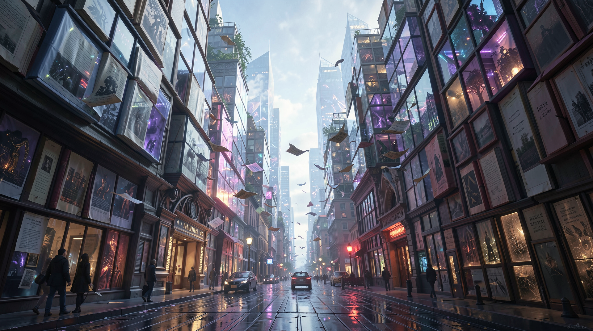
**Prompt:** A grand city street where the buildings are made of giant translucent glass books, pages fluttering in the wind, magical lighting, surreal architectural design.

---

## flux2_klein_00101_

**Prompt:** A candid, street-level 35mm film photograph of an architectural complex built from organic spider-silk-like structural fibers. The walkways are thin, tensile, and physically anchored into clouds, showing visible tension and stress points. Diffuse, natural atmospheric lighting through the mist. No digital blurring or AI-smoothing. High-detail tactile textures showing fiber weaving and organic structural junctions. Authentic 35mm film grain, sharp focus on the fiber geometry, natural light falloff.

---

## flux2_klein_00093_
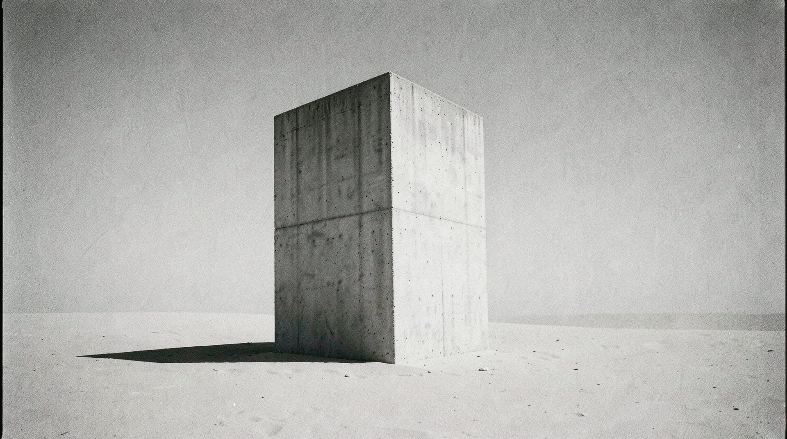
**Prompt:** A 35mm film shot of a single concrete brutalist monolith set against a flat, monochromatic sand plane. Harsh, high-contrast sunlight creates physical light falloff. Raw concrete texture, focus on sharp geometric angles, authentic film grain, non-synthetic look.

---

## flux2_klein_00085_
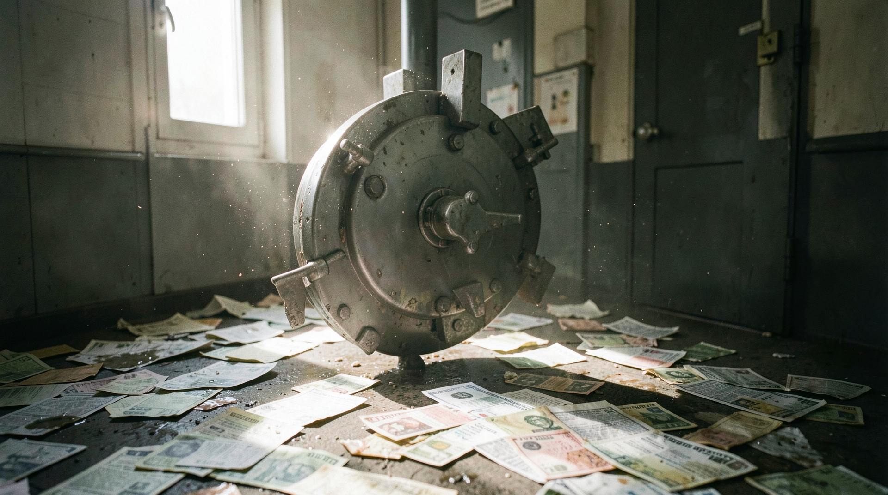
**Prompt:** A candid 35mm photograph of a bank interior. Vault door hanging off hinges, scattered, water-logged financial documents matted into the floor. Dust motes dance in single shafts of natural light. High detail, physical texture, no AI-smoothing.

---

## flux2_klein_00082_

**Prompt:** A close-up 35mm photograph of a rusted, collapsed library shelf. Books are decaying into pulp, with water damage and mold patterns forming organic, chaotic shapes. Natural, dim indoor light, shallow depth of field, physical tactile texture.

---

## flux2_klein_00083_

**Prompt:** A 35mm film photograph of a deserted, derelict subway station. Flooded tracks reflect rusted structural beams. Faint, natural light filters from a single cracked skylight above. Muted tones, authentic film grain, high detail, tactile texture.

---

## flux2_klein_00114_
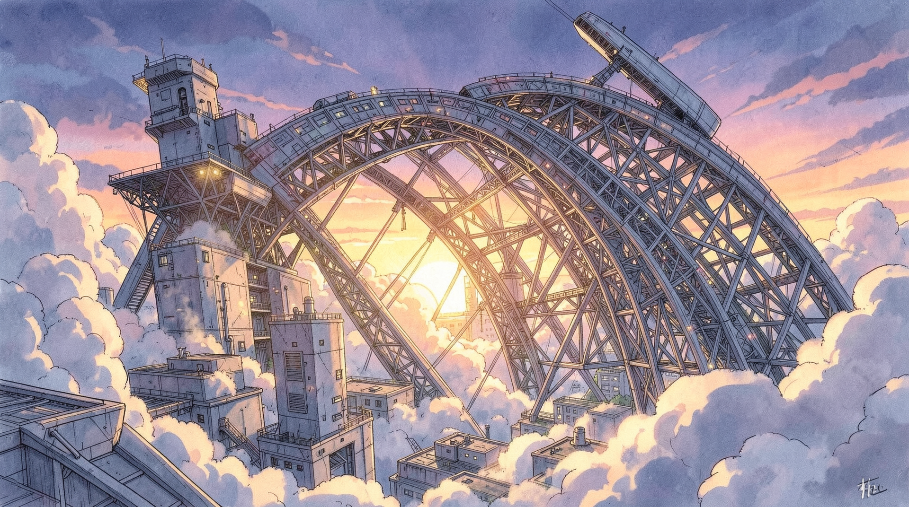
**Prompt:** 1995 Ghost in the Shell anime style, exterior view of a massive corporate arcology structure piercing the clouds, sun setting behind it, intricate structural designs, hand-painted atmosphere, artistic 90s anime aesthetic.

---

## flux2_klein_00108_
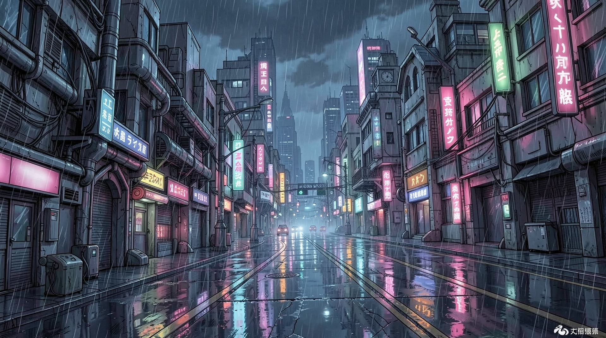
**Prompt:** 1995 Ghost in the Shell anime style, rainy night in a futuristic cyberpunk city, neon signs reflecting on wet asphalt, intricate mechanical buildings, moody atmosphere, cel-shaded with high-quality painted backgrounds, iconic 90s anime aesthetic.

---

## flux2_klein_00097_

**Prompt:** A beautiful, flowing organic structure made of giant spider silk patterns, interconnected walkways in the clouds, ethereal lighting, high-end fantasy design.

---

## flux2_klein_00116_
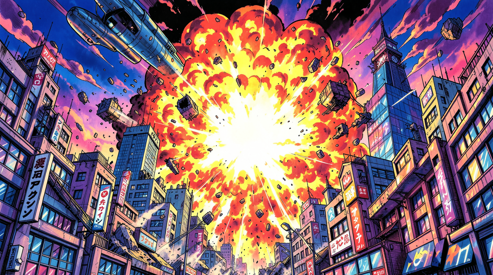
**Prompt:** 1988 Akira anime style, a massive explosion in a futuristic Tokyo city, crumbling skyscrapers and debris flying, intense saturated colors, cinematic impact, iconic 80s anime art style.

---

## flux2_klein_00075_

**Prompt:** hyper-realistic raw abandoned desert city, weathered brutalist concrete structures, shifting sands, harsh midday sun, authentic film grain, high detail, raw tactile texture

---

## flux2_klein_00080_
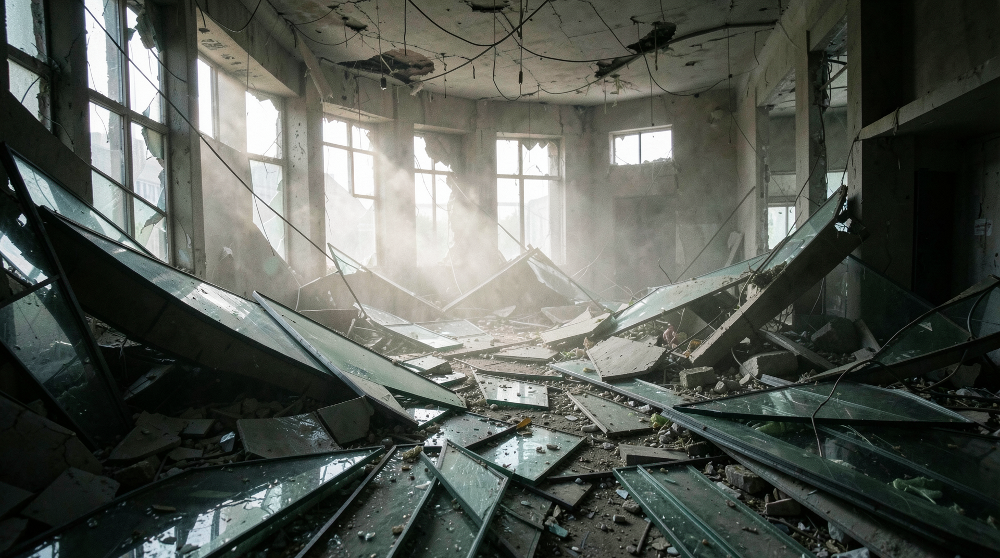
**Prompt:** A wide-angle 35mm photograph of a shattered skyscraper interior. Glass panes litter the floor. Thick dust mists through broken windows, catching slanted, natural light. No artificial color, focus on the physical weight of debris and layers of neglect.

---

## flux2_klein_00094_
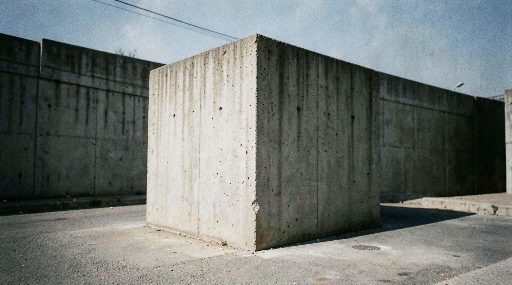
**Prompt:** A street-level 35mm film photograph of an isolated brutalist concrete cube in a void. Visible imperfections in the concrete casting. Sharp, physical light shadows. No AI buzzwords, high-detail raw tactile texture, 35mm film aesthetic.

---

## flux2_klein_00106_

**Prompt:** Close-up portrait of a cybernetic character in the style of Ghost in the Shell. Intricate facial mechanical details, synthetic skin textures, soft atmospheric neon light reflecting on surfaces. Introspective mood, high fidelity, 35mm film aesthetic, focus on mechanical realism.

---

## flux2_klein_00074_

**Prompt:** hyper-realistic raw medieval European village square at dawn, stone architecture, market stalls opening, soft natural morning light, authentic film grain, high detail, raw tactile texture

---

## flux2_klein_00110_
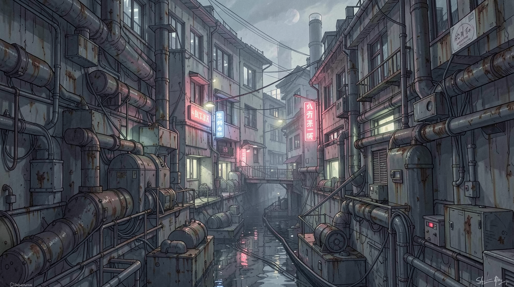
**Prompt:** 1995 Ghost in the Shell anime style, a quiet canal-side warehouse district, rusted pipes and dense machinery, muted color palette with brilliant neon lights, highly detailed hand-painted background style, cinematic composition.

---

## flux2_klein_00086_

**Prompt:** A street-level 35mm photograph of a crashed, long-forgotten commercial airliner sitting in the middle of a forest clearing. Moss-covered fuselage, trees growing through broken windows. Natural diffuse daylight, authentic film grain, high detail, tactile wear.

---

## flux2_klein_00088_

**Prompt:** A street-level 35mm film photograph of a crashed commercial airliner sitting in a forest clearing. The metal fuselage is dented and torn at the edges where trees have pushed through, showing sharp metal deformation and oxidation. The plane is physically settled deep into the damp, uneven forest floor, not floating. Diffuse, overcast natural light. Authentic forest floor textures, natural wear and tear, high detail, raw tactile metal surfaces.

---

## flux2_klein_00117_

**Prompt:** 1988 Akira anime style, an intense standoff in an abandoned research facility, complex wiring and machinery, gritty atmospheric lighting, high-contrast cel-shaded shadows, signature Katsuhiro Otomo character designs.

---

## flux2_klein_00095_

**Prompt:** A stunning bio-mimetic city where buildings look like giant shimmering jellyfish, hyper-detailed, glowing neon bioluminescence, dreamlike atmosphere, epic scale.

---

## flux2_klein_00077_

**Prompt:** hyper-realistic raw street level view of a bustling futuristic Tokyo market, rain-slicked neon streets with people walking on sidewalks and cars driving on the street, cinematic cyberpunk, authentic film grain, high detail, optical lens falloff, raw tactile texture

---

## flux2_klein_00073_

**Prompt:** hyper-realistic raw street level view of a bustling futuristic Tokyo market, rain-slicked neon streets, cinematic cyberpunk, authentic film grain, high detail, optical lens falloff, raw tactile texture

---

## flux2_klein_00091_
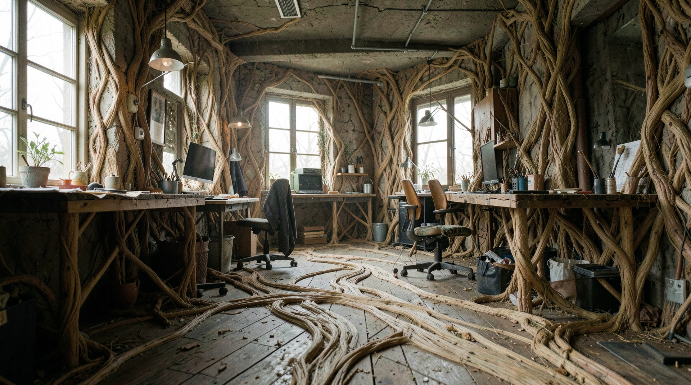
**Prompt:** A street-level 35mm photograph of a workspace interior where floor, walls, and furniture are integrated through bio-growth. No synthetic AI-look. Focus on structural integrity, fibrous wood-like and muscle-like tactile textures, and natural atmospheric light.

---

## flux2_klein_00109_

**Prompt:** 1995 Ghost in the Shell anime style, portrait of a cyborg woman with intricate mechanical facial details, deep blue and purple night lighting, clean lines, high-contrast, iconic 90s anime aesthetic, artistic background.

---

## flux2_klein_00090_

**Prompt:** A candid 35mm photograph of a living organic hallway. Walls mimic the texture of biological membrane, with branching structural veins. No digital smoothing. Natural, soft diffuse light, high detail, tactile surfaces, authentic 35mm grain.

---

## flux2_klein_00099_

**Prompt:** A stunning concrete fortress floating above a deep dark ocean, surreal brutalist architecture, sunset lighting, sharp geometry, cinematic composition.

---

## flux2_klein_00089_
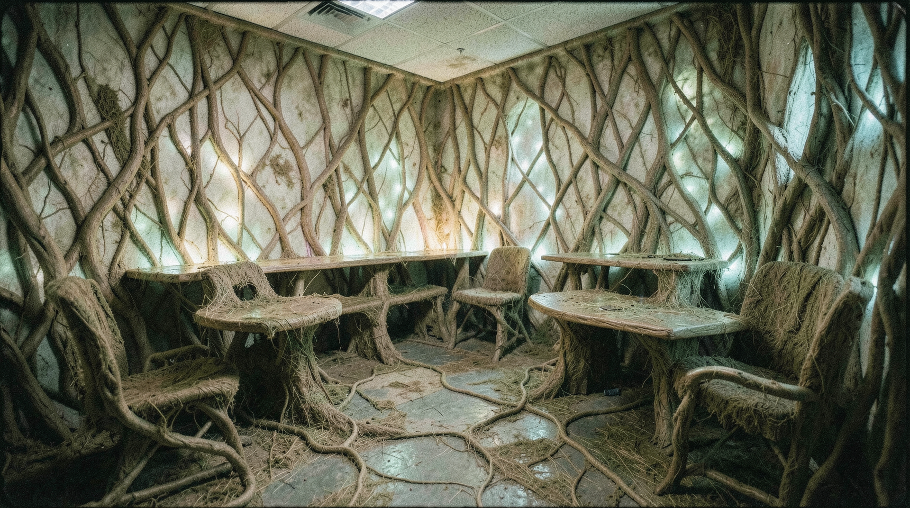
**Prompt:** A 35mm film photograph of a bio-mimetic workspace. Walls feature natural, vein-like patterns that integrate into the structure. Furniture grows organically from the floor, showing cellulose and fiber textures. Soft, internal bioluminescent lighting. Candid, high-detail, authentic film grain, raw tactile texture.

---

## flux2_klein_00076_
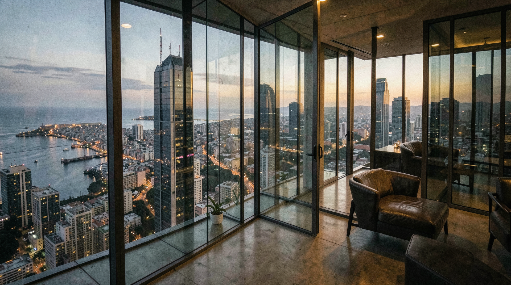
**Prompt:** hyper-realistic raw modern glass and steel skyscraper interior looking out over a sprawling coastal metropolis at dusk, warm interior lighting, authentic film grain, high detail, raw tactile texture

---

## flux2_klein_00070_

**Prompt:** hyper-realistic raw desolate jagged arctic glacier landscape, blue ice textures, sharp morning light, authentic film grain, high detail, raw tactile texture

---

## flux2_klein_00078_
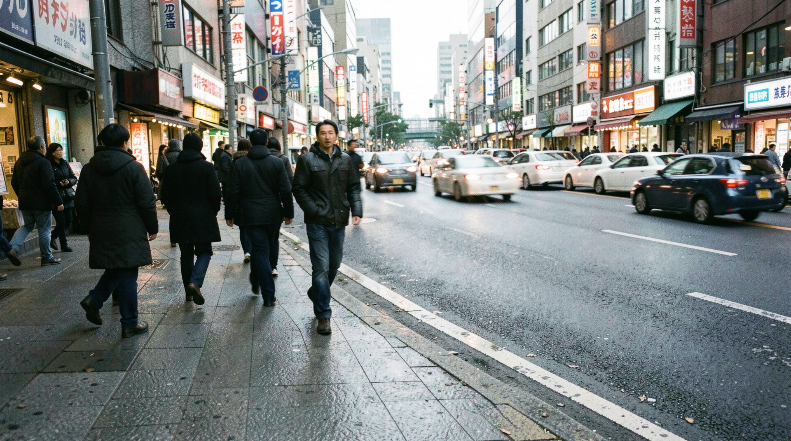
**Prompt:** A candid, street-level 35mm film photograph of a busy Tokyo street. Pedestrians are strictly walking on the sidewalk, captured in natural, non-posed motion. Vehicles are driving in the designated lanes on the asphalt street, with visible motion blur from the slow shutter speed. The environment is a realistic urban setting: worn pavement, subtle grime, natural light from neon signage reflecting on wet surfaces. No AI-generated smoothing or digital artifacts. Focus on realistic human proportions, authentic clothing textures, and physical light falloff. High-detail tactile surfaces. The composition emphasizes clear separation between sidewalk activity and street traffic.

---

## flux2_klein_00111_

**Prompt:** 1995 Ghost in the Shell anime style, a high-tech hacker den filled with obsolete monitors and tangled fiber-optic cables, dark room with glowing green code on screens, iconic 90s anime aesthetic, hand-painted background style.

---

## flux2_klein_00084_
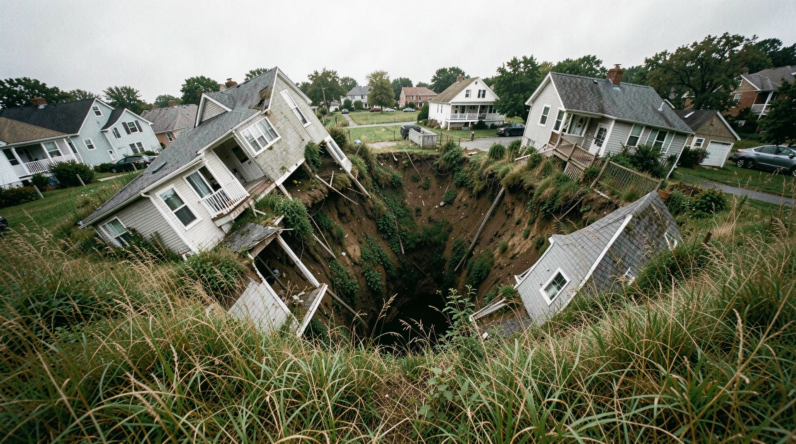
**Prompt:** A wide-angle 35mm film shot of a suburban neighborhood slowly collapsing into a sinkhole. Houses are tilted at severe, physically logical angles. Overgrown, wild tall grasses in the foreground. Natural overcast light, flat desaturated colors, authentic grain.

---

## flux2_klein_00092_

**Prompt:** A 35mm photograph of a clean, minimalist concrete brutalist structure isolated in a featureless white desert. Raw concrete (béton brut) shows physical pores and casting lines. Extreme, sharp sun-shadows. No digital enhancement, high-detail tactile concrete, authentic grain.

---

## flux2_klein_00068_

**Prompt:** hyper-realistic raw nature scenery, 35mm film, majestic mountains at dawn, soft diffused morning light, authentic film grain, high detail, optical lens falloff, raw tactile texture

---

## flux2_klein_00098_
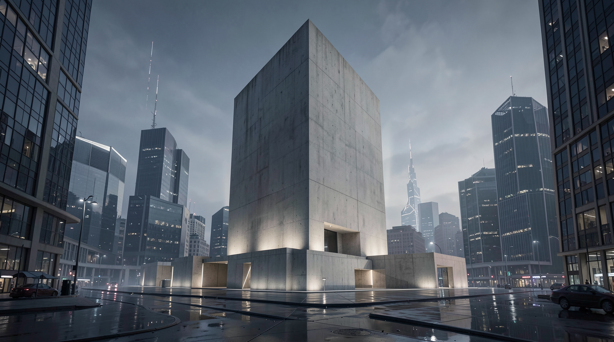
**Prompt:** A breathtaking minimalist brutalist monument in the center of a futuristic city, bold geometric shapes, dramatic lighting, epic scale, clean architecture, high-end aesthetic.

---

## flux2_klein_00113_
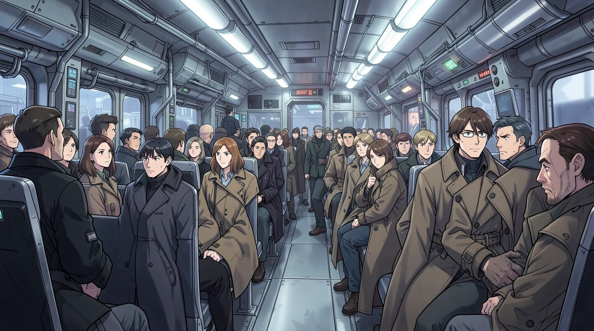
**Prompt:** 1995 Ghost in the Shell anime style, interior of a crowded futuristic transport ship, commuters in trench coats, soft overhead fluorescent lighting, detailed mechanical seating, high-quality cel-shaded anime style.

---

## flux2_klein_00081_
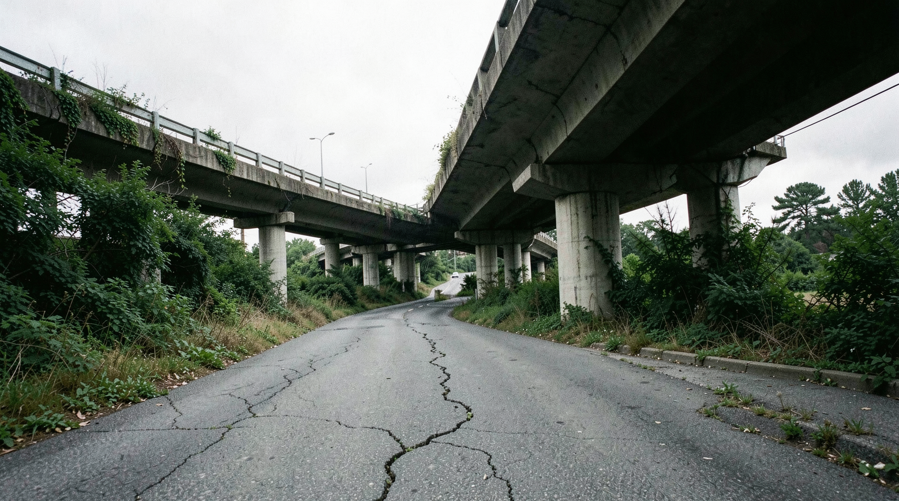
**Prompt:** A candid 35mm photograph of an overgrown suburban highway. Massive concrete overpasses are cracked with tectonic-looking fissures. Vegetation has reclaimed the asphalt. Overcast lighting, desaturated color palette, authentic film grain.

---

## flux2_klein_00069_

**Prompt:** hyper-realistic raw dense ancient pine forest at twilight, dappled moonlight through mist, authentic film grain, high detail, optical lens falloff, raw tactile texture

---

## flux2_klein_00072_

**Prompt:** hyper-realistic raw vibrant wildflower meadow in a rolling valley, golden hour, soft focus depth of field, authentic film grain, high detail, raw tactile texture

---

## flux2_klein_00105_
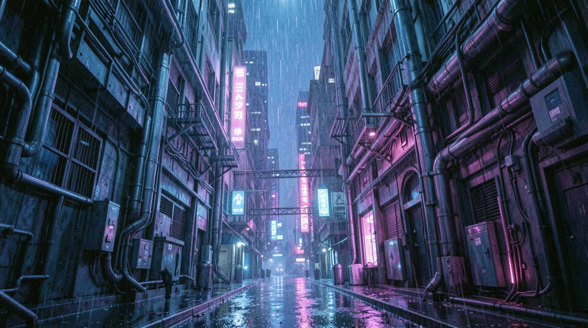
**Prompt:** A wide-angle 35mm film shot of a rainy neon-drenched city in the style of 1995 Ghost in the Shell. Detailed mechanical street-level structures, dark blue and vibrant purple night light, complex wiring and conduit textures. High fidelity, cinematic lighting, authentic film grain, no digital smoothing.

---

## flux2_klein_00087_
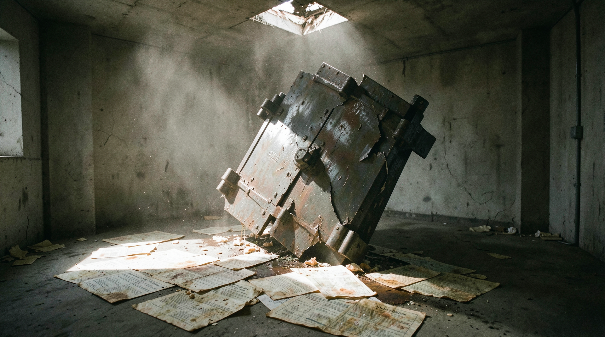
**Prompt:** A candid 35mm film photograph of a bank interior in decay. A massive vault door hangs tilted, its hinges sheared off and metal warped by structural stress, showing heavy, raw steel textures. Water-damaged, yellowed financial documents are matted into the floor, showing distinct layers of pulped paper and ink-bleed. Dust hangs in the air, catching a single, harsh beam of afternoon sunlight from a broken ceiling vent. Realistic shadows, authentic film grain, high detail, tactile concrete and metal surfaces.

---

## flux2_klein_00107_

**Prompt:** A candid street-level shot of a canal-side warehouse district in the style of 1995 Ghost in the Shell. Weathered brutalist concrete, dense pipes and mechanical infrastructure, rain-slicked surfaces, desaturated color palette with intense neon pops. Authentic film grain, high detail.

---

## flux2_klein_00071_

**Prompt:** hyper-realistic raw sun-drenched coastal cliff overlooking a stormy ocean, salty mist, dramatic lighting, authentic film grain, high detail, raw tactile texture

---

## flux2_klein_00115_

**Prompt:** 1988 Akira anime style, high-speed motorcycle chase on a neon-lit futuristic highway, dynamic motion lines, Katsuhiro Otomo's signature mechanical detail, vibrant red and orange color palette, classic cel-shaded anime aesthetic.

---

## flux2_klein_00100_
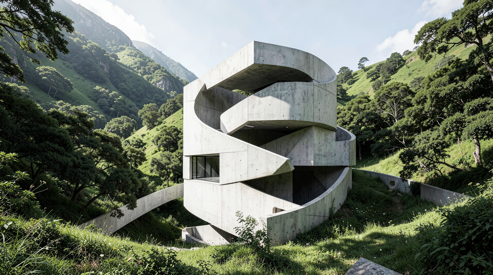
**Prompt:** An artistic minimalist concrete spiral building in a lush green valley, bold geometric lines, beautiful landscape, high contrast, surreal architecture.

---

## flux2_klein_00102_

**Prompt:** A surrealist painting of a clock melting over a giant redwood tree, vibrant psychedelic colors, dreamlike composition, high detail, surreal atmosphere.

---

## flux2_klein_00064_

**Prompt:** An authentic, medium-format film still of a rain-slicked city street at night in a vibrant, color-rich film noir style. A detective in a dark trench coat stands on the sidewalk on the right. A vintage black sedan is neatly parked on the left side of the street, completely separate from the detective. In the background, a glowing crimson and deep azure neon sign of a jazz club displays the text 'BLUE VELVET JAZZ' in sharp neon tubing. Beside it, a billboard features the legible text 'CRIMSON SODA'. A yellow taxi is driving down the road in the mid-ground. The pavement is wet, reflecting the neon lights into shimmering streaks. Heavy mist, high-contrast lighting, sharp focus on the detective's silhouette, dramatic deep shadows, rich color palette, natural 35mm film grain, cinematic anamorphic lens flare, sharp edge definition, physical texture on wet asphalt, no airbrushed skin, legible text, clear spatial layout.

---

## flux2_klein_00063_

**Prompt:** An authentic, medium-format film still of a rain-slicked city street at night in a vibrant, color-rich film noir style. A detective in a dark trench coat stands on the sidewalk on the right. A vintage black sedan is neatly parked on the left side of the street, completely separate from the detective. In the background, a glowing crimson and deep azure neon sign of a jazz club displays the text 'BLUE VELVET JAZZ' in sharp neon tubing. Beside it, a billboard features the legible text 'CRIMSON SODA'. A yellow taxi is driving down the road in the mid-ground. The pavement is wet, reflecting the neon lights into shimmering streaks. Heavy mist, high-contrast lighting, sharp focus on the detective's silhouette, dramatic deep shadows, rich color palette, natural 35mm film grain, cinematic anamorphic lens flare, sharp edge definition, physical texture on wet asphalt, no airbrushed skin, legible text, clear spatial layout.

---

## flux2_klein_00046_

**Prompt:** A raw, uncurated 35mm film photograph of a dense forest where the tree trunks are revealed to be giant, clockwork brass gears and rusted pistons. The transition between wood bark and metallic machinery is seamless, showing authentic rust and grease stains at the mechanical joints. The 'foliage' above is a mixture of green leaves and metallic cog-shaped leaves, all swaying in the wind with mechanical synchronicity. The light is diffused, filtered through a heavy fog, creating a cool, damp atmosphere that makes the metal look genuinely cold to the touch. Technical markers: slight peripheral softness of a vintage prime lens, fine-grain ISO 400 film, and natural, flat light falloff. The scene prioritizes physical realism, treating the clockwork forest as a plausible, tangible environment.

---

## flux2_klein_00045_

**Prompt:** A raw, uncurated 35mm film photograph of a dense forest where the tree trunks are revealed to be giant, clockwork brass gears and rusted pistons. The transition between wood bark and metallic machinery is seamless, showing authentic rust and grease stains at the mechanical joints. The 'foliage' above is a mixture of green leaves and metallic cog-shaped leaves, all swaying in the wind with mechanical synchronicity. The light is diffused, filtered through a heavy fog, creating a cool, damp atmosphere that makes the metal look genuinely cold to the touch. Technical markers: slight peripheral softness of a vintage prime lens, fine-grain ISO 400 film, and natural, flat light falloff. The scene prioritizes physical realism, treating the clockwork forest as a plausible, tangible environment.

---

## flux2_klein_00047_

**Prompt:** a surreal phone size wallpaper, melting celestial clocks floating in a neon nebula, raw, authentic tactile detail, 35mm film aesthetic

---

## flux2_klein_00052_
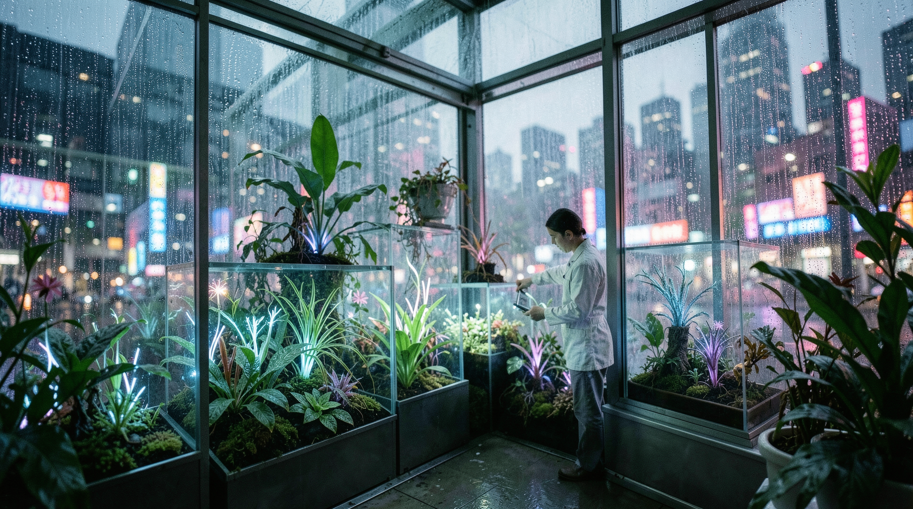
**Prompt:** A hyper-realistic 35mm film shot of a futuristic botanical atrium during a rainstorm. Inside, a scientist is tending to glowing, exotic bioluminescent plants in glass terrariums. Outside, a rain-slicked, neon-lit cyberpunk city looms in the background, out of focus. Raindrops bead on the large glass atrium windows. Authentic tactile detail on the leaves, soft bokeh city lights, metallic reflections, damp atmosphere, cinematic lighting, 35mm film grain, high dynamic range.

---

## flux2_klein_00051_
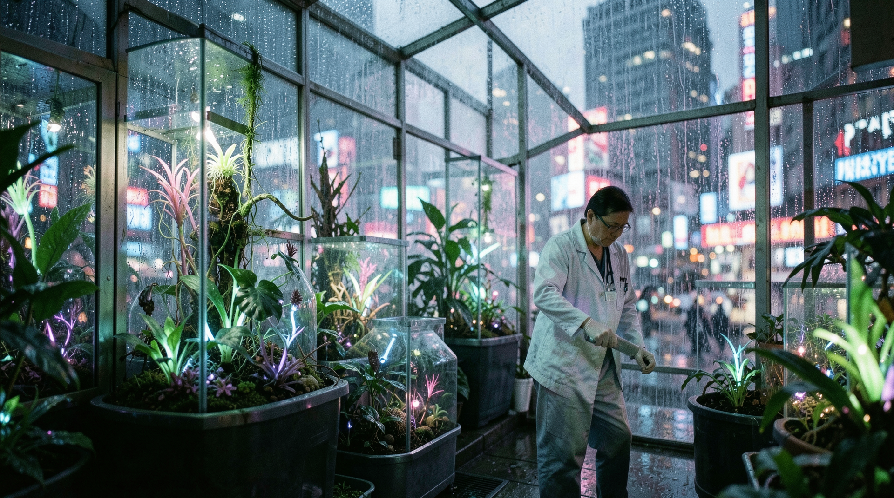
**Prompt:** A hyper-realistic 35mm film shot of a futuristic botanical atrium during a rainstorm. Inside, a scientist is tending to glowing, exotic bioluminescent plants in glass terrariums. Outside, a rain-slicked, neon-lit cyberpunk city looms in the background, out of focus. Raindrops bead on the large glass atrium windows. Authentic tactile detail on the leaves, soft bokeh city lights, metallic reflections, damp atmosphere, cinematic lighting, 35mm film grain, high dynamic range.

---

## out
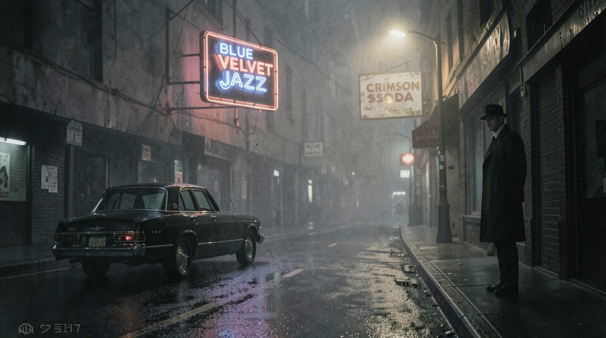
**Prompt:** A moody, authentic, medium-format film still of a rain-slicked, gloomy city street at night in a classic, muted-tone film noir style. A detective in a dark trench coat stands on the sidewalk on the right, barely illuminated by a dim streetlamp. A vintage black sedan is parked quietly on the left side of the street, showing matte textures rather than gloss. In the background, a worn, flickering crimson and deep azure neon sign of a jazz club displays the text 'BLUE VELVET JAZZ' in slightly dim, humored neon tubing. Beside it, a faded billboard features the text 'CRIMSON SODA'. The pavement is wet but not overly reflective, matte textures predominant. Heavy mist, low-contrast, deep moody shadows, desaturated color palette with deliberate color pops, authentic natural film grain, no digital over-sharpening, professional cinematic lighting, legible but aged text, clear spatial layout.

---

## flux2_klein_00049_
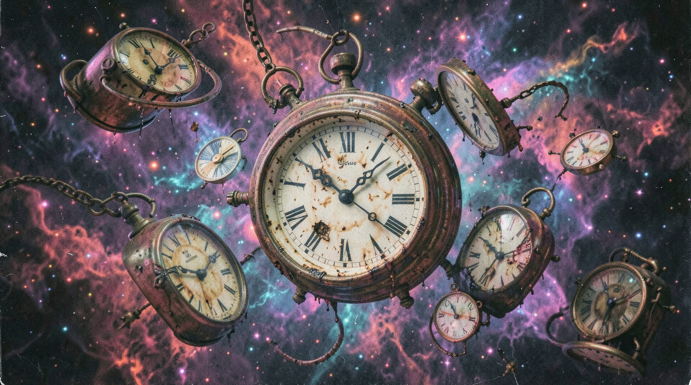
**Prompt:** a surreal phone size wallpaper, melting celestial clocks floating in a neon nebula, raw, authentic tactile detail, 35mm film aesthetic

---

## flux2_klein_00048_
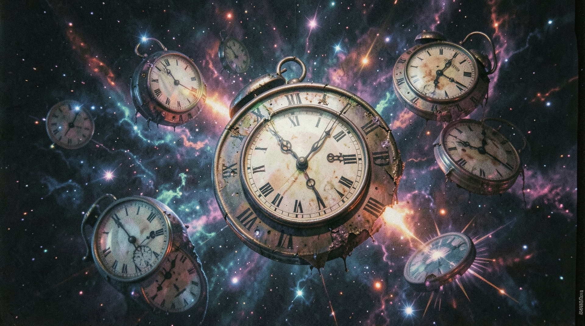
**Prompt:** a surreal phone size wallpaper, melting celestial clocks floating in a neon nebula, raw, authentic tactile detail, 35mm film aesthetic

---

## flux2_klein_00058_

**Prompt:** An authentic, medium-format film shot of a dimly lit, mid-century modern library at twilight. Thick, leather-bound books line heavy dark mahogany shelves that disappear into the shadows. A single, warm brass reading lamp sits on a polished writing desk, casting deep, soft-edged pools of light over a fountain pen, ink bottle, and a stack of yellowed parchment papers. A leather armchair sits slightly offset, with the texture of aged hide clearly visible. Through a tall window, a rain-streaked twilight city skyline is visible, soft bokeh streetlights blurred by moisture on the glass. Sharp detail on the desk surface, natural film grain, deep shadows, accurate warm-to-cool light color contrast, no digital post-processing artifacts, optical lens falloff, professional interior photography style.

---

## flux2_klein_00057_

**Prompt:** An authentic, medium-format film shot of a dimly lit, mid-century modern library at twilight. Thick, leather-bound books line heavy dark mahogany shelves that disappear into the shadows. A single, warm brass reading lamp sits on a polished writing desk, casting deep, soft-edged pools of light over a fountain pen, ink bottle, and a stack of yellowed parchment papers. A leather armchair sits slightly offset, with the texture of aged hide clearly visible. Through a tall window, a rain-streaked twilight city skyline is visible, soft bokeh streetlights blurred by moisture on the glass. Sharp detail on the desk surface, natural film grain, deep shadows, accurate warm-to-cool light color contrast, no digital post-processing artifacts, optical lens falloff, professional interior photography style.

---

## flux2_klein_00056_

**Prompt:** An authentic, candid 35mm film photograph of a dusty, sun-drenched artisan watchmaker's workshop in Greece. An aged man with weathered, detailed hands uses a tiny loupe to inspect the movement of a brass marine chronometer on a solid oak workbench. The workspace is cluttered with specialized steel tools, magnifying lenses, and small, scattered cogwheels, showing realistic, un-perfect wear and tear. Sunlight streams through a textured, unevenly painted wooden doorway, casting soft, hazy shadows across the room and highlighting dancing dust particles in the air. Outside, the Mediterranean sea is visible as a blurry, bright, azure streak. Captured with a vintage 50mm f/1.8 lens; slight natural film grain, authentic color temperature shift of early afternoon light, no unnatural smoothing, physical textures, and organic light falloff.

---

## flux2_klein_00055_

**Prompt:** An authentic, candid 35mm film photograph of a dusty, sun-drenched artisan watchmaker's workshop in Greece. An aged man with weathered, detailed hands uses a tiny loupe to inspect the movement of a brass marine chronometer on a solid oak workbench. The workspace is cluttered with specialized steel tools, magnifying lenses, and small, scattered cogwheels, showing realistic, un-perfect wear and tear. Sunlight streams through a textured, unevenly painted wooden doorway, casting soft, hazy shadows across the room and highlighting dancing dust particles in the air. Outside, the Mediterranean sea is visible as a blurry, bright, azure streak. Captured with a vintage 50mm f/1.8 lens; slight natural film grain, authentic color temperature shift of early afternoon light, no unnatural smoothing, physical textures, and organic light falloff.

---

## nature_scenery_00129

**Prompt:** hyper-realistic raw majestic alpine valley at dawn, pristine mountain stream, ancient pine trees, soft natural morning light, authentic 35mm film grain, high detail, optical lens falloff, raw tactile texture

---

## tokyo_nature_scenery_00130

**Prompt:** hyper-realistic raw majestic alpine lake at dawn, low-hanging mist, dense coniferous forest, snow-dusted peaks, warm golden morning light, atmospheric perspective, authentic 35mm film grain, high detail, tactile texture

---

