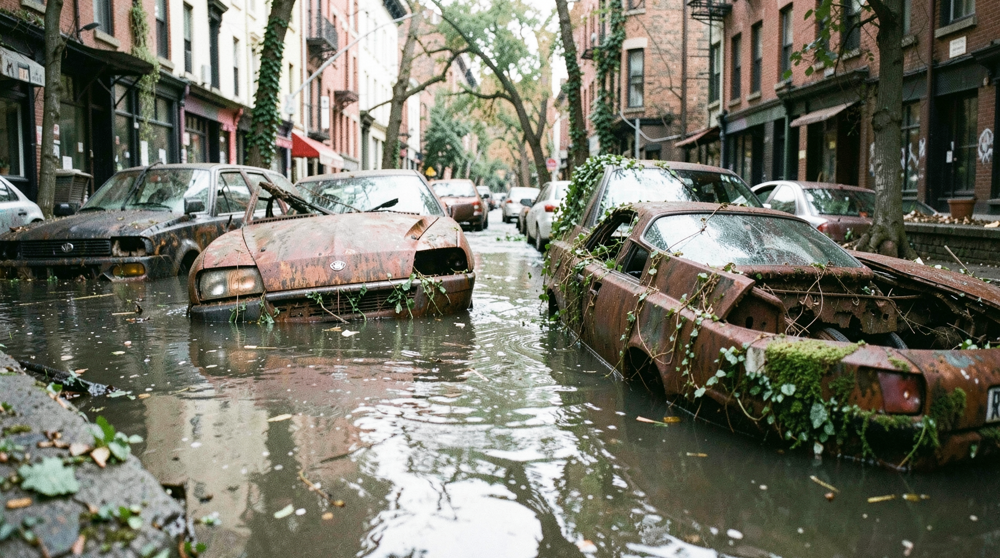

# Nature

## Flux2 Klein 00128

**Prompt:** A candid 35mm photograph of a lush alpine valley with pristine clear water in the foreground and towering pine trees. Natural daylight with soft lens softness at the periphery. Authentic film grain, subtle atmospheric haze.

---

## Flooded City Street

**Prompt:** A candid, street-level 35mm film photograph of a flooded city street. Abandoned rusted cars are half-submerged in water, with moss and vines creeping over the metal. Low contrast, flat daylight, authentic film grain, high detail, optical lens falloff.

---

## Pine Forest Twilight

**Prompt:** hyper-realistic raw dense ancient pine forest at twilight, dappled moonlight through mist, authentic film grain, high detail, optical lens falloff, raw tactile texture

---

## Arctic Glacier

**Prompt:** hyper-realistic raw desolate jagged arctic glacier landscape, blue ice textures, sharp morning light, authentic film grain, high detail, raw tactile texture

---

## Stormy Coastal Cliff

**Prompt:** hyper-realistic raw sun-drenched coastal cliff overlooking a stormy ocean, salty mist, dramatic lighting, authentic film grain, high detail, raw tactile texture

---

## Tokyo Market Crowded

**Prompt:** hyper-realistic raw street level view of a bustling futuristic Tokyo market, rain-slicked neon streets with people walking on sidewalks and cars driving on the street, cinematic cyberpunk, authentic film grain, high detail, optical lens falloff, raw tactile texture

---

## Tokyo Market

**Prompt:** hyper-realistic raw street level view of a bustling futuristic Tokyo market, rain-slicked neon streets, cinematic cyberpunk, authentic film grain, high detail, optical lens falloff, raw tactile texture

---

## Medieval Village Dawn

**Prompt:** hyper-realistic raw medieval European village square at dawn, stone architecture, market stalls opening, soft natural morning light, authentic film grain, high detail, raw tactile texture

---

## Abandoned Desert City

**Prompt:** hyper-realistic raw abandoned desert city, weathered brutalist concrete structures, shifting sands, harsh midday sun, authentic film grain, high detail, raw tactile texture

---

## Skyscraper Interior

**Prompt:** hyper-realistic raw modern glass and steel skyscraper interior looking out over a sprawling coastal metropolis at dusk, warm interior lighting, authentic film grain, high detail, raw tactile texture

---

## Fall 00001

**Prompt:** A candid 35mm photograph of an alpine watermill at autumn, gold and red forest canopy, moody overcast sky, fallen leaves around the mill. Authentic fine film grain, cool color temperature.

---

## Img2Img 00001

**Prompt:** A candid 35mm photograph of an alpine watermill in a serene landscape. Base reference image used for seasonal variations. Natural light, film grain.

---

## Spring 00001

**Prompt:** A candid 35mm photograph of an alpine watermill at spring, fresh green meadow with blooming wildflowers in the foreground. Soft natural daylight, pristine clear stream, subtle atmospheric haze, film grain.

---

## Summer 00001

**Prompt:** A candid 35mm photograph of an alpine watermill at summer, vibrant lush greenery, high mountain sun with dramatic shadows, clear blue sky. Authentic film grain, crisp details.

---

## Winter 00001

**Prompt:** A candid 35mm photograph of an alpine watermill in winter, heavy snow cover on roofs and surrounding pines, soft diffused winter light. Authentic film grain, subtle blue-tinted shadows.

---

## Technical Configuration
- **Workflow File:** `api/Flux.2Klein4B_T2I.json`
- **Model (UNET):** `flux-2-klein-4b.safetensors`
- **Model (CLIP):** `qwen_3_4b.safetensors` (Flux 2 type)
- **Model (VAE):** `flux2-vae.safetensors`
- **Architecture:** Flux.2 Klein 4B distilled
- **Sampler:** `euler`
- **Scheduler:** `Flux2Scheduler`
- **Steps:** 4 (fixed)
- **Resolution:** 1920×1080 (4B variant) or 1024×1024 (9B variant)
- **CFG Scale:** 1
- **Prompt Injection:** Node `76` (PrimitiveStringMultiline)
- **Tokyo Method:** Applied via photographic prompts focusing on 35mm candid composition, lens softness, and authentic film grain constraints.
