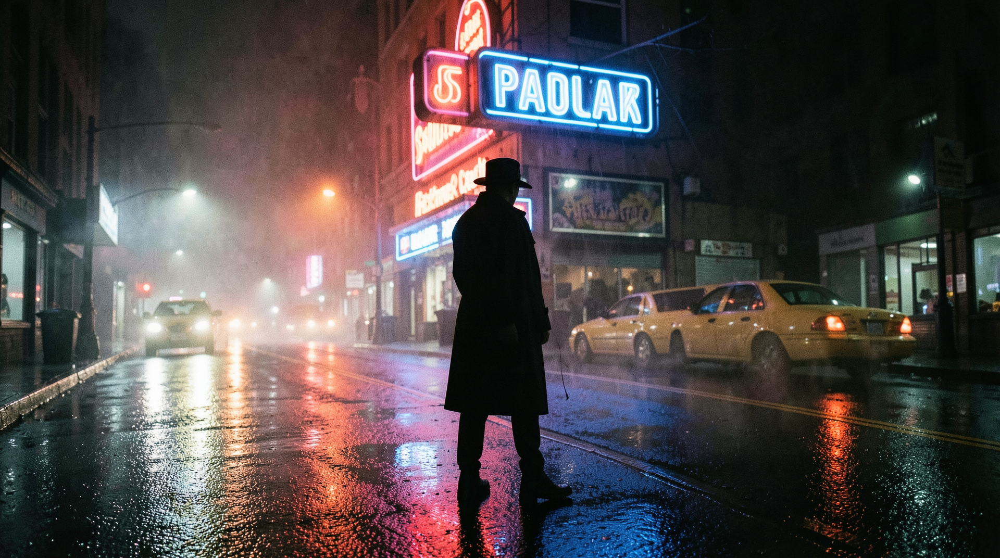
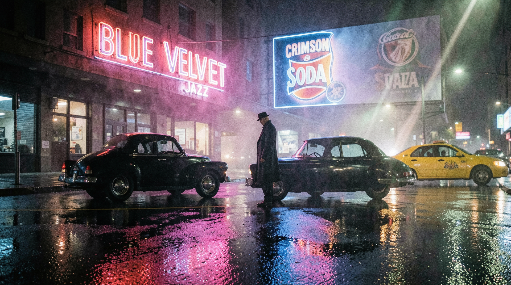
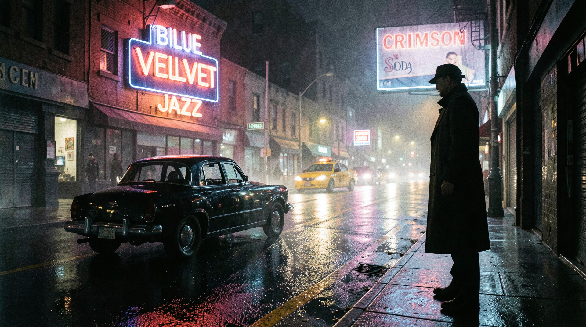
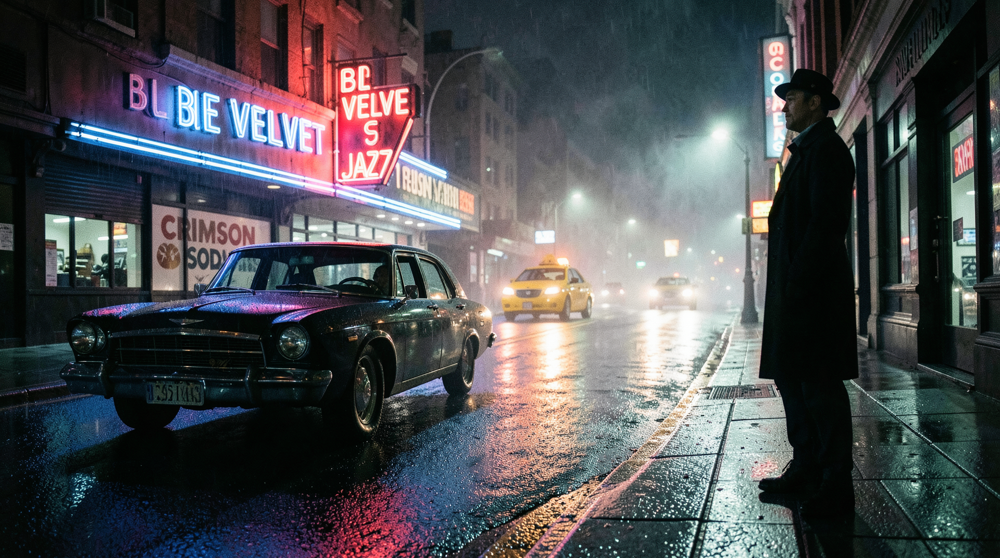
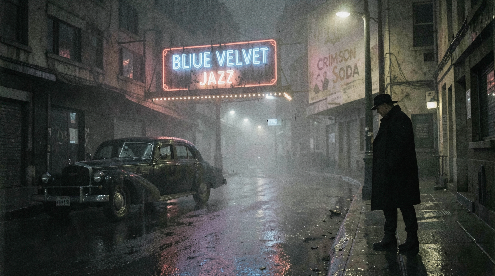

# NoirCity

## noircity_00059

**Prompt:** An authentic, medium-format film still of a rain-slicked city street at night in a vibrant film noir style. A detective in a dark trench coat stands under a glowing, intense crimson and deep azure neon sign of a jazz club. The pavement is wet, reflecting the colorful, distorted neon lights into long, shimmering streaks. Heavy mist hangs in the air, catching the light beams from a passing yellow taxi. High-contrast lighting, sharp focus on the detective's silhouette, dramatic deep shadows, rich color palette, natural 35mm film grain, cinematic anamorphic lens flare, sharp edge definition, physical texture on wet asphalt, no airbrushed skin, authentic night-time color depth.

---

## noircity_00060

**Prompt:** An authentic, medium-format film still of a rain-slicked city street at night in a vibrant film noir style. A detective in a dark trench coat stands under a glowing, intense crimson and deep azure neon sign of a jazz club. The pavement is wet, reflecting the colorful, distorted neon lights into long, shimmering streaks. Heavy mist hangs in the air, catching the light beams from a passing yellow taxi. High-contrast lighting, sharp focus on the detective's silhouette, dramatic deep shadows, rich color palette, natural 35mm film grain, cinematic anamorphic lens flare, sharp edge definition, physical texture on wet asphalt, no airbrushed skin, authentic night-time color depth.

---

## noircity_00061

**Prompt:** An authentic, medium-format film still of a rain-slicked city street at night in a vibrant, color-rich film noir style. A detective in a dark trench coat stands clearly separated from a parked vintage black sedan, with ample space between them to avoid any visual merging. In the background, a glowing crimson and deep azure neon sign of a jazz club explicitly displays the text 'BLUE VELVET JAZZ' in clear, sharp neon tubing. Beside it, a large billboard features a stylized graphic for a classic soda brand with the legible text 'CRIMSON SODA' in bold lettering. The pavement is wet, reflecting the colorful neon lights into distinct, shimmering streaks. Heavy mist hangs in the air, catching the light beams from a single yellow taxi. High-contrast lighting, sharp focus on the detective's silhouette, dramatic deep shadows, rich color palette, natural 35mm film grain, cinematic anamorphic lens flare, sharp edge definition, physical texture on wet asphalt, no airbrushed skin, legible text, clear object separation.

---

## noircity_00062

**Prompt:** An authentic, medium-format film still of a rain-slicked city street at night in a vibrant, color-rich film noir style. A detective in a dark trench coat stands clearly separated from a parked vintage black sedan, with ample space between them to avoid any visual merging. In the background, a glowing crimson and deep azure neon sign of a jazz club explicitly displays the text 'BLUE VELVET JAZZ' in clear, sharp neon tubing. Beside it, a large billboard features a stylized graphic for a classic soda brand with the legible text 'CRIMSON SODA' in bold lettering. The pavement is wet, reflecting the colorful neon lights into distinct, shimmering streaks. Heavy mist hangs in the air, catching the light beams from a single yellow taxi. High-contrast lighting, sharp focus on the detective's silhouette, dramatic deep shadows, rich color palette, natural 35mm film grain, cinematic anamorphic lens flare, sharp edge definition, physical texture on wet asphalt, no airbrushed skin, legible text, clear object separation.

---

## noircity_00063

**Prompt:** An authentic, medium-format film still of a rain-slicked city street at night in a vibrant, color-rich film noir style. A detective in a dark trench coat stands on the sidewalk on the right. A vintage black sedan is neatly parked on the left side of the street, completely separate from the detective. In the background, a glowing crimson and deep azure neon sign of a jazz club displays the text 'BLUE VELVET JAZZ' in sharp neon tubing. Beside it, a billboard features the legible text 'CRIMSON SODA'. A yellow taxi is driving down the road in the mid-ground. The pavement is wet, reflecting the neon lights into shimmering streaks. Heavy mist, high-contrast lighting, sharp focus on the detective's silhouette, dramatic deep shadows, rich color palette, natural 35mm film grain, cinematic anamorphic lens flare, sharp edge definition, physical texture on wet asphalt, no airbrushed skin, legible text, clear spatial layout.

---

## noircity_00064

**Prompt:** An authentic, medium-format film still of a rain-slicked city street at night in a vibrant, color-rich film noir style. A detective in a dark trench coat stands on the sidewalk on the right. A vintage black sedan is neatly parked on the left side of the street, completely separate from the detective. In the background, a glowing crimson and deep azure neon sign of a jazz club displays the text 'BLUE VELVET JAZZ' in sharp neon tubing. Beside it, a billboard features the legible text 'CRIMSON SODA'. A yellow taxi is driving down the road in the mid-ground. The pavement is wet, reflecting the neon lights into shimmering streaks. Heavy mist, high-contrast lighting, sharp focus on the detective's silhouette, dramatic deep shadows, rich color palette, natural 35mm film grain, cinematic anamorphic lens flare, sharp edge definition, physical texture on wet asphalt, no airbrushed skin, legible text, clear spatial layout.

---

## noircity_00065

**Prompt:** A moody, authentic, medium-format film still of a rain-slicked, gloomy city street at night in a classic, muted-tone film noir style. A detective in a dark trench coat stands on the sidewalk on the right, barely illuminated by a dim streetlamp. A vintage black sedan is parked quietly on the left side of the street, showing matte textures rather than gloss. In the background, a worn, flickering crimson and deep azure neon sign of a jazz club displays the text 'BLUE VELVET JAZZ' in slightly dim, humored neon tubing. Beside it, a faded billboard features the text 'CRIMSON SODA'. The pavement is wet but not overly reflective, matte textures predominant. Heavy mist, low-contrast, deep moody shadows, desaturated color palette with deliberate color pops, authentic natural film grain, no digital over-sharpening, professional cinematic lighting, legible but aged text, clear spatial layout.

---

## noircity_00066

**Prompt:** A moody, authentic, medium-format film still of a rain-slicked, gloomy city street at night in a classic, muted-tone film noir style. A detective in a dark trench coat stands on the sidewalk on the right, barely illuminated by a dim streetlamp. A vintage black sedan is parked quietly on the left side of the street, showing matte textures rather than gloss. In the background, a worn, flickering crimson and deep azure neon sign of a jazz club displays the text 'BLUE VELVET JAZZ' in slightly dim, humored neon tubing. Beside it, a faded billboard features the text 'CRIMSON SODA'. The pavement is wet but not overly reflective, matte textures predominant. Heavy mist, low-contrast, deep moody shadows, desaturated color palette with deliberate color pops, authentic natural film grain, no digital over-sharpening, professional cinematic lighting, legible but aged text, clear spatial layout.

---

## noircity_out

**Prompt:** A moody, authentic, medium-format film still of a rain-slicked, gloomy city street at night in a classic, muted-tone film noir style. A detective in a dark trench coat stands on the sidewalk on the right, barely illuminated by a dim streetlamp. A vintage black sedan is parked quietly on the left side of the street, showing matte textures rather than gloss. In the background, a worn, flickering crimson and deep azure neon sign of a jazz club displays the text 'BLUE VELVET JAZZ' in slightly dim, humored neon tubing. Beside it, a faded billboard features the text 'CRIMSON SODA'. The pavement is wet but not overly reflective, matte textures predominant. Heavy mist, low-contrast, deep moody shadows, desaturated color palette with deliberate color pops, authentic natural film grain, no digital over-sharpening, professional cinematic lighting, legible but aged text, clear spatial layout.

---

