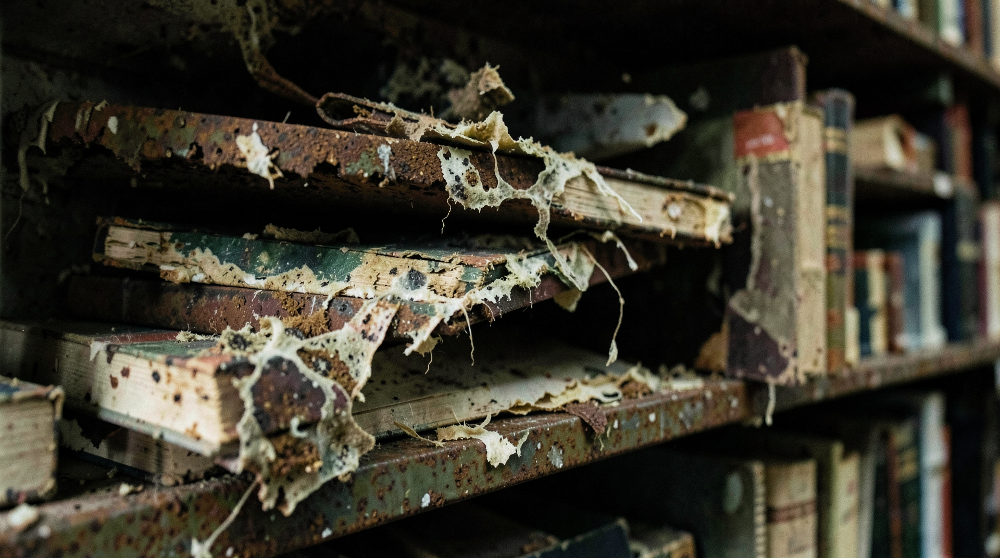
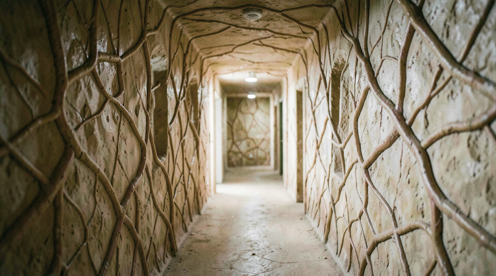
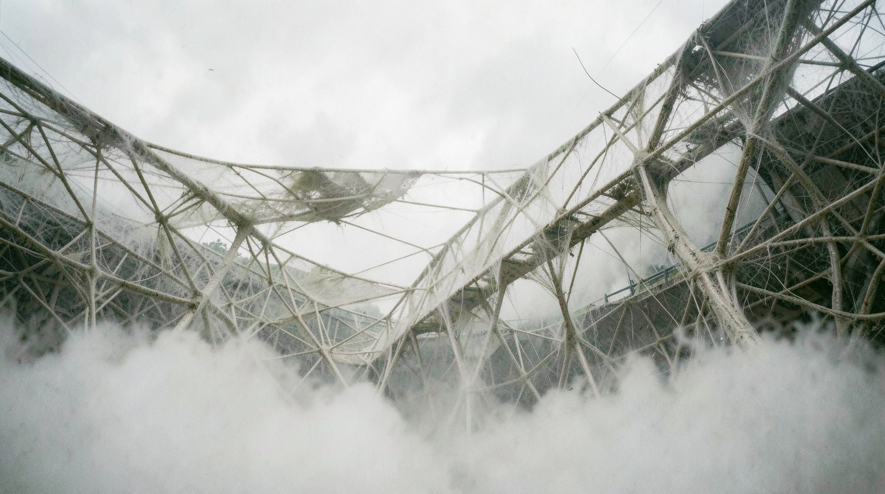

# OrganicArchitecture

## organicarchitecture_00082

**Prompt:** A close-up 35mm photograph of a rusted, collapsed library shelf. Books are decaying into pulp, with water damage and mold patterns forming organic, chaotic shapes. Natural, dim indoor light, shallow depth of field, physical tactile texture.

---

## organicarchitecture_00089

**Prompt:** A 35mm film photograph of a bio-mimetic workspace. Walls feature natural, vein-like patterns that integrate into the structure. Furniture grows organically from the floor, showing cellulose and fiber textures. Soft, internal bioluminescent lighting. Candid, high-detail, authentic film grain, raw tactile texture.

---

## organicarchitecture_00090

**Prompt:** A candid 35mm photograph of a living organic hallway. Walls mimic the texture of biological membrane, with branching structural veins. No digital smoothing. Natural, soft diffuse light, high detail, tactile surfaces, authentic 35mm grain.

---

## organicarchitecture_00097

**Prompt:** A beautiful, flowing organic structure made of giant spider silk patterns, interconnected walkways in the clouds, ethereal lighting, high-end fantasy design.

---

## organicarchitecture_00101

**Prompt:** A candid, street-level 35mm film photograph of an architectural complex built from organic spider-silk-like structural fibers. The walkways are thin, tensile, and physically anchored into clouds, showing visible tension and stress points. Diffuse, natural atmospheric lighting through the mist. No digital blurring or AI-smoothing. High-detail tactile textures showing fiber weaving and organic structural junctions. Authentic 35mm film grain, sharp focus on the fiber geometry, natural light falloff.

---

