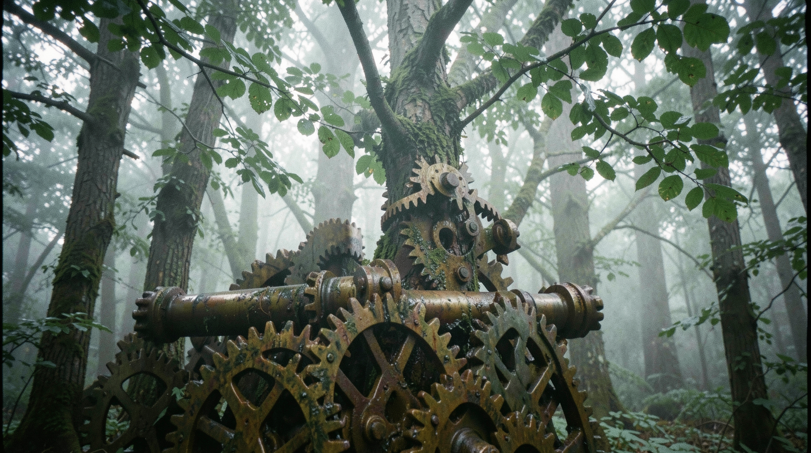
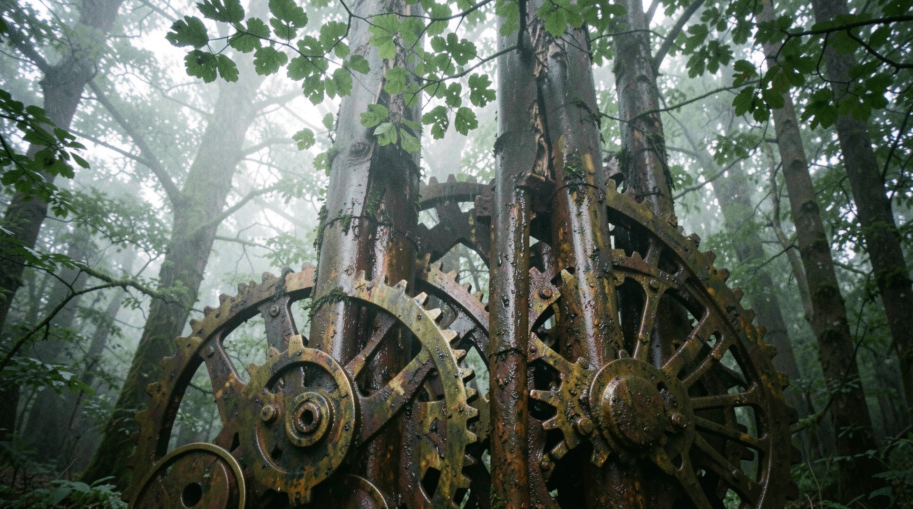
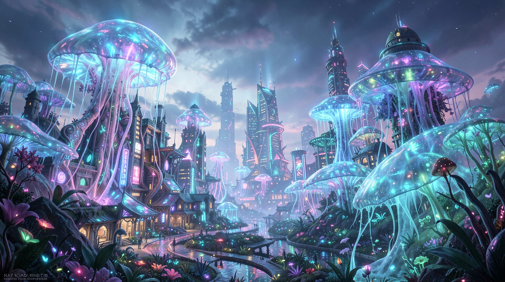
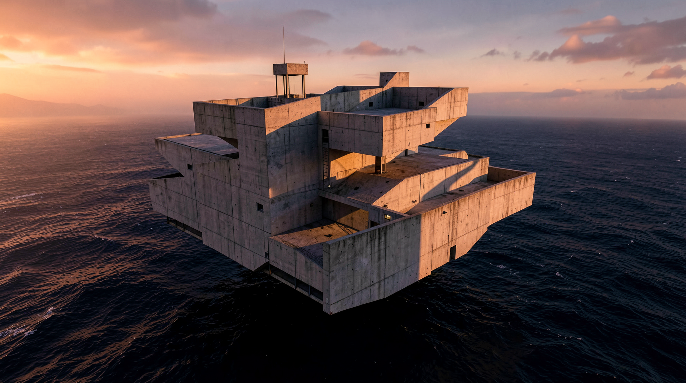
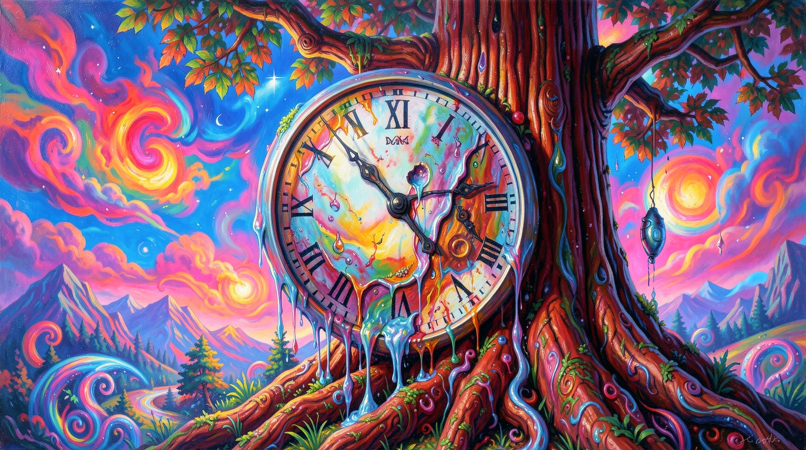
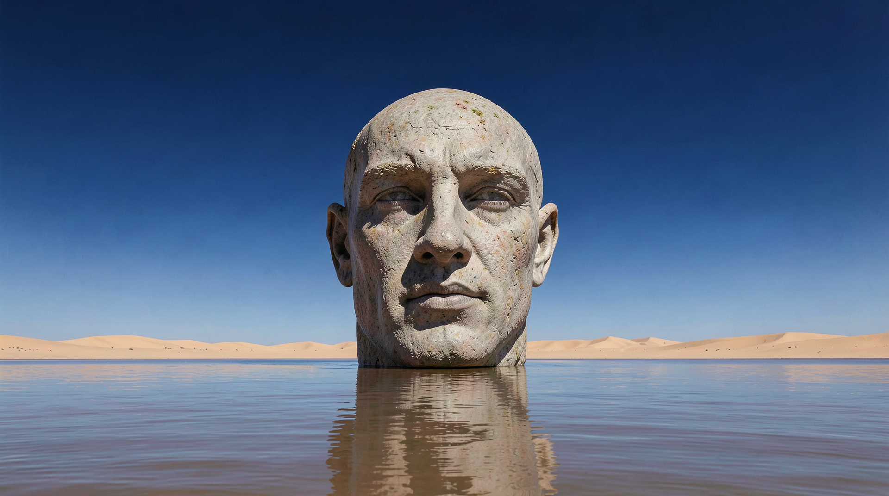

# SurrealAbstract

## surrealabstract_00045

**Prompt:** A raw, uncurated 35mm film photograph of a dense forest where the tree trunks are revealed to be giant, clockwork brass gears and rusted pistons. The transition between wood bark and metallic machinery is seamless, showing authentic rust and grease stains at the mechanical joints. The 'foliage' above is a mixture of green leaves and metallic cog-shaped leaves, all swaying in the wind with mechanical synchronicity. The light is diffused, filtered through a heavy fog, creating a cool, damp atmosphere that makes the metal look genuinely cold to the touch. Technical markers: slight peripheral softness of a vintage prime lens, fine-grain ISO 400 film, and natural, flat light falloff. The scene prioritizes physical realism, treating the clockwork forest as a plausible, tangible environment.

---

## surrealabstract_00046

**Prompt:** A raw, uncurated 35mm film photograph of a dense forest where the tree trunks are revealed to be giant, clockwork brass gears and rusted pistons. The transition between wood bark and metallic machinery is seamless, showing authentic rust and grease stains at the mechanical joints. The 'foliage' above is a mixture of green leaves and metallic cog-shaped leaves, all swaying in the wind with mechanical synchronicity. The light is diffused, filtered through a heavy fog, creating a cool, damp atmosphere that makes the metal look genuinely cold to the touch. Technical markers: slight peripheral softness of a vintage prime lens, fine-grain ISO 400 film, and natural, flat light falloff. The scene prioritizes physical realism, treating the clockwork forest as a plausible, tangible environment.

---

## surrealabstract_00047

**Prompt:** a surreal phone size wallpaper, melting celestial clocks floating in a neon nebula, raw, authentic tactile detail, 35mm film aesthetic

---

## surrealabstract_00048

**Prompt:** a surreal phone size wallpaper, melting celestial clocks floating in a neon nebula, raw, authentic tactile detail, 35mm film aesthetic

---

## surrealabstract_00049

**Prompt:** a surreal phone size wallpaper, melting celestial clocks floating in a neon nebula, raw, authentic tactile detail, 35mm film aesthetic

---

## surrealabstract_00095

**Prompt:** A stunning bio-mimetic city where buildings look like giant shimmering jellyfish, hyper-detailed, glowing neon bioluminescence, dreamlike atmosphere, epic scale.

---

## surrealabstract_00096

**Prompt:** A gorgeous interior of a room made of giant coral reefs, ethereal light, vibrant colors, artistic surrealism, breathtaking architectural design.

---

## surrealabstract_00099

**Prompt:** A stunning concrete fortress floating above a deep dark ocean, surreal brutalist architecture, sunset lighting, sharp geometry, cinematic composition.

---

## surrealabstract_00100

**Prompt:** An artistic minimalist concrete spiral building in a lush green valley, bold geometric lines, beautiful landscape, high contrast, surreal architecture.

---

## surrealabstract_00102

**Prompt:** A surrealist painting of a clock melting over a giant redwood tree, vibrant psychedelic colors, dreamlike composition, high detail, surreal atmosphere.

---

## surrealabstract_00103

**Prompt:** A massive stone head floating in the middle of a calm desert ocean, surrealist art, minimalist horizon, deep blue sky, artistic masterpiece.

---

## surrealabstract_00104

**Prompt:** A grand city street where the buildings are made of giant translucent glass books, pages fluttering in the wind, magical lighting, surreal architectural design.

---

