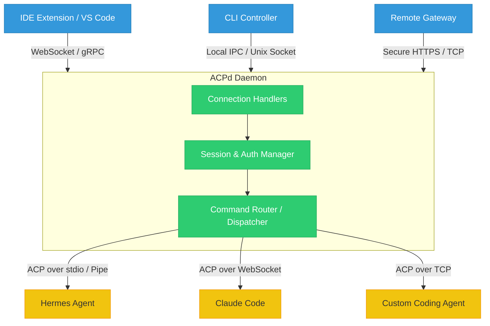

ACPd is a daemon that connects to agents via the Agent Client Protocol (ACP) and serves as a standard interface for agent remote control through various transports.

## Architecture

Here is a block diagram illustrating how ACPd sits between various clients and target AI agents, managing connections, sessions, and dispatching commands over the standardized Agent Client Protocol (ACP):

**Relevant Information/Docs:**
* https://agentclientprotocol.com
