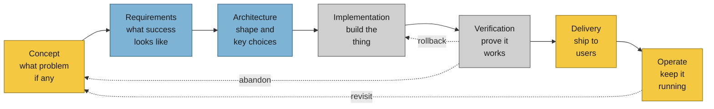
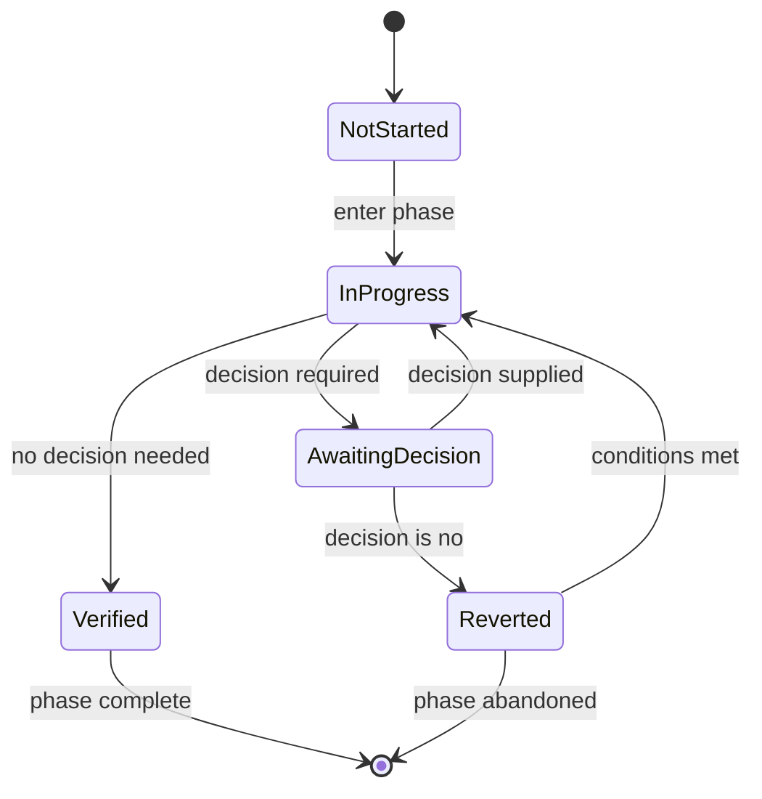

# SDLC for AI-Augmented Operators

A working model of how a solo operator ships software with AI coding agents. The interesting question is not which phases exist — those are well-known — but **where the decision rights live at each phase boundary**. This doc treats each phase as a decision the operator (or the agent, or both) has to make, names the question that must be answered, and lists the facts that answer depends on. It deliberately avoids encoding procedural approval gates; per the [[Research/cognitive-locality-orchestrator-tax|orchestrator's-tax]] framing, a competent agent given the right fact usually picks the right gate — and encoding checkpoints is the common failure mode.

## Phase Flow

The dominant flow with verification-driven rollback. Phase colours mark the primary decision-maker at the entry to that phase. Gold = human decides, blue = agent drafts and human decides, grey = agent executes with human on the hook for verification.

## Phase State Machine

Each phase moves through five states. The `awaiting-decision` state is the only one where the work cannot proceed without external input.

## Decision Map

The actual content. Each phase row names the question, the facts required to answer it, and who is best placed to produce each fact. H = human, A = agent, H+A = joint.

| Phase | Question to answer | Facts required | Fact sources | Decision rights |
|-------|-------------------|----------------|--------------|----------------|
| Concept | Is this worth building? | Problem evidence, alternative landscape, opportunity cost | H holds the problem evidence; A surveys alternatives | H decides |
| Requirements | What does done look like? | Acceptance criteria, edge cases, non-goals | A drafts criteria; H adds non-goals and priorities | H approves scope |
| Architecture | What is the spine of the solution? | Component boundaries, key tech choices, failure modes | A drafts three shapes; H picks the spine | H picks; A documents |
| Implementation | Does the code do what the spec says? | Spec from Requirements, build green, lint clean | A implements; CI runs the verification | A executes; H spot-checks |
| Verification | Does it work in conditions the spec didn't cover? | Test coverage, build artifact, smoke run on real env | A runs the harness; H approves risky deploys | A runs; H gates publish |
| Delivery | Should this leave the building? | Release notes, rollback plan, downstream impact | A drafts notes; H makes the reputation call | H decides |
| Operate | Is it still worth keeping alive? | Usage signal, error rate, maintenance cost | A monitors; H judges | H decides; A flags |

## Open Questions

Places where the operator's preference is the deciding factor and this doc should not guess.

- **Confidence threshold for autonomous implementation.** How much ambiguity in the spec is tolerable before pausing for human input? The skill in [[Entities/superpowers]] suggests a "plan-then-execute" pattern that defers this question to the spec phase.
- **Verification gating.** Is the agent allowed to ship to a staging environment without human approval, with only production requiring sign-off? Or is every environment gated?
- **Operate phase ownership.** Does the agent have authority to revert a deploy that breaks a hard SLO, or does it have to escalate even at 3 AM? This is the kind of decision that should be encoded as a fact in a standing instruction file, not as a procedural gate.
- **Concept phase discipline.** How long does a concept stay in the operator's head before either committing to requirements or killing it? Without a discipline rule, concepts accumulate and stall.

## See Also

- [[Research/cognitive-locality-orchestrator-tax]] — the orchestrator's-tax framing this doc leans on
- [[Research/second-brain-build]] — adjacent AI-augmented build workflow (six-step process)
- [[Concepts/six-step-ai-build-process]] — Superpowers' six-step process, an alternative spine
- [[Concepts/capture-process-connect-create-workflow]] — four-phase loop framing