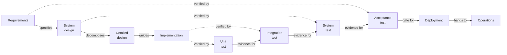

# Traditional Software Development Lifecycle

The classic SDLC is a family of related sequential models — Waterfall, the V-Model, Iterative-Waterfall, Big-Bang — sharing the same shape: a fixed sequence of phases, each producing a documented deliverable that gates the next phase. The most-cited member is the **V-Model**, which makes the verification side explicit by drawing a development-to-verification correspondence between each specification phase and its corresponding test phase. This file uses the V-Model as the spine because it is the most useful reference when comparing the traditional model against the AI-augmented overlay described in [[Projects/SDLC|SDLC for AI-Augmented Operators]].

The traditional model is not a prescription to follow; it is a reference model that other methods descend from or react against. Knowing it well is what makes it possible to read a project plan, a contract clause, or a compliance requirement and recognise which phase of which model is being invoked.

## Involved Roles

The traditional SDLC is role-heavy by design — every phase has a named owner, and handovers between roles are auditable events. Most mid-sized organisations will not staff every role below on every project; smaller teams will combine them. The list is the canonical decomposition.

| Role | Responsibility | Reports to |
|------|---------------|------------|
| Sponsor / Steering Committee | Business case, funding, go/no-go at phase gates | Executive leadership |
| Business Analyst | Elicits and documents business requirements | Project Manager |
| Product Manager | Defines product vision, prioritises scope, owns roadmap | Sponsor |
| Project Manager | Plans, schedules, tracks delivery, manages risk and comms | Sponsor |
| System Architect | High-level architecture, non-functional requirements, integration topology | Engineering Lead or Project Manager |
| Domain Expert / Subject Matter Expert | Validates that requirements reflect real-world usage | Business Analyst or Product Manager |
| Developer / Engineer | Builds components per the design specification | System Architect or Tech Lead |
| QA Engineer / Test Lead | Designs and executes test plans, owns defect lifecycle | Project Manager |
| DevOps / Release Engineer | Build, deploy, environment, release packaging | Operations Lead or Engineering Lead |
| Operations / Support Lead | Runs the system in production, owns incident response | Sponsor |
| Configuration Manager | Version control, baseline management, artefact integrity | Project Manager |

## Phases

Each phase has a defined input, a set of activities, a documented output, and a named role responsible for declaring the phase complete. The Output column is the artefact that physically changes hands at the phase boundary.

| Phase | Inputs | Activities | Output (Deliverable) | Handover to | Responsible | Quality Gate |
|-------|--------|-----------|---------------------|-------------|-------------|--------------|
| Concept / Inception | Business case, market need, regulatory driver | Feasibility study, rough cost-benefit, risk register, scope sketch | Project Charter, Feasibility Report | Sponsor for go/no-go | Sponsor + Business Analyst | Sponsor signs charter |
| Requirements | Approved charter, stakeholder interviews, domain knowledge | Requirements elicitation, use-case modelling, requirement traceability, acceptance criteria | Software Requirements Specification (SRS), Use-Case Document, Requirements Traceability Matrix | System Architect for design; QA Engineer for test planning | Business Analyst | Requirements review board, traceability matrix complete |
| System / High-Level Design | Approved SRS, architectural constraints, integration landscape | Architecture selection, component decomposition, interface contracts, non-functional requirement allocation | High-Level Design Document, Architecture Diagram, Interface Control Document | Developers for detailed design; QA for system test plan | System Architect | Design review board, ADR for each significant choice |
| Detailed Design | Approved HLD, framework conventions, coding standards | Module design, data model, API contracts, error-handling strategy | Detailed Design Document, Data Model, API Specification | Developers for build; QA for integration test plan | Tech Lead / Senior Developer | Code-review-ready design, peer review |
| Implementation / Coding | Approved DDD, environment access, dependencies | Coding, unit testing, static analysis, peer review | Source code, Unit tests, Build artefacts | QA for verification; Configuration Manager for baseline | Developer | Code review pass, unit test coverage threshold met |
| Verification / Testing | Built artefacts, test plans from earlier phases, defect repository | Test execution (unit, integration, system, acceptance), defect triage, regression | Test reports, Defect log, Verification & Validation report | Sponsor for acceptance; Release Engineer for deployment | QA Engineer | All critical and high defects resolved or accepted |
| Deployment / Release | Verified build, release notes, operational runbooks | Environment promotion, release packaging, smoke testing, cutover | Released artefact, Deployment log, Operational runbook | Operations Lead for ongoing support | DevOps / Release Engineer | Production smoke test passes, rollback plan documented |
| Operations & Maintenance | Released system, support contract, incident management tooling | Monitoring, incident response, patching, capacity planning, retirement planning | Operational reports, Patch releases, Retrospective documentation | Sponsor for renewal/retirement decision | Operations Lead | Service Level Agreement met, retro complete |

## V-Model Diagram

The diagram below draws the V-Model: each specification phase on the descending (left) arm has a corresponding verification activity on the ascending (right) arm, joined by a dotted edge that names the verification relationship. Solid arrows show phase-to-phase handovers; dotted arrows show the verification correspondence.

## Phase Handover Map

The table below is the operational core of the traditional SDLC: who hands what to whom at each phase boundary, and which document trails behind the handover for audit.

| Boundary | From | To | Artefact handed over | Audit trail |
|----------|------|-----|----------------------|-------------|
| Concept → Requirements | Sponsor | Business Analyst | Approved Project Charter, Feasibility Report | Charter signature, board minutes |
| Requirements → Design | Business Analyst | System Architect | SRS, Use-Case Document, RTM | Requirements baseline commit |
| Requirements → Test Planning | Business Analyst | QA Engineer | SRS, Acceptance criteria | Test plan reference number |
| Design → Detailed Design | System Architect | Tech Lead | High-Level Design Document, Architecture Diagram, ICD | Design review minutes |
| Design → System Test Planning | System Architect | QA Engineer | High-Level Design, Non-Functional Requirements | System test plan draft |
| Detailed Design → Implementation | Tech Lead | Developer | Detailed Design Document, API Specification, Data Model | Code repo branch created |
| Detailed Design → Integration Test Planning | Tech Lead | QA Engineer | Detailed Design, Interface contracts | Integration test plan draft |
| Implementation → Verification | Developer | QA Engineer | Source code, Unit tests, Build artefact | Build labelled, code-review record |
| Implementation → Baseline | Developer | Configuration Manager | Tagged source baseline | Baseline label, checksum |
| Verification → Acceptance | QA Engineer | Sponsor | V&V report, Defect log, Test reports | Acceptance sign-off |
| Verification → Release | QA Engineer | DevOps / Release Engineer | Verified build artefact, Release notes | Release candidate label |

## See Also

- [[Projects/SDLC|SDLC for AI-Augmented Operators]] — the AI-augmented overlay, framed as a decision map rather than a process map. The natural follow-up to this file is an explicit overlay document that maps each traditional phase onto the AI-augmented decision points, and identifies which roles collapse, which merge, and which become agentic for a solo operator.
- The orchestrator's-tax framing in your wiki argues against encoding procedural approvals as standing rules; the handover map above is useful precisely because it documents explicit transfer points, not because it prescribes that every transfer requires committee approval.