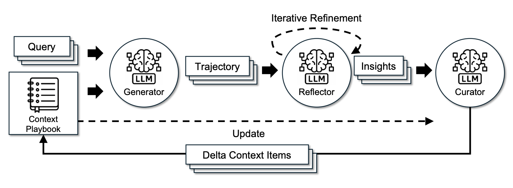
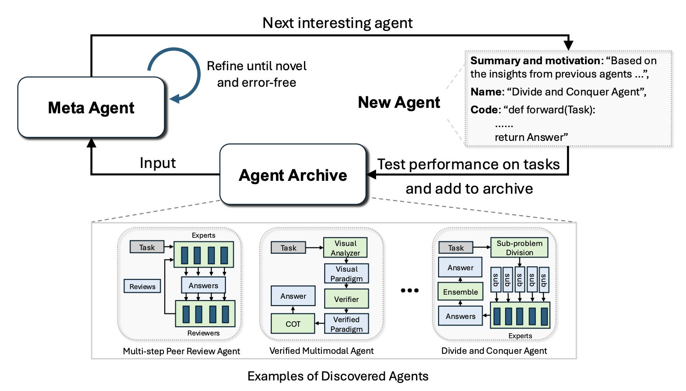
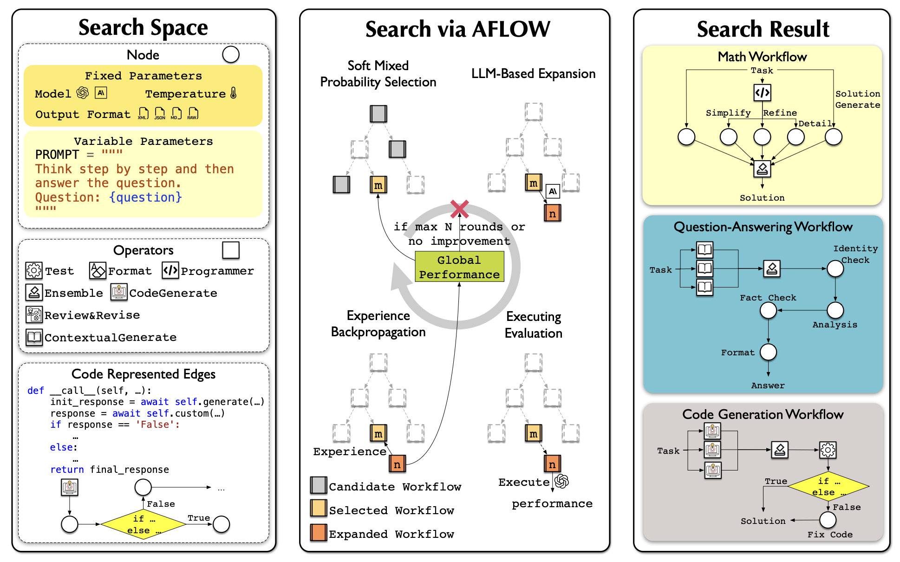
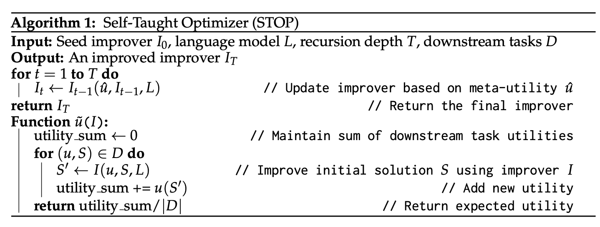
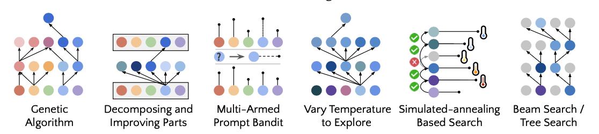

# Harness Engineering for Self-Improvement

**Source:** Lilian Weng, Lil'Log, July 4 2026 — <https://lilianweng.github.io/posts/2026-07-04-harness/>
**Citation:** Weng, Lilian. "Harness Engineering for Self-Improvement". Lil'Log (Jul 2026).

---

## Core Thesis

The concept of recursive self-improvement (RSI) dates back to I. J. Good (1965), where he defined an "ultraintelligent machine" as a system that can surpass humans in all intellectual activities and design better machines to improve itself. Yudkowsky (2008) used the phrase "recursive self-improvement" for a specific feedback loop: an AI uses its current intelligence to improve the cognitive machinery that produces its intelligence.

In modern AI, this feedback loop may indicate the model rewriting its own weights directly, or more broadly the model improves the **training pipeline** and the **deployment system**, which in turn enables a better successor model. The speed of research development in AI has drastically accelerated in frontier labs (Anthropic; OpenAI).

> **Harness:** The system surrounding a base model that orchestrates execution and decides how the model thinks and plans, calls tools and acts, perceives and manages context, stores artifacts, and evaluates results.

Harnesses (Claude Code, Codex, etc.) are as important as the model's raw intelligence. The near-term RSI path is unlikely to start as a model directly rewriting its weights — it will start with harness engineering evolving toward meta-methodology.

---

## Harness Design Patterns

Compared with early agent frameworks ("agent = LLM + memory + tools + planning + action"), harness engineering additionally includes **workflow design (loop engineering), evaluation, permission controls, and persistent state management**. It is no longer only prompt templates, but closer to runtime and software system design.

The design should be deliberately simple and generic to enable generalization, with reference to existing software engineering practices. There is a strong analogy between operating systems and harnesses: encapsulate complicated logic while keeping the interface simple; configs, tool interfaces and protocols may gradually become standardized across the industry.

### Pattern 1: Workflow Automation

Defining a workflow in which the model can operate, test, and iterate is a key design for automation. [[Entities/karpathy-autoresearch|Karpathy's autoresearch repo]] is a clean example. A common workflow follows a goal-oriented loop of **plan → execute → observe/test → improve → execute again** until the goal is achieved. The process may trigger proactive requests to users for clarity in task specification or execution preference.

*A simplified Codex agent loop: the agent calls tools and tool responses affect the model's next generation. (Image source: OpenAI codex agent post)*

The workflow graph emphasizes the model analyzing its own trajectories and failure cases and iterating on its progress through an "agent runtime" rather than a static prompt template.

### Pattern 2: File System as Persistent Memory

A recurring pattern in long-horizon agent systems is simple control over rich states and artifacts. A harness should NOT carry the entire workflow and all logs in context; instead, it should keep **durable state in files**. In long-horizon agentic rollout, artifacts such as experiment logs, code diffs, paper summaries, error traces, and past rollout trajectories often grow much longer than the context window the model has trained for.

Learning how to read, write, and edit the file system (commonly via `bash` commands) is a foundation skill for LLMs, and managing persistent memory as files naturally benefits from improvements in core model capability.

### Pattern 3: Sub-agent and Backend Jobs

A harness can spawn multiple subagents to execute in parallel and monitor backend jobs. This is useful when the main agent needs to search multiple hypotheses, run experiments concurrently, or delegate isolated subtasks without polluting the main context. The parent agent needs a small process manager: launch jobs, inspect logs, cancel failed runs, merge results.

> **Key design choice:** make parallelism explicit and inspectable. If subagent outputs only live in a transient chat context, they become obsolete and hidden. If they are stored as files, logs, and status records, the model can recover after interruptions and reason over its own execution history.

### Case Study: Coding Agent Harness

The core interface of mainstream coding agents has stabilized across Claude Code, Codex, OpenCode, and Cursor-style agents. They commonly use a loop like:

*Coding agent harness loop. (Image source: Lil'Log)*

| Group | Tool definitions |
|-------|------------------|
| **File system** | Discovery: `glob`, `grep`, `ls`; Read: `read`, `read_many`; Modification: `write` (whole file), `edit` (string exact-match), `multi_edit`, `apply_patch` (structured diff) |
| **Shell execution** | `bash`, `PowerShell` |
| **IO** | `lsp`, `git_status`, `git_diff`, `git_commit` |
| **External context** | MCP tools, Skills |
| **Web search** | `web_search`, `web_fetch`, browser tools |
| **Artifacts** | Read docs/images; generate HTML, images |
| **Backend processes** | `CronCreate`, `CronDelete`, `CronList` |
| **Agent delegation** | `spawn_agent`, `resume_agent`, `wait_agent`, `list_agents`, `close_agent`, `interrupt_agent` |

### Harness Layer vs Core Intelligence?

The near-term path of RSI is unlikely to start as a model directly rewriting its weights. The author's prediction:

1. Harness engineering will evolve in the direction of **meta-methodology** — improving the machinery for getting better answers, not just improving the answer itself. The harness system itself becomes an optimization target, with fewer heuristic rules and more general mechanisms.
2. Mature harnesses enable auto-research for model self-improvement loop; smarter models prevent harnesses from overengineering and keep the system sustainable.

Eventually many harness improvements will be *internalized* into core model behavior, but the interface with external context and tools should remain. We have seen a softer version of this pattern with prompt engineering: manual prompt tricks became less central as instruction tuning and reasoning improved, but the need to specify goals, constraints, context, and evaluation did not disappear.

---

## Harness Optimization

The progression in the object being optimized is roughly:
**instruction prompts → structured context → workflow → harness code → optimizer code**

As the model becomes more intelligent, we move toward more complex targets and generic methods.

### Context Engineering

Simply appending all tool responses and model generations into context quickly grows out of control as the agentic job horizon increases. Context management constructs a more structured and concise context for the LLM and manages persistent state.

#### Agentic Context Engineering (ACE; Zhang et al. 2025)

Treats context as an **evolving playbook of bullet points** rather than a lengthening prompt. Three components maintain one context playbook of bullets, each with an identifier and description:

- **Generator** — produces task trajectories, with reference to bullet points.
- **Reflector** — distills insights from successful and failed trajectories.
- **Curator** — updates the structured context with incremental, itemized entries.

*The framework of Agentic Context Engineering (ACE). (Image source: Zhang et al. 2025)*

> To prevent context collapse and brevity bias during iterative rewrites, the curator does **not** rewrite a full prompt blob. It outputs a collection of structured, itemized bullets in the form of `(identifier, description)`, merged into a structured context logbook with deterministic logic. Context items are refined and deduplicated periodically.

#### Meta Context Engineering (MCE; Ye et al. 2026)

Separates **mechanism** (how to manage context) from **artifact content** (what is in context), running skill evolution at the meta-optimization level and context optimization at the base level.

A skill $s \in \mathcal{S}$ defines a context function $c_s=(\rho_s,F_s)$ and maps input $x$ to context $c = F_s(x;\rho_s)$, where:

- $\rho_s = \{\rho_1,\dots,\rho_m\}$ are static components (prompts, knowledge bases, code libraries)
- $F_s = \{F_1,\dots,F_k\}$ are dynamic operators (search, selection, filtering, formatting)

**Bi-level optimization:**

$$
\text{Inner: } c_s^* = \arg\max_{c_s} J_\text{train}(c_s; s) \quad
\text{Outer: } s^* = \arg\max_{s\in\mathcal{S}} J_\text{val}(c_s^*)
$$

The skill database tracks the history $\mathcal{H}_{k-1} = \{(s_i, c_i, J_i^\text{train}, J_i^\text{val})\}_{i=1}^{k-1}$. A meta-level agent performs **agentic crossover** over prior skills to create a new skill given task $\tau$: $s_k = \text{crossover}(\tau, \mathcal{H}_{k-1})$.

Then a base-level context engineer executes $s_k$ and learns the context function from rollout feedback $\mathcal{R}_k$, guided by the current skill: $c_k = \text{engineer}(\tau, s_k; c_{k-1}^*, \mathcal{R}_k)$.

*The framework of Meta Context Engineering (MCE): meta-level skill evolution searches over context-management mechanisms; base level optimizes the task context. (Image source: Ye et al. 2026)*

MCE does not enforce a heuristic rule for how to structure context. It uses free-form skills stored as files (`skill.md` + dynamic context/data), and evolves the skill and the skill-conditioned context iteratively together. Implementation-wise, a context function $c$ is a collection of files in a dedicated directory, including both static (`skill.md`) and dynamic components. Both meta-level and base-level optimization run in agentic coding envs with tool set:

$$
\mathcal{T} = \{\texttt{Read}, \texttt{Write}, \texttt{Edit}, \texttt{Bash}, \texttt{Glob}, \texttt{Grep}, \texttt{TodoWrite}\}
$$

#### Meta-Harness (Lee et al. 2026)

Moves another level deeper: the optimized object is **the code that determines and optimizes what information should be stored, retrieved, and presented to the model**. "Meta-" means it is a harness for optimizing harnesses.

*The Meta-Harness outer-loop optimization algorithm. (Image source: Lee et al. 2026)*

The proposer for creating a new harness is itself a coding agent; the final output is a collection of harness candidates on the Pareto frontier.

- The entire execution history is accessible via a file system; the coding agent uses `grep` or `cat` instead of shoveling everything into a single prompt context.
- The proposed harness is a dictionary in the file system containing its own source code, scores, rollout trajectories, and state updates.
- The meta-harness loop iteratively creates new harnesses; only qualified ones are kept.

*Performance of Meta-Harness on (Left) text classification with a small number of iterations and (Right) TerminalBench-2. The search in the TerminalBench-2 experiment is initialized from Terminus-KIRA and Terminus-2, two very strong harnesses. (Image source: Lee et al. 2026)*

> **Lesson:** Once harness design becomes an executable search space, a strong coding agent can exploit the same design space human engineers use.

### Workflow Design

Workflow design in harness engineering can be handcrafted by domain experts. Various auto-research frameworks have been proposed and tested:

#### AI Scientist (Lu et al. 2026, Nature)

Pipeline of **propose research ideas → write code → run experiments → analyze results → write manuscript** → peer review.

*AI Scientist pipeline for idea generation, experimentation, paper writing, and review. (Image source: Lu et al. 2026)*

**ScientistOne** (Meng et al. 2026) makes verifiability the central design constraint — every claim (citation, numerical, methodological, conclusion) must trace to an evidence source and is audited by Chain-of-Evidence checks.

#### Autodata (Kulikov et al. 2026)

Designed to work as a data scientist for generating training and evaluation data. The main agent manages a **challenger** that proposes problems, a weak solver, a strong solver, and a verifier/judge, aiming to synthesize data at the "just right" level of difficulty (strong solver succeeds, weak solver fails).

The challenger prompt is updated iteratively according to feedback from the solvers and verifier. Limitation: synthesized tasks are used to fine-tune weak solvers but not strong solvers; if the loop cannot iteratively improve the strong model, it is more like indirect distillation over a generated prompt distribution, with less RSI flavor.

*Autodata agentic workflow design for generating synthetic training and evaluation data around challenger, solver, and verifier roles. (Image source: Kulikov et al. 2026)*

#### ADAS — Automated Design of Agentic Systems (Hu et al. 2025)

Formulates agent design itself as an optimization problem: **"meta-agent search"** where a meta-agent proposes new designs of agentic workflows.

1. Initialize an archive of agentic workflows with simple agents (CoT, self-refine).
2. Ask a meta-agent to program new agents, all in code, inspired by existing solutions in the archive.
3. The meta-agent first generates a high-level description of the new workflow, then implements it in code.
4. The draft program goes through two self-refine steps (Madaan et al. 2023) by the meta-agent to check its novelty.
5. Evaluate each new candidate; add successful ones back to the archive.
6. Repeat steps 2-3 until the maximum iteration count is reached.

*Illustration of Automated Design of Agentic Systems (ADAS). (Image source: Hu et al. 2025)*

#### AFlow (Zhang et al. 2025)

Represents an agentic workflow as a **graph**, where nodes are LLM-invoking actions and edges implement logical operations in code. Workflow optimization uses MCTS (Monte Carlo Tree Search):

1. Initialize the starting workflow $W_0$ in the tree with a template.
2. Select a workflow node using a soft mixture of score and uniform exploration.
3. Expand it by asking an LLM to produce a modified workflow conditioned on its evaluation performance.
4. Execute and evaluate the new workflow.
5. Add it back to the tree if it shows improvement within a budget of $N$ rounds.
6. Repeat steps 2-5 and stop when the top-$k$ average score plateaus or budget is hit.

*AFlow optimization process over a tree of workflow candidates. (Image source: Zhang et al. 2025)*

Experiments in QA, code, and math tasks showed decent improvement of AFlow over manually designed workflows and ADAS.

*AFlow experiments in comparison to manual methods and ADAS. (Image source: Zhang et al. 2025)*

### Self-Improving Harness

Either context engineering or workflow design is only one part of a harness. We need to search through the entire design space and optimize context-management logic, workflow, permissions, and other harness components together. As seen in Meta-Harness, ADAS, and AFlow, ✨code✨ is a universal language for defining programs and systems. In simple words, a harness is code that programs how prompts, tool calls, subagents, control flow, memory, and workflow logic work together.

#### Self-Taught Optimizer (STOP; Zelikman et al. 2023)

One of the early examples of recursive scaffolding improvement. A seed improver $I_0$ at step $t=0$ takes an initial solution $s$, a utility function $u$, and a black-box language model $M$, and returns an improved solution $s' = I(u, s; M)$. The goal of STOP is not directly to improve $s$ but to improve the improver $I$ itself.

The **meta-utility** is the average utility of a given improver function $I$ over a collection of downstream tasks $\mathcal{D}$:

$$
\hat{u}(I) \triangleq \frac{1}{|\mathcal{D}|} \mathbb{E}_{(u,s)\sim \mathcal{D}}[u(I(u,s; M))]
$$

Because improving the improver is itself an optimization problem, we recursively get a new version of $I_t$ based on $I_{t-1}$'s performance:

$$
I_t = I_{t-1}(\hat{u}, I_{t-1}; M)
$$

*Algorithm of Self-Taught Optimizer (STOP). (Image source: Zelikman et al. 2023)*

The improved improver discovered strategies such as genetic algorithms, decomposing-and-improving-parts, multi-armed prompt bandits, simulated annealing, varying temperature, and beam/tree search. Analogous to how a harness workflow can be represented as an object for optimization.

*Examples of self-improvement strategies discovered by STOP. (Image source: Zelikman et al. 2023)*

> **Cautionary result:** STOP improved mean downstream performance across iterations with GPT-4 but **degraded with weaker models** like GPT-3.5 and Mixtral. Recursive structure alone is not enough — the base model must be capable enough to improve the mechanism. Harness improvement enables better deployment of the model, but intelligence is still the core.

#### Harness Updating vs Harness Benefit (Lin et al. 2026)

Investigated the dependency of harness evolution on model capabilities in detail. Disentangled two axes:

1. **Harness-updating** — capability of producing useful harness edits
2. **Harness-benefit** — capability of utilizing the updated harness for better task solving

Interestingly, a range of models from Qwen3.5-9B to Claude Opus 4.6 showed **similar harness updating capability**: the 9B harness proposer/evolver can write a skill procedurally isomorphic to Opus. To best utilize a harness, a model needs to invoke skills/tools correctly and timely and be good at long-horizon instruction following.

*Main results: (A) harness updating capability is flat across Qwen2-32B to Opus 4.6; (B) harness benefit capability is non-monotonic where middle-tier models benefit the most. (Image source: Lin et al. 2026)*

#### Self-Harness (Zhang et al. 2026)

LLM agents improve their own harness via a **propose-evaluate-accept loop**.

*Self-Harness uses a loop of weakness mining, bounded harness proposal, and validation to update a harness. (Image source: Zhang et al. 2026)*

**Three stages:**

1. **Weakness mining** — cluster failures into verifier-grounded failure patterns. The current harness $h_t$ evaluates tasks; execution traces are collected. Two runs can share the same verifier outcome (timeout, missing artifact) while having different causal mechanisms, so we need a failure record of rich information containing the terminal verifier-level cause, the causal status of the relevant agent behavior, and the abstract agent mechanism exposed by the trace.

2. **Harness proposal** — propose bounded harness edits based on mined failure patterns. The same model is invoked under $h_t$ as a proposer with a bounded proposal context: (1) the editable surfaces of the current harness, (2) the verifier-grounded failure patterns, (3) records of passing behaviors to preserve, (4) summaries of previously attempted edits. Edits prefer recurrent error patterns that are addressable (not task-specific difficulty) and resolvable by narrow changes. Candidates should be distinct and diverse.

3. **Proposal validation** — validate and merge qualified edits to create a new harness $h_{t+1}$. Edits evaluated by regression tests on held-in $D_\text{in}$ (weakness resolved?) and held-out $D_\text{out}$ (no other regressions?). Accepted only if both pass. Accepted candidates are merged to update the harness; rejected candidates are logged without changing the active harness.

When running `MiniMax M2.5`, `Qwen3.5-35B-A3B`, and `GLM-5` on Terminal-Bench-2, Self-Harness learned model-specific harness instructions that target different weaknesses of different base models and improved held-out pass rates.

> **Author's concern:** If a program is allowed to edit the OS system, abstraction boundaries are broken. The editable surface needs to be properly designed; permission control and security layers need to live outside this loop. All the challenges around reward hacking still remain.

#### Agentic Harness Engineering (AHE; Lin et al. 2026)

Sees the bottleneck of harness evolution as **observability** — when a rollout fails, we need to know which component is responsible; every edit should be grounded by evidence. The framework creates a closed loop with **3 observability pillars**:

- **Component observability** — every editable harness component has a representation in the file system so the action space is explicit and traceable. A harness contains 7 components: system prompt, tool description, tool implementation, middleware, skill, sub-agent configuration, long-term memory. Each failure pattern is mapped to one component so the edit can be more targeted.

- **Experience observability** — analyze and summarize a large amount of raw trajectories into a hierarchy of evidence and failure patterns. Each harness generates $k$ traces. An "Agent debugger" analyzes trajectories (each stored in one file) and generates per-task analysis reports on root causes. All per-task reports are aggregated into a benchmark overview; raw traces can be accessed if needed. This layered access structure is more token efficient.

- **Decision observability** — every edit is paired with a prediction for the next round to validate. An "Evolve agent" reads the repo, decides which component to edit, then produces the edit and the reasoning behind it. Every edit is a file-level, falsifiable claim verifiable in the next round, under two constraints: (1) Edits are only applied to the harness workspace — the runs directory, tracer, verifier, and LLM configuration are read-only, disabling a set of reward hacking (disabling the verifier, swapping the model, raising the reasoning budget), keeping every recorded gain attributable to harness edits. (2) Edits are evidence-driven, with a manifesto entry: the failure evidence's name, the inferred root cause, the targeted fix, and a predicted impact (expected fixes + at-risk regressions).

On Terminal-Bench-2, AHE achieved better than human-designed harnesses (OpenCode, Terminus-2, Codex) except for the Hard tier and a few other self-evolve baselines (ACE, TF-GRPO). The same frozen harness, without further evolving, transfers to SWE-bench-verified, indicating that the evolved harness encodes engineering experience rather than benchmark-specific optimization.

### Evolutionary Search

Evolutionary search evolves a population of solutions by mutating them and only keeping those with high "fitness". Useful when (1) the search space is extensive or weirdly shaped; and (2) it is hard to optimize directly with gradients but easy to evaluate solutions. Harness search fits this.

Prior prompt-evolution work: **Promptbreeder** (Fernando et al. 2023) optimizes task-specific prompts through a rich set of mutation operations; the mutation prompts are themselves improved through evolution. **GEPA** (Agrawal et al. 2025) combines reflection-based prompting with evolutionary search using natural language reflection over trial-and-error trajectories to propose prompt updates.

#### AlphaEvolve (Novikov et al. 2025)

A coding-agent evolutionary search system: stores a pool of candidate programs and prompts frozen LLMs to generate diffs for improvement. As the system repeatedly evaluates child programs and keeps successful ones, it discovers better solutions in time.

*How AlphaEvolve works. (Image source: Novikov et al. 2025)*

Key design details:

- The prompt includes parent programs, results, instructions, and sometimes meta information.
- The coding agent has access to the full repo, but code regions for improvement are explicitly marked with `# EVOLVE-BLOCK-START` and `# EVOLVE-BLOCK-END`.
- Meta-prompt co-evolves with instructions and context as suggested by the LLM, similar to how solution programs are evolved.

Ablations show the value of the evolution procedure, context in prompts, meta-prompts, full-file evolution, and stronger LLMs.

*Ablations show the value of several designs in AlphaEvolve. (Image source: Novikov et al. 2025)*

#### ThetaEvolve (Wang et al. 2025)

Combines evolutionary search with RL and in-context learning.

#### DemoEvolve (Che et al. 2026)

Augments the self-rollout archive with **human expert demonstrations** as reference experience for harness-level diagnosis and editing.

#### ShinkaEvolve (Lange et al. 2025)

Introduced three new components for LLM sampling efficiency:

- More sample-efficient exploration by designing parent sampling to balance performance rank and offspring count.
- **Code-novelty rejection sampling** — discard candidates too similar to the existing population based on embedding-based cosine similarity.
- Identifying good patterns in successful solutions in a **meta-scratchpad** to guide future mutation.

#### Darwin Gödel Machine (DGM; Zhang et al. 2025)

Explicitly targets the evolution of an **editable harness-code repository** with an LLM-based coding agent — the agent is allowed to modify its own harness. A follow-up **Hyperagents** (Zhang et al. 2026) introduced a meta-agent to control how to modify existing task agents to create new ones.

1. Start with one coding agent in the pool.
2. In each iteration, pick one parent with probability proportional to its performance and **inversely to the number of children it has**, to modify and branch off to produce new agents.
3. The selected parent agent examines its own benchmark evaluation log and proposes improvements to its own harness codebase to generate a new version of the coding agent. Code editing is implemented with two basic tools: (1) `bash` (args: `<bash_command>`) and (2) `editor` (args: `view/create/edit <file_path>`).
4. New coding agents are evaluated; only those with sufficiently high performance are added back to the pool.
5. Repeat steps 2-4 until some stop criterion hits.

DGM is harness evolution under a fixed model. In experiments with `Claude 3.5 Sonnet` as the base LLM and simple initial harness configs, the DGM-discovered agents are comparable to or outperform handcrafted agents on **SWE-bench Verified (20% to 50%)** and **Polyglot (14.2% to 30.7%)**.

This family of methods works well when candidate solutions are automatically evaluable and candidate fitness is easy to quantify (matrix multiplication, GPU kernel optimization, algorithm contests, datacenter scheduling). It struggles with domains where evaluation is slow, ambiguous, or mostly heuristic-based. Compute efficiency and effectiveness of evolution are also concerns.

### Joint Optimization with Model Weights

Harness evolution changes the non-parametric system around the model. To enable full self-improvement, the model can also update its own weights via improvements in the training pipeline or continual learning at test time.

#### SIA (Hebbar et al. 2026)

Early attempt to combine harness improvement and model-parameter updates in the same optimization loop, with three components:

- **Meta-Agent** — proposes the initial harness
- **Task-Specific Agent** — executes the task
- **Feedback-Agent** — chooses whether to update the harness or the model weights based on recent trajectories

*The Feedback-Agent in SIA decides the next iteration type. (Image source: Hebbar et al. 2026)*

> **Author's caveat:** Confounding choices in SIA's experiments make the results hard to interpret — the task-specific agent is much weaker than the models used for the Meta-Agent and Feedback-Agent (`gpt-oss-120b` vs `Claude Sonnet 4.6`); baselines are too weak to cross-reference cleanly against related methods. The direction is interesting; the evidence is provisional. Training stability and Goodhart effect remain open.

#### Continual Harness (Karten et al. 2026)

Experiments in long-horizon gameplay with harness updating and co-learning a policy model by distilling a strong teacher model's labels on low-reward trajectories.

---

## Future Challenges

The AI Scientist line of work is a strong demonstration that an expert-designed harness can coordinate a large portion of auto-research loop, experimented in the form of writing research papers. But paper production is not identical to scientific discovery. A system can write a plausible manuscript while still having fabricated citations, implementation drift, or weak experimental results.

Trehan & Chopra (2026) tested whether LLMs can go from research idea to paper with minimal scaffolding (basic tools: `read_file`, `write_file`, `llm_search`, `list_files`). Each idea had a dedicated workspace where agents could generate and read documents. They experimented in three domains (world models, multi-agent RL, AI safety & alignment) with 45-50 high-quality seed documents per domain. Only 4 ideas were selected by human experts; only 1 was fully executed into a paper.

**Six recurring failure modes:**

1. **Bias toward training-data defaults** — use old libraries, stale commands, standard formats, or assumptions not grounded in the actual repository or dataset.
2. **Implementation drift under execution pressure** — when implementation becomes complex, the model moves toward a common simpler solution rather than the proposed method.
3. **Memory and context degradation** — long-horizon projects lose critical details unless logs are written as persistent artifacts.
4. **Over-optimism** — the model declares success despite noisy or failed experiments, similarly observed as "p-hacking and eureka-ing" by Bubeck et al. (2025) where models can introduce "numerical duct tape" and declare victory when signals are still noise.
5. **Insufficient domain intelligence** — the model lacks tacit craft knowledge (predicting implementation complexity, judging whether an experimental result is plausible, knowing which baselines matter).
6. **Weak scientific taste** — experiments may be executable but fail to answer the right question.

**Seven open bottlenecks toward full RSI:**

1. **Weak and fuzzy evaluators** — many research claims do not have a fast and precise verifier. Current self-improvement loops work best for tasks with measurable, objective metrics. Research taste, novelty, and long-term scientific value are much harder to measure.

2. **Context and memory lifecycle** — memory grows as AI agents become more autonomous. A useful harness needs to manage context and memory to complement long-context limitations while maximizing long-horizon task success. Since humans maintain memory through our lifetime, context engineering should become a core part of intelligence rather than staying in the software system layer.

3. **Negative results** — literature is biased toward successes. LLMs may be bad at deciding when to abandon a hypothesis, report a negative result, or acknowledge failure due to the imbalance of success vs failure cases in training data. A research harness should make failed attempts easy to preserve — learning from failure is the best way to trim the task search space.

4. **Diversity collapse** — evolutionary and RL loops tend to exploit known high-reward patterns. We need mechanisms to prevent the population from collapsing into variants of the same solution. Critical for open-ended research where the best path may initially look worse under the current evaluator.

5. **Reward hacking** — a self-improvement loop optimizes whatever signal it is given. If the reward comes from unit tests, the agent may overfit to tests; if from a judge model, it may learn reward hacking tricks specific to this judge; if from benchmark scores, it may exploit benchmark artifacts. The evaluator and permission control should likely sit outside the loop that evolves harness, with held-out tests, trace audits, and human review at decision points that matter.

6. **Long-term success** — extrinsic loop optimization works on rewards outside individual rollouts that we can simulate in training sandbox. Coding agents have increased daily productivity in software engineering, but many optimization goals are still too short-term. Standard sandbox-based RLVR-style training rarely captures maintainability, ownership boundaries, migration cost, backwards compatibility, or future debugging burden.

7. **The role of humans** — humans should move up the stack, not be removed from the loop. Humans should provide oversight at the right time, at the right abstraction level; system design should consider when and how to set up such touch points.

> "We are building the technology for better future of humanity, not other way around."

---

## Appendix: Useful Benchmarks

- **PaperBench** (Starace et al., ICML 2025) — replicate 20 ICML 2024 Spotlight and Oral papers from scratch. 8,316 rubrics co-developed with paper authors. Best model at the time (`Claude 3.5 Sonnet`, ~21%) does not outperform ML PhDs. Includes PaperBench, PaperBench Code-Dev (lighter), and JudgeEval.

- **CORE-Bench** (Siegel et al., TMLR 2024) — evaluate computational reproducibility of published research. 270 tasks based on 90 scientific papers across CS, social science, medicine. Multiple difficulty levels; language-only and vision-language tasks. Best reported agent at the time (`GPT-4o` and `GPT-4o-mini`) achieved only 21% accuracy on the hardest task.

- **ScienceAgentBench** (Chen et al., ICLR 2025) — evaluate LLM agents for data-driven scientific discovery. 102 tasks from 44 peer-reviewed publications in math, chemistry, biology, geography. Covers data processing, model development, data analysis, information visualization.

- **RE-Bench** (Wijk et al., ICML 2025) — frontier AI agents on realistic ML research-engineering environments against human experts. 7 open-ended ML research-engineering environments. Each environment = (scoring function, starting solution, reference solution); each can run with ≤8 H100 GPUs. 71 eight-hour attempts by 61 distinct human experts. Human experts achieved non-zero score in 82% of 8-hour attempts; 24% matched or exceeded strong reference solutions. Best AI agents scored 4× higher than humans at 2-hour budget, but humans exceeded agents at 8-hour and 32-hour settings.

- **MLE-bench** (Chan et al., 2024) — ML engineering agents on offline Kaggle competitions. 75 ML-engineering competitions. Best setup: `o1-preview` with AIDE scaffolding reached ≥ Kaggle bronze-medal level in 16.9% of competitions. Includes resource-scaling and contamination analyses.

- **KernelBench** (Ouyang et al., 2025) — correctness and speed for generated GPU kernels. 250 PyTorch tasks. Metric `fast_p` = percentage of generated kernels that are correct and faster than baseline.

---

## References

[1] Good, I. J. "Speculations Concerning the First Ultraintelligent Machine." Advances in Computers, 6:31–88, 1965.
[2] Yudkowsky, Eliezer. "Recursive Self-Improvement." LessWrong, 2008.
[3] Choi, et al. "Anchored Self-Play for Code Repair." ICML 2026.
[4] Zhao, et al. "Absolute Zero: Reinforced Self-play Reasoning with Zero Data." arXiv:2505.03335, 2025.
[5] Yuan, et al. "Self-Rewarding Language Models." arXiv:2401.10020, 2024.
[6] Chen, et al. "Self-Play Fine-Tuning Converts Weak Language Models to Strong Language Models." ICML 2024.
[7] Zhang, et al. "Agentic Context Engineering: Evolving Contexts for Self-Improving Language Models." ICLR 2026.
[8] Ye, et al. "Meta Context Engineering via Agentic Skill Evolution." arXiv:2601.21557, 2026.
[9] Lee, et al. "Meta-Harness: End-to-End Optimization of Model Harnesses." arXiv:2603.28052, 2026.
[10] Lu, et al. "Towards end-to-end automation of AI research." Nature, 651:914–919, 2026.
[11] Meng, et al. "ScientistOne: Towards Human-Level Autonomous Research via Chain-of-Evidence." arXiv:2605.26340, 2026.
[12] Kulikov, et al. "Autodata: An agentic data scientist to create high quality synthetic data." arXiv:2606.25996, 2026.
[13] Hu, Lu, and Clune. "Automated Design of Agentic Systems." ICLR 2025.
[14] Madaan, et al. "Self-Refine: Iterative Refinement with Self-Feedback." NeurIPS 2023.
[15] Zhang, et al. "AFlow: Automating Agentic Workflow Generation." ICLR 2025.
[16] Zelikman, et al. "Self-Taught Optimizer (STOP): Recursively Self-Improving Code Generation." COLM 2024.
[17] Zhang, et al. "Self-Harness: Harnesses That Improve Themselves." arXiv:2606.09498, 2026.
[18] Fernando, et al. "Promptbreeder: Self-Referential Self-Improvement Via Prompt Evolution." arXiv:2309.16797, 2023.
[19] Agrawal, A. et al. "GEPA: Reflective Prompt Evolution Can Outperformance Reinforcement Learning." arXiv:2507.19457, 2025.
[20] Novikov, et al. "AlphaEvolve: A coding agent for scientific and algorithmic discovery." arXiv:2506.13131, 2025.
[21] Lange, Imajuku, and Cetin. "ShinkaEvolve: Towards Open-Ended And Sample-Efficient Program Evolution." arXiv:2509.19349, 2025.
[22] Wang, et al. "ThetaEvolve: Test-time Learning on Open Problems." arXiv:2511.23473, 2025.
[23] Zhang, et al. "Darwin Gödel Machine: Open-Ended Evolution of Self-Improving Agents." arXiv:2505.22954, 2025.
[24] Zhang, et al. "Hyperagents." arXiv:2603.19461, 2026.
[25] Yuksekgonul, et al. "Learning to Discover at Test Time." arXiv:2601.16175, 2026.
[26] Riaz, et al. "Epistemic Uncertainty for Test-Time Discovery." arXiv:2605.11328, 2026.
[27] Hebbar, et al. "SIA: Self Improving AI with Harness & Weight Updates." arXiv:2605.27276, 2026.
[28] Trehan and Chopra. "Why LLMs Aren't Scientists Yet: Lessons from Four Autonomous Research Attempts." arXiv:2601.03315, 2026.
[29] Bubeck, et al. "Early science acceleration experiments with GPT-5." arXiv:2511.16072, 2025.
[30] Starace, et al. "PaperBench: Evaluating AI's Ability to Replicate AI Research." ICML 2025.
[31] Wijk, et al. "RE-Bench: Evaluating frontier AI R&D capabilities of language model agents against human experts." ICML 2025.
[32] Chan, et al. "MLE-bench: Evaluating Machine Learning Agents on Machine Learning Engineering." arXiv:2410.07095, 2024.
[33] Chen, et al. "ScienceAgentBench: Toward Rigorous Assessment of Language Agents for Data-Driven Discovery." ICLR 2025.
[34] Siegel, et al. "CORE-Bench: Fostering the Credibility of Published Research Through a Computational Reproducibility Agent Benchmark." TMLR 2024.
[35] Ouyang, et al. "KernelBench: Can LLMs Write Efficient GPU Kernels?" arXiv:2502.10517, 2025.
[36] Lin, et al. "Harness Updating Is Not Harness Benefit: Disentangling Evolution Capabilities in Self-Evolving LLM Agents." arXiv:2605.30621, 2026.
[37] Lin, et al. "Agentic Harness Engineering: Observability-Driven Automatic Evolution of Coding-Agent Harnesses." arXiv:2604.25850, 2026.
[38] Karten, et al. "Continual Harness: Online Adaptation for Self-Improving Foundation Agents." arXiv:2605.09998, 2026.
[39] Che, et al. "DemoEvolve: Overcoming Sparse Feedback in Agentic Harness Evolution with Demonstrations." arXiv:2605.24539, 2026.
