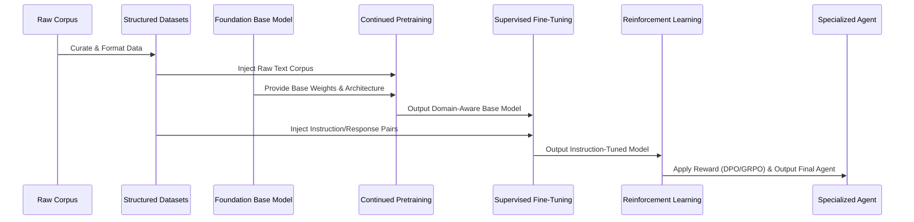

# Abstract Procedure for LLM Training and Fine-Tuning

This research paper outlines the abstract, end-to-end procedural framework for specializing a Large Language Model (LLM) on a domain-specific corpus. The procedure is model-agnostic but emphasizes parameter-efficient and compute-optimized techniques (such as LoRA and GRPO).

## 1. Abstract

The adaptation of a foundation model to a highly specialized domain requires a multi-stage pipeline. Rather than a single training pass, the process is divided into capability injection (Pretraining), format alignment (Supervised Fine-Tuning), and behavioral shaping (Reinforcement Learning). This document serves as the theoretical backbone for practical implementations, such as the [[rust-agent-finetuning-guide|Rust Agent Fine-tuning Guide]].

## 2. Pipeline Overview

## 3. Dataset Curation and Formulation

Before any training occurs, the raw data corpus must be transformed into structured formats suitable for different training phases. See [[dataset-creation|LLM Dataset Creation]] for detailed methodologies.

*   **Corpus Extraction:** Parsing raw unstructured data (e.g., HTML, PDF, EPUB) into clean, standard text (typically Markdown).
*   **Chunking & Tokenization:** Segmenting the data to fit within the model's context window context, preserving logical boundaries (e.g., chapters, functions).
*   **Dataset Bifurcation:**
    *   *Pretraining Dataset:* Raw, continuous text chunks separated by EOS (End of Sequence) tokens.
    *   *Instruction Dataset:* Synthetically generated or human-annotated Instruction-Response pairs, often mapping complex reasoning or tool-calling structures.

## 4. Continued Pretraining (CPT)

Continued Pretraining addresses the model's fundamental lack of domain knowledge or syntax. See [[llm-training-methods|LLM Training Methods]] for architectural details.

*   **Objective:** Shift the model's internal probability distribution to reflect the target domain's vocabulary and structural syntax without forcing a conversational format.
*   **Mechanism:** Next-token prediction over the raw *Pretraining Dataset*. 
*   **Efficiency:** Often performed using LoRA (Low-Rank Adaptation) on all linear modules (Attention and MLP) to prevent catastrophic forgetting of the model's original capabilities while significantly reducing VRAM footprint.

## 5. Supervised Fine-Tuning (SFT)

Once the model understands the domain language, it must learn how to interact. 

*   **Objective:** Align the model to follow instructions, adhere to chat templates (e.g., ChatML), and utilize specific output structures (like `<tool_call>` tags).
*   **Mechanism:** Training on the *Instruction Dataset*. The loss function is only calculated on the model's *response* tokens, masking the instruction tokens.
*   **Outcome:** The model transitions from a raw text-completer to a conversational or agentic assistant capable of structured output.

## 6. Reinforcement Learning (RL)

SFT teaches the model *how* to answer, but RL teaches it *what constitutes a good answer*. See [[reinforcement-learning|Reinforcement Learning for LLMs]] for optimization strategies.

*   **Objective:** Enforce logical correctness, safety, or adherence to best practices (e.g., code compilation success, minimizing hallucinations).
*   **Algorithms:**
    *   *DPO (Direct Preference Optimization):* Uses binary chosen/rejected pairs to implicitly adjust the model's policy.
    *   *GRPO (Group Relative Policy Optimization):* Generates multiple outputs per prompt, evaluates them against a rule-based reward function (e.g., a linter or compiler), and updates the model to favor high-scoring behaviors. Ideal for verifiable domains like mathematics or programming.

## 7. Conclusion

By strictly separating the training lifecycle into CPT (knowledge acquisition), SFT (format alignment), and RL (behavioral optimization), engineers can systematically debug and enhance an LLM's performance on highly specialized, complex tasks without incurring the immense computational cost of training from scratch.
