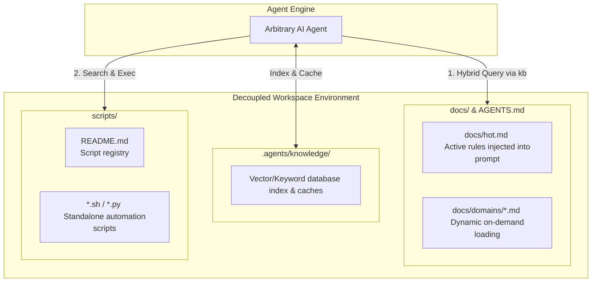
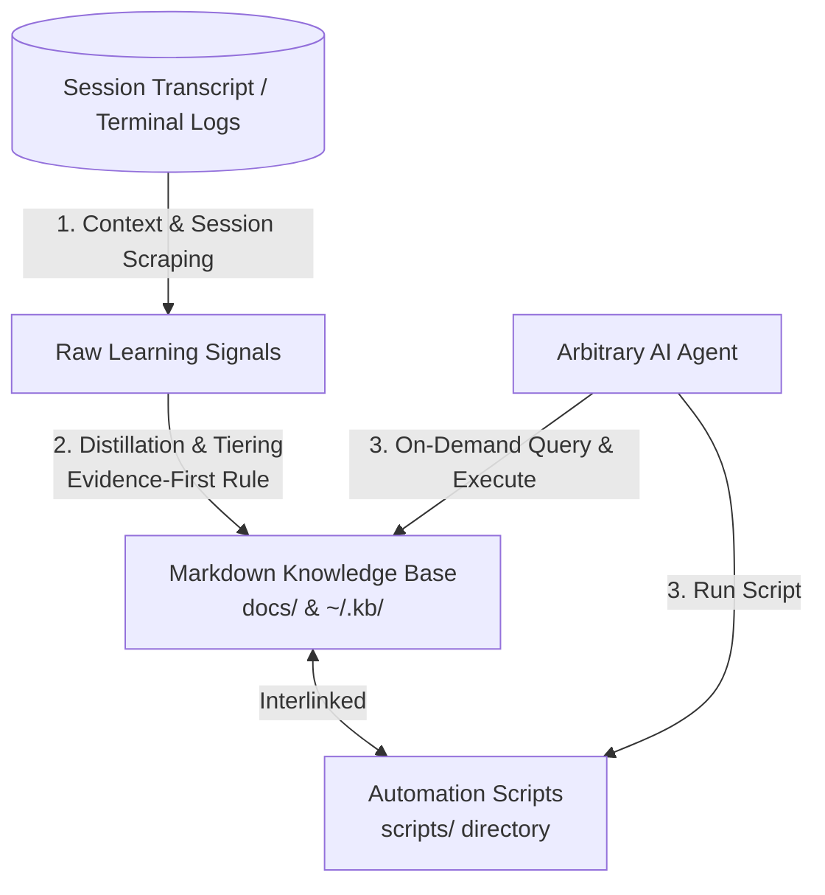

# Research: Arbitrary AI Agent Self-Improvement

This research outlines the architectural specifications for instructing arbitrary AI agents to self-improve while preventing context pollution, maintaining human readability, and maximizing agent-agnostic portability.

---

## 1. Architectural Paradigms: Human-Centric vs. Tool-Specific Storage

By treating **Knowledge as Infrastructure** rather than hardcoding "skills" into the agent, we establish a clean separation of concerns. The agent acts as an execution engine, while the workspace serves as a structured environment containing declarative knowledge (Markdown files) and procedural automations (Scripts).

To ensure transparency and avoid "hiding" information from human operators, we separate human-readable knowhow from tool-specific metadata:
- **`docs/` (Human-Readable Knowhow)**: Standard Markdown files containing project architectures, conventions, active guidelines, and domain cheatsheets. This directory remains open, easily browsed, and editable by any human.
- **`.agents/knowledge/` (Tool-Specific Metadata)**: Internal indices, cache files, configuration logs, and sqlite/vector databases used by CLI tools to speed up semantic querying.



---

## 2. Multi-Scope Knowledge Architecture

An effective knowledge infrastructure distinguishes between different layers of scope to prevent project bloat while preserving global developer habits and preferences:

1. **Project-Specific Knowledge (stored in `./docs/`)**:
   - Scope: Unique coding style guidelines, infrastructure setups, deployment scripts, linting requirements, and specific library versions for the active repository.
   - Checked into git so that all developers (human or agent) share the exact same project constraints.
2. **Global Knowledge (stored in `$HOME/.kb/` or `$HOME/docs/`)**:
   - Scope: Globally applicable cheatsheets, programming languages rules, generic command line syntaxes (e.g., standard Docker, Kubernetes, or Git workflows), and shared utility scripts.
   - Shared across all projects on the operator's machine.
3. **User-Specific Preferences (stored in `$HOME/.kb/user_preferences.md`)**:
   - Scope: Personal operator preferences (e.g., timezone, favorite coding style, preferred terminal text wrapper, IDE keybindings, and active environment restrictions).
   - This ensures any agent working in the workspace respects the operator's personal engineering constraints and habit preferences.

---

## 3. Dynamic Memory Tiering

To solve context bloat, learnings are divided into three physical tiers. Signals are continuously promoted or demoted based on frequency and utility.



| Tier | Format | Storage Location | Activation Mechanism |
| :--- | :--- | :--- | :--- |
| **HOT** | Markdown bullet-list | `./docs/hot.md` or `$HOME/.kb/user_preferences.md` | Injected directly in initial system prompt (< 100 lines total). |
| **WARM** | Domain markdown files | `./docs/domains/*.md` or `$HOME/.kb/*.md` | Loaded dynamically via semantic vector or keyword search. |
| **COLD** | Compressed archives | `./docs/archive/` or `$HOME/.kb/archive/` | Stored for historical reference, excluded from active search. |

### The Evidence-First Rule
To prevent noise, no learning signal is promoted directly to the **HOT** or **WARM** tier on its first occurrence. The agent requires **three independent repetitions** of an error, correction, or preference in the scraped logs before solidifying it into a permanent rule in `docs/` or `$HOME/.kb/`.

---

## 4. Light Version: Pure Markdown Workspace

A zero-dependency, filesystem-based design that is fully compatible with any text-searching agent out-of-the-box.

### Folder Structure
```text
workspace/
├── docs/
│   ├── hot.md             # Active high-impact project heuristics
│   ├── log.md             # Chronological ledger of project learnings
│   └── dev-workflows.md   # Project domain guidelines
├── .agents/
│   └── knowledge/         # Internal tool index and cached config (hidden)
├── .proposals/
│   └── PENDING.md         # Draft rules awaiting human review
├── AGENTS.md              # Instruction manual for AI agents
└── scripts/
    ├── README.md          # Script Registry (Name, Trigger, Purpose)
    └── git-squash.sh      # Standalone automation script
```

### The `AGENTS.md` Specification
The `AGENTS.md` file resides at the root of the project. It serves as the explicit instruction manual telling any visiting AI agent how to interact with the workspace properly and use the knowledge base.

```markdown
# AGENTS.md - System Instructions for AI Agents

You are a visiting AI developer agent in this repository. To maintain workspace integrity and prevent context pollution, you must strictly follow these rules:

## 1. On-Demand Knowledge Retrieval
- Do not assume you know all project rules. Search the `./docs/` folder using search/grep tools for keywords matching your task before writing code.
- Always check `$HOME/.kb/user_preferences.md` (if readable) to align your execution style and formatting with the operator's preferences.

## 2. Script Automation first
- Before writing helper code or performing multi-step actions, search `scripts/README.md` to see if a pre-existing automation script exists.
- If it exists, execute it instead of writing custom code.

## 3. Feed the Knowledge Base
- If you solve a complex bug, receive a correction from the user, or discover a non-trivial workflow:
  1. Append a raw learning signal proposal to `./.proposals/PENDING.md`. Do not modify files in `./docs/` directly.
  2. If the task is highly repetitive, compile your solution into a standalone script under `scripts/`, and add its usage to `scripts/README.md`.
```

---

## 5. Git Tracking & First-Run Initialization

To keep repositories clean, collaborative, and easy to deploy, we must establish clear boundaries for Git control.

### What is Tracked in Git
- **`./docs/`**: Open, human-readable guidelines, architectures, and lessons. Checked into Git so all human and AI contributors are aligned.
- **`AGENTS.md`**: The system instructions file, committed to Git.
- **`scripts/` & `scripts/README.md`**: All tested, safe task automations and their indexes. Checked into Git.

### What is Ignored (Add to `.gitignore`)
- **`.agents/`**: Private, tool-specific metadata, cache files, and vector indices. This is compiled dynamically and must never be committed.
- **`.proposals/`**: Optional choice. However, to prevent polluting pull requests with unvetted draft rules, `./.proposals/` should be ignored. Only approved, merged files under `docs/` should be tracked in Git.

```text
# .gitignore addition
.agents/
.proposals/
```

### First-Run Initialization Workflow
When a new developer (human or agent) clones the repository, the `.agents/` folder is missing.
1. The developer runs **`kb init`**.
2. This creates `./.agents/knowledge/` locally and `$HOME/.kb/` globally if missing.
3. The tool parses the existing Markdown files inside `./docs/` and `$HOME/.kb/` and builds the SQLite/vector indices from scratch.
4. The workspace is immediately ready for fast local queries.

---

## 6. Unified Agent Skill Compatibility: `kb-handler`

To maintain compatibility with modern AI agent environments (like Hermes or OpenClaw) without scattering domain-specific code across multiple individual skills, the agent's workspace requires **exactly one single standard skill**: `kb-handler`.

Rather than writing a custom skill for every topic (e.g., `git-skill`, `docker-skill`, `linting-skill`), the agent loads the `kb-handler` skill, which bridges the agent to our decoupled Markdown knowledge base.

### The `kb-handler` Skill Specification (`SKILL.md`)
```markdown
# Skill: kb-handler

Enables the agent to interface with decoupled project and global knowledge bases.

## Operating Prompt

Whenever this skill is active:
1. **Startup Check**: On session start, check if `AGENTS.md` or `./docs/` exists in the working directory. If so, read `AGENTS.md` first.
2. **On-Demand Loading**: Before running any multi-step task, execute your keyword-search or vector-search tool (`kb query "<task_keywords>"`) to pull matching guidelines. Do not load entire files unless they are under 100 lines.
3. **Registry Inspection**: Before writing custom scripts or code generators, inspect `./scripts/README.md` to see if a pre-configured solution is already available.
4. **Session Closing**: Upon task completion, if you made mistakes or received human feedback, call the log parsing parser tool (`kb scrape`) or manually append a JSON learning signal to `./.proposals/PENDING.md`.
```

---

## 7. Full Version: Semantic Tooling & KB Engine

Wraps the Markdown files with a lightweight command-line interface (CLI) tool named `kb` that operates seamlessly on local files and global home configurations.

### The `kb` CLI Specification
- **`kb init`**: Initializes directory structure (creates `./docs/` and `./.agents/knowledge/` locally, and `$HOME/.kb/` globally).
- **`kb add <text_or_file> [--global]`**: Chunks Markdown headers, generates embeddings, and indexes content into either `./.agents/knowledge/` or `$HOME/.kb/`.
- **`kb query "<query>" [--global-only | --project-only]`**: Runs hybrid retrieval (keyword + vector cosine similarity) across local and global scopes, outputting plain text back to the agent's context window.
- **`kb scrape <transcript_path>`**: Automated post-session log parser that flags corrections and generates `./.proposals/PENDING.md` entries.

### Semantic Search and Concept Graphing
- **Semantic Chunking**: Split Markdown files keeping section titles associated with their respective bullet points, ensuring high retrieval relevance.
- **Local Embedding Engine**: Employs lightweight local embedding models to ensure zero cost, low latency, and high privacy.
- **Knowledge Graph**: Treats relative markdown links (e.g., `[[/concepts/git|Git Workflow]]`) as concept edges. When querying a topic, `kb` traverses adjacent links to retrieve neighboring concept pages, boosting contextual awareness without context flooding.

---

## 8. Related Pages

- [[ai-agents|AI Agents]]
- [[agent-self-improvement|Agent Self-Improvement Concept]]
