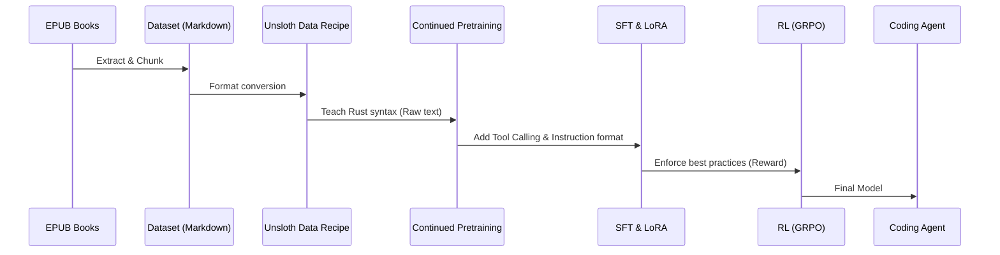

# Rust Agent Fine-tuning Guide

This guide outlines the end-to-end process of training a small base LLM to become a proficient Rust coding agent using a corpus of Markdown files extracted from Rust EPUBs.

## Architecture

## Dataset Creation
1. Extract EPUBs to Markdown.
2. Use [Unsloth Data Recipe](https://unsloth.ai/docs/new/studio/data-recipe) to define extraction pipelines.
3. Split into two datasets: 
   - **Corpus**: Raw Markdown chapters (for continued pretraining).
   - **Instruction/QA**: Generated QAs using a strong model (e.g., Claude 3.5 Sonnet) acting as a teacher. Include tool-calling examples (e.g., `<tool_call>cargo check</tool_call>`).

## Continued Pretraining
If the base model (e.g., Llama-3-8B) is weak at Rust, run Continued Pretraining on the raw Markdown corpus to bake the syntax and standard library into the model weights using [Unsloth Continued Pretraining](https://unsloth.ai/docs/basics/continued-pretraining).

## SFT with LoRA
Fine-tune the model using the Instruction dataset.
- Apply **LoRA** to target attention and MLP modules.
- Ensure the chat template supports tool calling natively.
- Use Unsloth notebooks for efficient 4-bit quantized training.

## Reinforcement Learning (GRPO)
To ensure the agent writes *solid, best practice* code, use GRPO.
1. Define a reward function: e.g., code compilation success via `cargo check` and `cargo clippy`.
2. Generate multiple completions for a prompt, compile them, and reward the model based on success and clippy warnings.
