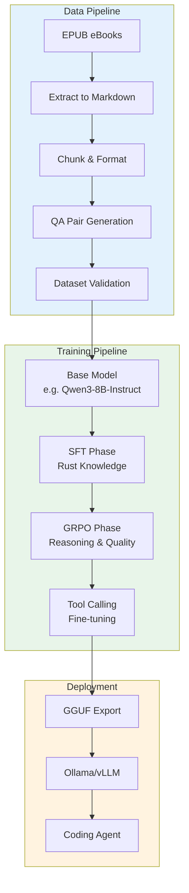
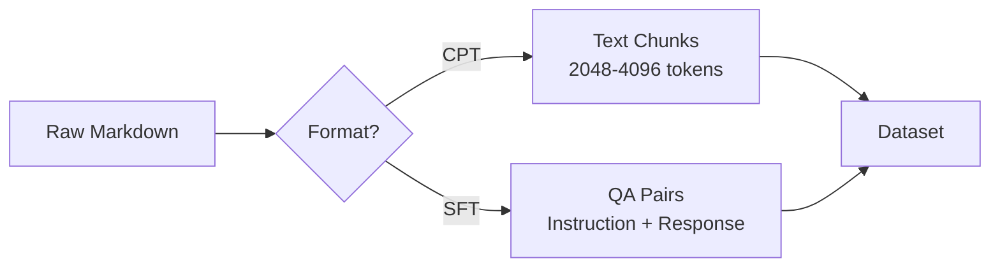
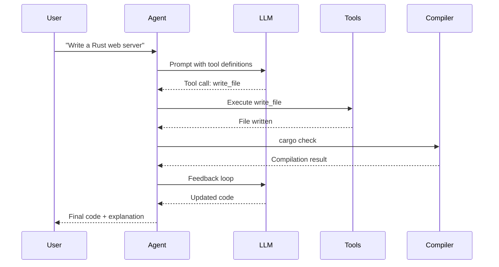

# Fine-tuning a Rust Coding LLM with Unsloth

A practical research guide for training a small LLM to write solid, best-practice Rust code using EPUB-derived markdown datasets, with the goal of deploying it in a coding agent with tool-calling and reasoning capabilities.

## Table of Contents

- [[#executive-summary|Executive Summary]]
- [[#architecture-overview|Architecture Overview]]
- [[#phase-1-data-ingestion--preparation|Phase 1: Data Ingestion & Preparation]]
- [[#phase-2-base-model-selection|Phase 2: Base Model Selection]]
- [[#phase-3-fine-tuning-sft|Phase 3: Fine-Tuning (SFT)]]
- [[#phase-4-reinforcement-learning-grpo|Phase 4: Reinforcement Learning (GRPO)]]
- [[#phase-5-tool-calling--agent-integration|Phase 5: Tool Calling & Agent Integration]]
- [[#phase-6-evaluation--deployment|Phase 6: Evaluation & Deployment]]
- [[#hardware-requirements|Hardware Requirements]]
- [[#references|References]]

## Executive Summary

This research document outlines a complete pipeline for fine-tuning a small LLM (7-14B parameters) to become proficient in Rust programming. The pipeline leverages:

- **Unsloth** for memory-efficient training (QLoRA/LoRA)
- **EPUB-to-markdown** extraction for dataset creation
- **Supervised Fine-Tuning (SFT)** for initial Rust knowledge injection
- **GRPO (Group Relative Policy Optimization)** for reasoning and code quality
- **Tool calling** training for agent integration

The end goal is a model that can be used in a coding agent to write idiomatic, safe, and efficient Rust code.

## Architecture Overview



## Phase 1: Data Ingestion & Preparation

### 1.1 EPUB to Markdown Extraction

Rust programming eBooks (e.g., "The Rust Programming Language", "Programming Rust", "Rust for Rustaceans") need to be converted to markdown for processing.

**Tools:**
- [pandoc](https://pandoc.org/) - Universal document converter
- [epub2txt](https://github.com/kevinboone/epub2txt) - Lightweight EPUB to text
- [marker](https://github.com/VikParuchuri/marker) - Fast PDF/EPUB to markdown

**Example pipeline:**

```bash
# Extract EPUB to markdown
pandoc -f epub -t markdown book.epub -o book.md

# Or using marker (recommended for code-heavy books)
marker_single book.epub --output_dir ./markdown/
```

### 1.2 Data Chunking & Formatting

Raw markdown needs to be structured for training. Two primary approaches:

**Approach A: Continued Pretraining (CPT)**
- Treat the entire markdown corpus as raw text
- Train the model to predict next tokens
- Good for: Domain knowledge, terminology, idioms

**Approach B: Instruction Fine-Tuning (SFT)**
- Convert text into (instruction, response) pairs
- Better for: Task-oriented behavior, Q&A, code generation



### 1.3 QA Pair Generation with Unsloth Data Recipes

[Unsloth Data Recipes](https://unsloth.ai/docs/new/studio/data-recipe) provides a visual workflow for generating synthetic training data:

1. **Upload** markdown files as seed data
2. **Configure** LLM blocks to generate QA pairs
3. **Validate** output with built-in linters
4. **Export** to HuggingFace datasets format

**Example prompt for QA generation:**

```
Given the following Rust code excerpt, generate 3 question-answer pairs:
- Question should ask for an explanation or implementation
- Answer should provide idiomatic Rust code with comments
- Focus on: ownership, borrowing, lifetimes, error handling, async

Excerpt: {{ code_excerpt }}
```

### 1.4 Dataset Validation

Before training, validate the dataset:

| Check | Method |
|-------|--------|
| Syntax correctness | `rustc --check` on code snippets |
| Token count | Tokenizer analysis |
| Data balance | Check distribution across topics |
| Duplicates | Fuzzy deduplication |
| Quality filter | Remove low-quality or incomplete entries |

## Phase 2: Base Model Selection

### 2.1 Model Requirements

For a Rust coding agent, the base model must support:

1. **Tool calling** - Native function calling capabilities
2. **Reasoning** - Chain-of-thought or similar reasoning
3. **Code generation** - Pre-trained on code corpora
4. **Context length** - At least 8K tokens for large code blocks

### 2.2 Recommended Models

| Model | Params | Tool Calling | Reasoning | Code | Notes |
|-------|--------|-------------|-----------|------|-------|
| Qwen3-8B-Instruct | 8B | Yes | Yes | Good | Recommended starting point |
| Llama-3.1-8B-Instruct | 8B | Yes | Limited | Good | Broad support |
| Mistral-7B-Instruct | 7B | Limited | Limited | Good | Fast inference |
| Qwen3-14B-Instruct | 14B | Yes | Yes | Excellent | Better quality, more VRAM |
| DeepSeek-Coder-V2 | 16B | Yes | Yes | Excellent | Code-specialized |

**Recommendation:** Start with **Qwen3-8B-Instruct** or **Llama-3.1-8B-Instruct** as they balance capability and resource requirements.

### 2.3 Why Instruct Models?

As noted in the [Unsloth Fine-tuning Guide](https://unsloth.ai/docs/get-started/fine-tuning-llms-guide), instruct models are preferred because:

- They already understand conversational formats (ChatML, ShareGPT)
- Require less data compared to base models
- Can be fine-tuned directly without pre-formatting training data

## Phase 3: Fine-Tuning (SFT)

### 3.1 Unsloth Setup

```python
from unsloth import FastLanguageModel
import torch

# Load model with QLoRA
model, tokenizer = FastLanguageModel.from_pretrained(
    model_name="unsloth/Qwen3-8B-Instruct",
    max_seq_length=8192,
    dtype=torch.bfloat16,
    load_in_4bit=True,
)

# Add LoRA adapters
model = FastLanguageModel.get_peft_model(
    model,
    r=16,
    target_modules=["q_proj", "k_proj", "v_proj", "o_proj",
                    "gate_proj", "up_proj", "down_proj"],
    lora_alpha=16,
    lora_dropout=0,
    bias="none",
    use_gradient_checkpointing="unsloth",
    random_state=3407,
)
```

### 3.2 Training Configuration

```python
from trl import SFTTrainer
from transformers import TrainingArguments

args = TrainingArguments(
    per_device_train_batch_size=2,
    gradient_accumulation_steps=4,
    warmup_steps=5,
    max_steps=500,
    learning_rate=2e-4,
    fp16=not torch.cuda.is_bf16_supported(),
    bf16=torch.cuda.is_bf16_supported(),
    logging_steps=1,
    optim="adamw_8bit",
    weight_decay=0.01,
    lr_scheduler_type="linear",
    seed=3407,
    output_dir="outputs",
)

trainer = SFTTrainer(
    model=model,
    tokenizer=tokenizer,
    train_dataset=dataset,
    dataset_text_field="text",
    max_seq_length=8192,
    args=args,
)

trainer.train()
```

### 3.3 Key Hyperparameters for Code Fine-Tuning

| Parameter | Value | Rationale |
|-----------|-------|-----------|
| `learning_rate` | 2e-4 | Standard for LoRA; lower for precision |
| `r` (rank) | 16-32 | Higher for complex tasks like code |
| `lora_alpha` | 16-32 | Typically equal to rank |
| `max_seq_length` | 8192 | Code needs longer context |
| `warmup_steps` | 5-10 | Short warmup for small datasets |
| `max_steps` | 500-1000 | Monitor for overfitting |

## Phase 4: Reinforcement Learning (GRPO)

### 4.1 Why GRPO for Rust?

After SFT, GRPO can further improve the model by:

- **Encouraging reasoning** - Reward models that explain their code
- **Validating correctness** - Compile and test generated Rust code
- **Enforcing style** - Reward idiomatic patterns

### 4.2 Reward Function Design

```python
def rust_reward_function(prompts, completions, **kwargs):
    """Reward function for Rust code generation."""
    rewards = []
    for completion in completions:
        reward = 0
        code = extract_code(completion)

        # Check 1: Code compiles
        if compile_rust(code):
            reward += 3

        # Check 2: No warnings with strict flags
        if lint_rust(code):
            reward += 2

        # Check 3: Contains tests
        if has_tests(code):
            reward += 2

        # Check 4: Uses idiomatic patterns
        if is_idiomatic(code):
            reward += 1

        # Check 5: Reasoning present
        if has_reasoning(completion):
            reward += 1

        rewards.append(reward)
    return rewards
```

### 4.3 GRPO Training with Unsloth

```python
from unsloth import FastLanguageModel
from trl import GRPOConfig, GRPOTrainer

# Load model (same as SFT but with fast_inference for vLLM)
model, tokenizer = FastLanguageModel.from_pretrained(
    model_name="your-sft-model",
    fast_inference=True,
)

trainer = GRPOTrainer(
    model=model,
    reward_funcs=rust_reward_function,
    args=GRPOConfig(
        per_device_train_batch_size=2,
        num_generations=8,
        max_steps=300,
    ),
)

trainer.train()
```

## Phase 5: Tool Calling & Agent Integration

### 5.1 Training for Tool Calling

To use the model in a coding agent, it must support tool/function calling. The [Unsloth Tool Calling Guide](https://unsloth.ai/docs/basics/tool-calling-guide) provides patterns for this.

**Dataset format for tool calling:**

```json
{
  "messages": [
    {"role": "user", "content": "Create a Rust function that reads a file"},
    {"role": "assistant", "content": "I'll create that function for you."},
    {"role": "assistant", "tool_calls": [
      {"function": {"name": "write_file", "arguments": "{\"path\": \"src/read.rs\", \"content\": \"...\"}"}}
    ]}
  ]
}
```

### 5.2 Agent Architecture



## Phase 6: Evaluation & Deployment

### 6.1 Evaluation Metrics

| Metric | Method |
|--------|--------|
| Compilation rate | `cargo build` on generated code |
| Test pass rate | `cargo test` on generated tests |
| Clippy compliance | `cargo clippy -- -D warnings` |
| Idiomatic score | Human evaluation or LLM judge |
| Reasoning quality | Presence of explanations |

### 6.2 Export Formats

```python
# Save LoRA adapter
model.save_pretrained("rust-lora-adapter")

# Merge and export to GGUF for Ollama
model.save_pretrained_gguf("rust-model", tokenizer, quantization_method="q4_k_m")

# Or push to HuggingFace
model.push_to_hub("your-username/rust-coder-7b")
```

### 6.3 Deployment Options

| Platform | Format | Use Case |
|----------|--------|----------|
| Ollama | GGUF | Local development |
| vLLM | FP16/AWQ | Production serving |
| llama.cpp | GGUF | Edge/embedded |
| HuggingFace | Safetensors | Research/sharing |

## Hardware Requirements

### Minimum (QLoRA 4-bit)

| Model Size | VRAM | RAM | Storage |
|------------|------|-----|---------|
| 7B | 6-8 GB | 16 GB | 50 GB |
| 14B | 12-16 GB | 32 GB | 100 GB |
| 70B | 48 GB | 64 GB | 300 GB |

### Recommended (LoRA 16-bit)

| Model Size | VRAM | RAM | Storage |
|------------|------|-----|---------|
| 7B | 24 GB | 64 GB | 100 GB |
| 14B | 48 GB | 128 GB | 200 GB |

### GRPO Additional Requirements

- Add ~50% more VRAM for GRPO training
- vLLM for fast inference during GRPO

## References

### Papers

- [LoRA: Low-Rank Adaptation of Large Language Models](https://arxiv.org/abs/2106.09685) - Hu et al., 2021
- [QLoRA: Efficient Finetuning of Quantized LLMs](https://arxiv.org/abs/2305.14314) - Dettmers et al., 2023
- [DeepSeek-R1: Incentivizing Reasoning Capability in LLMs via Reinforcement Learning](https://arxiv.org/abs/2501.12948) - DeepSeek-AI, 2025
- [Llama 2: Open Foundation and Fine-Tuned Chat Models](https://arxiv.org/abs/2307.09288) - Touvron et al., 2023

### Documentation

- [Unsloth Fine-tuning Guide](https://unsloth.ai/docs/get-started/fine-tuning-llms-guide)
- [Unsloth RL Guide](https://unsloth.ai/docs/get-started/reinforcement-learning-rl-guide)
- [Unsloth Notebooks](https://unsloth.ai/docs/get-started/unsloth-notebooks)
- [Unsloth Continued Pretraining](https://unsloth.ai/docs/basics/continued-pretraining)
- [Unsloth Data Recipes](https://unsloth.ai/docs/new/studio/data-recipe)
- [Nathan Lambert's RLHF Book](https://rlhfbook.com/)

### Related Concepts

- [[Concepts/lora-qlora|LoRA and QLoRA]]
- [[Concepts/supervised-fine-tuning|Supervised Fine-Tuning]]
- [[Concepts/reinforcement-learning-grpo|Reinforcement Learning and GRPO]]
- [[Concepts/dataset-creation-llm|Dataset Creation for LLM]]
- [[Concepts/continued-pretraining|Continued Pretraining]]
- [[Concepts/tool-calling-llm|Tool Calling in LLMs]]
- [[Concepts/model-selection-llm|Model Selection for LLM]]
