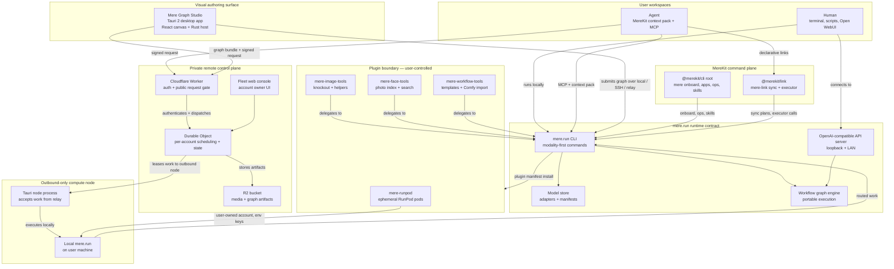

# Research Index: The Mere Ecosystem (sawfwair)

**Updated:** 2026-08-01
**Scope:** All public repositories under the `sawfwair` GitHub organization, with emphasis on the six repositories that compose the **Mere** AI ecosystem: `mere-run`, `mere-run-graph-studio`, `relay-mere-run`, `merekit-cli`, `merekit-link`, `mere-run-plugins`. The two `mlx` / `mlx-swift` forks and the `dkcli` design CLI are noted but are not part of the Mere product line.
**Source-of-truth:** the org README on github.com/sawfwair, plus each repo's README and architecture docs.

---

## Overview

**Sawfwair Inc.** is a Prince Edward Island (Canada) software practice founded by Kyle McCullough. Its **Mere** product line is described in the org README as a *"local-first AI ecosystem: one runtime contract from a single machine to private remote compute, visual workflow authoring, plugins, and agent-ready workspace operations."* The aim is to make the local-first claim inspectable rather than aspirational.

The ecosystem is intentionally layered:

1. A single local runtime (`mere.run`) owns the model, the workflow, and the API surface.
2. A visual authoring app (`Mere Graph Studio`) edits and runs portable workflow graphs against that runtime over local, SSH, or relay submission.
3. A control plane (`relay-mere-run`) lets remote clients schedule work onto user-owned desktop nodes without opening inbound ports.
4. A command plane (`MereKit CLI` / `@merekit/cli`) is the single human/agent entrypoint for Mere workspaces — onboarding, context packs, MCP tools, diagnostics, skill installation.
5. A declarative link tool (`MereKit Link` / `@merekit/link`) declares and syncs workspace links and Executor-backed integrations.
6. A plugin repo (`mere-run-plugins`) ships official companion bridges to user-controlled outside resources (RunPod, SSH GPU hosts, local image/face/workflow tooling).

The cross-cutting claim that ties them together is the **portable graph contract**: a graph authored once runs locally, over SSH, or through Relay — without Studio inventing a second execution contract. Plugins cannot reach outside without the user opting in (account, credentials, spending limits, cleanup policy), and Relay never opens inbound ports on a node.

## Concepts

### Architecture Patterns

- [[Concepts/local-first-ai-runtime]] — a single binary that owns inference, model management, training, workflows, and an OpenAI-compatible API surface; the user keeps data, models, and runs on the same machine that produced them.
- [[Concepts/portable-workflow-graph-contract]] — one graph document (`.meregraph.json`) that runs locally, over SSH, or through Relay with no change to its executable contract.
- [[Concepts/account-scoped-relay-control-plane]] — a Cloudflare Worker + Durable Object (one per account) that authenticates public requests, owns scheduling, stores durable work state, and pushes accepted work to outbound-only desktop nodes.
- [[Concepts/manifest-backed-cli-command-plane]] — a root CLI discovers product behaviour through app CLI adapters and bundled manifests, keeping the root thin and the per-product behaviour owned by the product.
- [[Concepts/declarative-link-graph-with-executor-runtime]] — a YAML link graph declares integration boundaries and write policy; an external Executor runtime owns tool discovery, schemas, auth, approvals, and invocation.

### Safety and Operations

- [[Concepts/outbound-only-compute-node]] — a desktop node initiates the connection to the relay; the relay cannot reach the node, eliminating inbound-port exposure.
- [[Concepts/lease-safe-retries-and-terminal-cancellation]] — work leases are tracked per account/node and recoverable across client reconnect; cancellation propagates all the way to the node.
- [[Concepts/operator-policy-capability-gate]] — before context export, sync apply, or Executor tool invocation, a neutral gate checks operator identity, provider, client, account class, trust tier, environment, and requested capabilities.

## Tools & Projects

### Mere Runtime and Surfaces

- [[Entities/sawfwair]] — Sawfwair Inc., founder-led technical-leadership practice that ships the Mere ecosystem.
- [[Entities/mere-run]] — the core Swift runtime; modality-first CLI covering image, text, speech, vision, music, sfx, video, world, training, model management, and an OpenAI-compatible API server. Latest release v0.30.0 (Jul 31, 2026).
- [[Entities/mere-run-graph-studio]] — Tauri 2 desktop app (React + Rust) for visual authoring and operations of portable `mere.run` workflow graphs. Hosted at [studio.mere.run](https://studio.mere.run/).
- [[Entities/relay-mere-run]] — Cloudflare Worker + Durable Object + R2 + Tauri node + fleet web console; account-scoped control plane for private, local `mere.run` inference.
- [[Entities/merekit-cli]] — `@merekit/cli` — the `mere` root command; TUI onboarding, manifest-backed app CLIs, read-first ops, agent context packs, MCP tools, skill installation.
- [[Entities/merekit-link]] — `@merekit/link` — `mere-link` standalone CLI; declarative links, sync policy, and Executor-backed integrations (`mere`, `executor`, `url`, `local`, `generic` plugins).
- [[Entities/mere-run-plugins]] — official companion plugin contracts and provider runners; plugin catalog at [plugins.mere.run](https://plugins.mere.run/).

### Sawfwair Repos Not Part of Mere

- [[Entities/mlx]] and [[Entities/mlx-swift]] — `ml-explore` forks of MLX (C++) and the MLX Swift API; the engine layer beneath `mere.run`'s Apple Silicon inference path.
- [[Entities/dkcli]] — proof-driven design CLI for OKLCH palettes, APCA contrast, fluid scales, motion curves, layout audits, tokens, Svelte components; standalone tool.

## Architecture

The system is one runtime contract, four execution surfaces, two control planes, and one plugin boundary. The diagram below is deliberately the **whole** picture — it is the simplest way to show that Studio, SSH, and Relay are all *submitters* to the same `mere.run` execution contract, that the plugin boundary is user-controlled, and that the relay control plane never reaches a node directly (the node reaches it).

Read the diagram left-to-right and top-to-bottom: the *user* and *agent* are on the left; the *runtime contract* is the spine; the *plugin boundary* sits beneath the runtime and only ever crosses it outward under explicit user policy. The relay control plane never has a downward arrow into a node — every node connection is initiated by the node itself.

## Capability Matrix

Each row is one capability; each column is one of the six Mere surfaces. "—" means the surface does not implement the capability (by design — e.g. Studio does not own models; it asks the target runtime).

| Capability | mere-run | Graph Studio | relay-mere-run | MereKit CLI | MereKit Link | run-plugins |
|------------|----------|--------------|----------------|-------------|--------------|-------------|
| Local inference (image / text / speech / vision / music / sfx / video / 3D) | Yes (modality-first CLI) | Runs against it | Schedules onto nodes that have it | — | — | Delegates to it |
| Model management (pull, list, capabilities, runtime, benchmark) | Yes (`mere.run model …`) | One-click pull, model chip swap, preflight sheet | — | — | — | RunPod plugin plans volume + build pack |
| LoRA training (image, text) | Yes (`image train-lora`, `text train-lora`) | Visual run-as-app | — | — | — | RunPod recipe: klein-style-lora on remote pod |
| OpenAI-compatible API (`/v1/chat`, `/v1/images`, `/v1/embeddings`, `/v1/audio`) | Yes (`mere.run api serve`) | — | — | — | — | — |
| Portable graph contract (`.meregraph.json`) | Authoring surface + executor | Primary editor; one-file import/export | Immutable bundles over the wire | — | — | Templates + Comfy import |
| Local / SSH submission | Yes | Yes | — | — | — | — |
| Remote submission over relay | — | Yes | Accepts, schedules, leases | — | — | — |
| Account-scoped scheduling & lease-safe retries | — | — | Yes (per-account Durable Object) | — | — | — |
| Terminal cancellation of in-flight work | — | — | Yes | — | — | — |
| Outbound-only node (no inbound port) | — | — | Yes (node reaches relay) | — | — | — |
| Workspace onboarding (TUI, invite code, waitlist) | — | — | — | Yes (`mere onboard --interactive`) | — | — |
| Agent context packs (AGENT.md, bootstrap.json, …) | — | — | — | Yes (`mere agent bootstrap`) | — | — |
| MCP tools (server, integration) | — | — | — | Yes (`mere help agent`, MCP discovery) | — | — |
| Skill installation for agents | — | — | — | Yes (`mere skills …`) | — | — |
| Read-first ops (doctor, snapshot, status) | Yes (`mere.run status`, `run list/inspect`) | Streamed run inspection (logs, hashes, attempts) | — | Yes (`mere ops doctor`, `workspace-snapshot`) | — | Plugin doctor for each runner |
| Declarative link graph (YAML) | — | — | — | — | Yes (`mere.link.yaml`) | — |
| Executor-backed integrations (Monday, SharePoint, GitHub, Slack, OpenAPI, MCP, GraphQL) | — | — | — | — | Yes (via Executor HTTP runtime) | — |
| Operator-policy capability gate | — | — | — | — | Yes (identity, provider, client, account class, trust tier, env, capabilities) | — |
| Plugin contract (manifest, plans, run manifests) | Consumer (`mere.run plugin list/info/install/doctor`) | Catalog-driven node palette | — | — | — | Authoritative source |
| ComfyUI API import | — | Conservative import, round-trips to canvas | — | — | — | Workflow-tools plugin |
| Native Apple Silicon / MLX path | Yes (via `mlx` / `mlx-swift` forks) | Targets any compatible mere.run build | — | — | — | — |
| Linux CUDA path | Yes (build packs in plugin repo) | Targets it via SSH / relay | — | — | — | RunPod ships CUDA build pack |

## Per-Repository Notes

### `mere-run` — the runtime

The CLI is **modality-first**: `image`, `text`, `speech`, `vision`, `music`, `sfx`, `video`, `world`, plus `model`, `adapter`, `run`, `api`, `plugin`, `agent`, `setup`, `config`. The `api serve` command exposes an OpenAI-compatible loopback server; `open-webui quickstart` wires it into a local chat UI. The `agent` group handles local agent onboarding and can install Pi (a code-agent harness) as a sub-tool. LoRA training is built in for both images and text; models and adapters are checksum-pinned on pull.

Latest release as of the snapshot: **v0.30.0**, Jul 31 2026. The repo is 96.4% Swift and the release artefact is a signed executable at [mere.run/downloads](https://mere.run/releases).

### `mere-run-graph-studio` — visual authoring

Pre-1.0, Tauri 2 (React + Rust) desktop app. The contract promise: Studio never invents a second execution contract — it edits, validates, and submits the same `.meregraph.json` that `mere.run` runs natively. The editor is a typed XYFlow canvas with catalog-driven ports and compatibility-checked connections; graphs can be exported as one portable file. Run-as-App turns a graph into a run-only surface whose exposed inputs become a form and whose outputs become a results gallery.

Submission modes are explicit: local, SSH, or Relay. The model chip on a generation node only ever offers models the *target executor* reports as installed; missing models can be pulled from the chip, with size, free disk, and usage terms shown before the download starts. Workflow templates come from `mere-run-plugins`; a conservative ComfyUI API-prompt inspector is bundled.

### `relay-mere-run` — control plane

The relay is the answer to *"how do remote clients reach a private `mere.run` without opening inbound ports?"* It is a Cloudflare Worker (public request gate) fronting one Durable Object per account (scheduling + durable work state) and an R2 bucket (media + graph artifacts). The desktop node is a Tauri process that *initiates* the connection back to the relay; the relay never reaches the node. The fleet web console is the account owner's UI; public Swift and TypeScript client libraries are the integration surface.

Critical guarantees (per the relay README): account isolation, capability-aware placement, lease-safe retries, terminal cancellation, validated wire contracts, immutable portable graph bundles. The hosted control plane is `relay.mere.run`; the identity boundary is `mere.world`. Opening the source does not grant access to production — account IDs, production routes, bucket names, and Secrets Store IDs must stay in private deployment configuration.

The repo's gate policy is unusually strict for a small project: `verify:fast` runs lint, TS, architecture/complexity/policy, Worker + node tests concurrently and is the pre-push hook (target under 30s); `verify:full` adds web/node builds + Swift + Rust gates; `check:complexity` reports McCabe A–F grades and rejects new functions above C. The `main` branch is GitHub-protected with three required CI jobs, one approving review, resolved conversations, linear history, and force-push / branch-deletion blocks.

### `merekit-cli` (`@merekit/cli`) — the command plane

The `mere` root is a thin command plane; product behaviour is owned by app CLI adapters bundled inside the package. Discovery, context, audit logs, diagnostics, smoke checks, workspace snapshots, MCP access, and skill installation all live at the root. The agent path is first-class: `mere agent bootstrap` writes a secret-free context pack (`AGENT.md`, `bootstrap.json`, `apps-list.json`, `doctor.json`, `auth-status.json`, `finance-profiles.json`, `context.json`, `apps-manifest.json`, `workspace-snapshot.json`, `mcp.json`, `command-reference.md`) into `~/.config/mere/agents/default/`.

Three onboarding modes: human interactive (`mere onboard --interactive`), headless human from an invite code, and agentic (where the agent already has a persistent AgentsIdentify identity and the Business adapter mints a short-lived proof from that identity to create the workspace-agent binding).

### `merekit-link` (`@merekit/link`) — declarative links

Link is a standalone CLI that operates in three modes: no-Mere-platform (validate a local `mere.link.yaml`), partial-Mere (local URLs + repos + channels + files + selected Mere apps), and full-Mere (generate starter YAML from `mere ops workspace-snapshot`). Five built-in integration plugins: `mere`, `executor`, `url`, `local`, `generic`. The `executor` plugin is the runtime bridge — Link keeps the declarative graph and write policy, Executor owns tool discovery, schemas, auth, approvals, and invocation. Target systems include Monday, SharePoint, GitHub, Slack, OpenAPI, MCP, and GraphQL.

The operator-policy gate is the safety story: before *any* context export, sync plan/apply, or Executor tool invocation, Link checks operator identity, provider, client, account class, trust tier, environment, and the requested capabilities. Token security is enforced — Link refuses to forward config-selected token env vars or the global `MERE_LINK_EXECUTOR_TOKEN` to non-local Executor URLs; non-local URLs require an explicit `--executor-token-env` after the operator verifies the destination.

### `mere-run-plugins` — the bridge to outside compute

The core `mere.run` CLI stays local-first; this repo contains explicit bridges to user-controlled outside resources. A plugin can automate remote compute, but it must use the user's account, credentials, spending limits, and cleanup policy. Four plugins ship today:

- `mere-runpod` — runs `mere.run image train-lora` on an ephemeral RunPod pod owned by the user; manages network volume caching, CUDA build-pack caching by SHA, and pod termination by default.
- `mere-image-tools` — `knockout` plans and runs a subject cutout through `mere.run vision segment` with SAM 3.1; local-only.
- `mere-face-tools` — composes `mere.run vision face` into a resumable SQLite photo index and reference-face search; writes ranked JSON/CSV, contact sheet, and symlink-only review folders.
- `mere-workflow-tools` — six focused companion commands plus graph-provider conformance, reusable native graph templates, and conservative ComfyUI API import.

The plugin catalog lives at [plugins.mere.run](https://plugins.mere.run/); the plugin contract is documented at [plugins-docs.mere.run/plugins/contract](https://plugins-docs.mere.run/plugins/contract).

## Cross-Cutting Themes

### 1. One Runtime Contract, Many Surfaces

`mere.run` is the only executable in the picture that owns inference, model management, training, workflows, and the API server. Studio, SSH submission, Relay, the MereKit agent path, and every plugin *submit to* that contract — none of them re-implement it. The `relay-mere-run` README states the contract as "Studio never invents a second execution contract"; the MereKit Link README states it as "Link remains the source package for command behavior, docs, YAML model, and safety policy; the root CLI discovers the Link command manifest and delegates." The practical consequence: a graph authored today in Studio runs the same way on a local Mac, an SSH-reachable Linux box, and a remote node accessed via Relay, and any of them can swap to a different model without re-authoring.

### 2. Local-First with Honest Escape Hatches

The core product keeps data, models, and runs on the user's machine. When a workload genuinely needs more compute than is local (training a LoRA on a dataset that won't fit in VRAM, for example), the escape hatch is explicit and user-controlled: a plugin can run on RunPod under the user's account, with the user's credentials, and the plugin writes its run manifest, fetches the artefact, and terminates the pod by default. The plugin README is unambiguous: *"A plugin can automate remote compute, but it must use the user's account, credentials, spending limits, and cleanup policy."* The relay is the same pattern for *running* existing local models from remote clients — the node owns the data, the relay only owns scheduling.

### 3. The Relay's Three Security Postures

The relay does three things and refuses to do anything else. (a) It authenticates public requests against a Cloudflare Worker. (b) It hands off to a per-account Durable Object that owns scheduling and durable work state. (c) It leases work to a *node that has already connected to it* — never the other way around. Inbound ports on the node stay closed. Account IDs, production routes, bucket names, and Secrets Store IDs do not belong in source, fixtures, documentation, or handoffs. The repo's `wrangler.toml` documents the maintained deployment topology with local/placeholder values only.

### 4. Operator Policy as a Neutral Gate

Both the relay and MereKit Link enforce an operator-policy capability gate before doing anything that could touch user data or external systems. Relay checks capability-aware placement per account. Link checks operator identity, provider, client, account class, trust tier, environment, and the requested capabilities — before context export, before sync planning or apply, and before any Executor tool call. The gate is intentionally *neutral* about what the operator is: human or agent, as long as the policy matches. This is the same pattern [[Concepts/operator-policy-capability-gate]] captures for the broader agent-runtime design space.

### 5. Context Packs Over Prompt Engineering

MereKit's `agent bootstrap` writes a *structured* context pack to a known directory rather than handing the agent a one-shot prompt. `AGENT.md` is the readable entry point; `bootstrap.json`, `apps-list.json`, `doctor.json`, `auth-status.json`, `finance-profiles.json`, `context.json`, `apps-manifest.json`, `workspace-snapshot.json`, `mcp.json`, and `command-reference.md` are the typed machine-readable companions. An agent that wants to know "what's in this workspace?" reads the snapshot; an agent that wants to know "what can I call?" reads the manifest and the MCP file. This is more verbose than a prompt but is inspectable, refreshable, and survives the agent's context window.

### 6. Conservative Import, Faithful Export

Both Studio and the workflow-tools plugin support ComfyUI import — and both are explicit that the import is *conservative*. Studio can round-trip back to canvas. The Comfy import does not pretend to be a complete Comfy clone; it imports the parts of the API prompt graph that have a clean portable mapping and leaves the rest for the user to map. The same posture appears in the model chip ("only offers models the target executor reports as installed") and in the importable graph model ("graph documents include their own sidecar-only state and the executable graph contract is unchanged by editor choices").

## Next Research Directions

- [ ] **Run a portable graph across all three execution surfaces** — author a single `.meregraph.json` in Studio, submit it locally, then over SSH, then via Relay. Verify the run manifests, hashes, and artefact paths match. This is the cleanest possible end-to-end test of the "no second execution contract" claim.
- [ ] **Audit the relay's lease-safe retry semantics** — simulate a node disconnect mid-run with a long generation; verify the lease is reclaimed, the work is re-dispatched, and the original run record is preserved. Check that terminal cancellation propagates to the node within a documented bound.
- [ ] **Compare the MereKit Link operator-policy gate with AURA's HITL gates** — both are capability gates, but MereKit's is declarative YAML evaluated at plan time, while AURA's is per-tool-glob evaluated at call time. Map the overlap and the differences.
- [ ] **Benchmark the RunPod plugin's network-volume cache behaviour** — measure cold vs warm pod start, model-load time on a cached volume, and the size of the build-pack cache footprint. The plugin's own docs claim warm starts; verify on a real recipe.
- [ ] **Test the `mere agent bootstrap` output in a code-agent harness** — feed the context pack into Hermes / Claude Code / Pi and see which sections the agent actually uses. The pack is rich; the question is whether the agent-side loader is well-tuned.
- [ ] **Examine `merekit-link` against the Executor's policy layer** — when an agent calls `mere link executor tools search "github issue"`, what does the operator-policy gate actually inspect, and how is the result scoped back to the caller's trust tier? Trace a real call end-to-end.

## References

- Sawfwair Inc. — https://github.com/sawfwair
- `mere-run` — https://github.com/sawfwair/mere-run
- `mere-run-graph-studio` — https://github.com/sawfwair/mere-run-graph-studio
- `relay-mere-run` — https://github.com/sawfwair/relay-mere-run
- `merekit-cli` — https://github.com/sawfwair/merekit-cli
- `merekit-link` — https://github.com/sawfwair/merekit-link
- `mere-run-plugins` — https://github.com/sawfwair/mere-run-plugins
- `mlx` (fork) — https://github.com/sawfwair/mlx
- `mlx-swift` (fork) — https://github.com/sawfwair/mlx-swift
- `dkcli` — https://github.com/sawfwair/dkcli
- mere.run releases — https://mere.run/releases
- Studio web app — https://studio.mere.run/
- Plugin catalog — https://plugins.mere.run/
- Plugin docs — https://plugins-docs.mere.run/
- Plugin contract — https://plugins-docs.mere.run/plugins/contract
- Relay code orientation — https://github.com/sawfwair/relay-mere-run/blob/main/CODEBASE.md
- Relay architectural decisions — https://github.com/sawfwair/relay-mere-run/blob/main/DECISIONS.md
- Relay graph-jobs contract — https://github.com/sawfwair/relay-mere-run/blob/main/docs/graph-jobs.md
