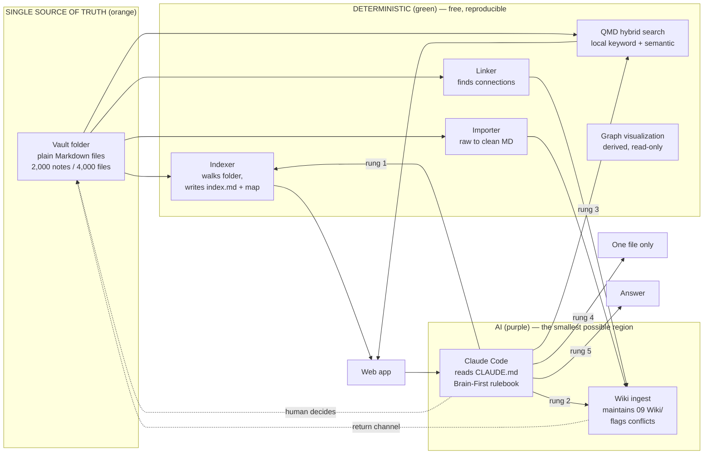
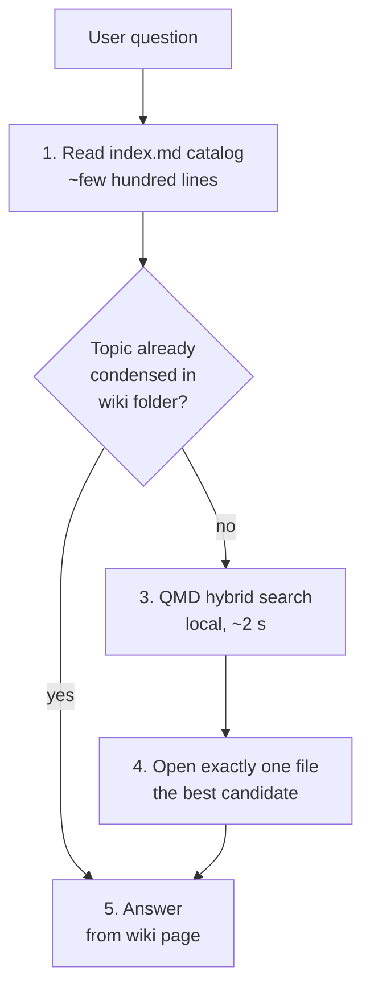
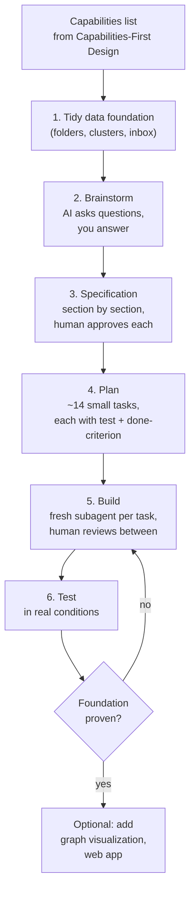
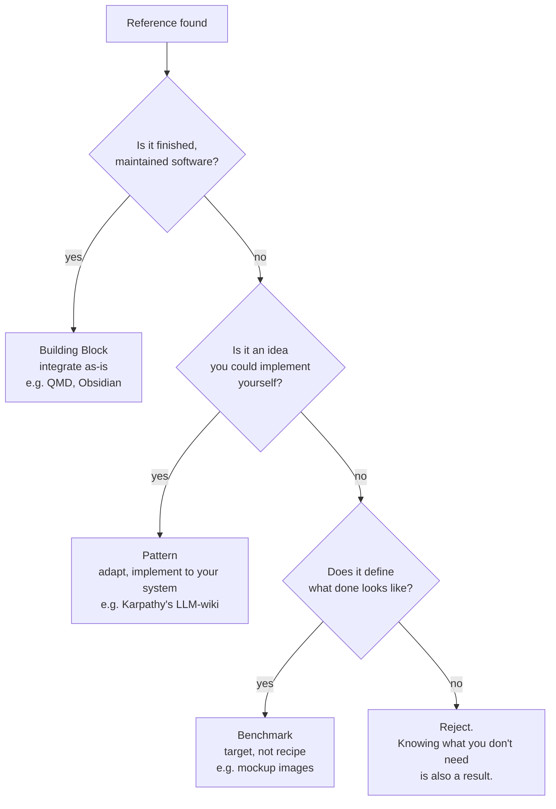
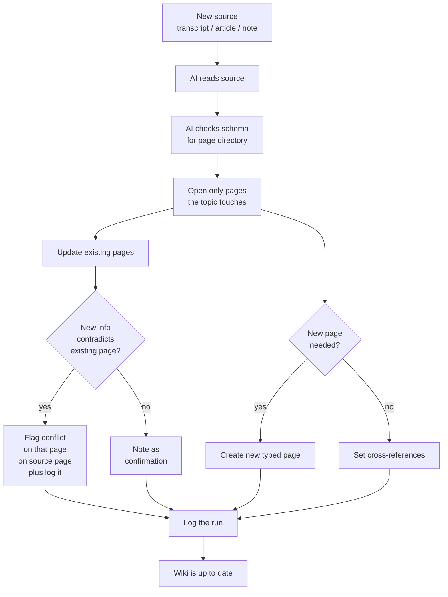
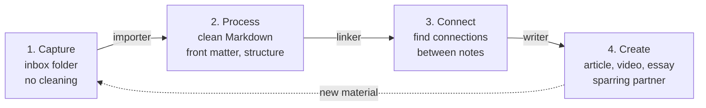

# Research Index: Building a Second Brain with AI

**Updated:** 2026-07-25
**Source:** The Node AI — *My Second Brain* (https://m.youtube.com/watch?v=mHSOsy_usAg), 45 min, German with auto-captions, fully translated to English in the linked Raw source.

---

## Overview

Comprehensive synthesis of The Node AI's (Patrick) full walkthrough of his private Second Brain system — a non-trivial, production-validated AI-assisted knowledge management architecture. The system runs on a Mac, contains ~2,000 notes and 4,000 files, costs ~$20/month (Claude Pro only; the rest is local and free), and has been in daily use long enough to have surfaced 52 latent conflicts in a single ingest run on the speaker's real vault.

This index is the entry point. It explains the architecture, the build process, the lessons, and the transferable rules. Use the linked concept and entity pages for deeper treatment of each subsystem.

## The four capabilities

Before any tool is chosen, the system must satisfy four concrete capabilities. Each one later found a home in a specific component of the architecture.

| # | Capability | Concrete test | Architectural home |
|---|------------|---------------|---------------------|
| 1 | **Find** | "What was our subtitle style again" returns the right note in seconds, without knowing the file name. | QMD hybrid search (local, keyword + semantic) |
| 2 | **Read** | Open and read the found note in the same system, no app switch. | Web app, side-by-side with the graph |
| 3 | **Stay clean** | System itself flags contradictions, duplicates, outdated states. Condenses knowledge rather than stacking it. | AI-curated wiki folder, ingest flow with conflict detection |
| 4 | **Overview** | See the whole system at a glance. | Graph visualization (derived, not central) |

The boundary condition "everything runs locally" sits on the same list. See [[Concepts/capabilities-first-system-design]] for the full discipline.

## The architecture

The colour coding is the architectural rule. The smallest possible region is purple. The AI is an upgrade, not a foundation. See [[Concepts/deterministic-first-architecture]] and [[Concepts/markdown-as-single-source-of-truth]].

## The Brain-First search ladder

The rulebook that Claude Code reads from `CLAUDE.md` at every startup. Five rungs; only rung 5 is purple.

Benchmark on 5 real workday questions: **50% fewer tokens, 40% less time, 5/5 correct in both runs**. The "most expensive question" (a single-line fix) cost >500K tokens without Brain; the same question cost ~1/3 with Brain. See [[Concepts/brain-first-search-ladder]] for the full pattern.

## The six-step build process

Four of six steps produce zero code. End-to-end the brainstorming-to-build-start took ~30 minutes. The discipline is shipped as a reusable Claude Code skill: [[Entities/superpowers]]. See [[Concepts/six-step-ai-build-process]].

## The three reference roles

For any AI-assisted project, ask three questions about each reference. The answer drives how the reference is used.

Discarding is a research result. The Node AI studied Gbrain and Graphify, took no code from either, but adopted their pattern of "Markdown as the single source of truth, graph is only a derived snapshot" because of them. See [[Concepts/three-reference-roles]].

## The AI-curated wiki

The implementation of capability 3 (Stay clean). The vault has a `09 Wiki/` folder. A hard rule: **the human does not touch it.** Not a single text in it is from the human. Claude Code maintains it under a schema file in the same folder.

**Production result:** the first ingest on the speaker's real vault flagged **52 conflict points** — real contradictions, outdated states, and cases where "should" and "is" were not separated cleanly. The AI finds the conflicts; the human decides. The system never overwrites anything. The human fixes the source, not the warning.

See [[Concepts/ai-curated-knowledge-wiki]] for the schema, page types, and human-decides rule.

## The visual-specification lesson

The most expensive mistake the speaker made: describing visual targets in words ("denser, 3D, more depth, less glow") and watching the AI guess wrong for many iterations. The fix:

1. Generate a mockup with an image-capable AI (ChatGPT's image engine in his case).
2. Hand the mockup to Claude Code as the reference.
3. Build one step, check in the browser, approve, next step.

The two-AI division of labour (ChatGPT produces the image, Claude Code implements it) is what makes the visual specification portable. The same discipline generalises: any "make it X" instruction should be replaced by "here is what X looks like". See [[Concepts/visual-specification-by-mockup]].

## The hybrid local search

QMD is a local hybrid (keyword + semantic) search engine. Two modes:

- **Fast variant** (web app search box): query understander + embedding + combined score, no fine ranker. ~2 seconds. Used when the human is driving.
- **Full hybrid** (Claude Code Brain-First rung 3): adds a fine ranker. Used when the LLM is driving the search.

Cost story: ~2 seconds of processor work per search, no API token consumption, no cloud round-trip, works offline. The same searches through a cloud semantic-search service would cost real money per query. The Karpathy framing: "RAG is nothing more than giving the graduate your documents before the exam." See [[Concepts/hybrid-local-search-pattern]].

## The four-phase workflow

A loop, not a pipeline. The AI is load-bearing only in phase 4. Phases 1-3 are mostly free. The user's finished work is also raw material for the next iteration. See [[Concepts/capture-process-connect-create-workflow]].

## Concepts

### Architecture & Storage
- [[Concepts/markdown-as-single-source-of-truth]] — plain-Markdown vault, every other view is derived and disposable
- [[Concepts/deterministic-first-architecture]] — orange/green/purple colour rule, AI is an upgrade not a foundation
- [[Concepts/capabilities-first-system-design]] — 3-5 concrete capabilities before any tool is chosen

### AI Process
- [[Concepts/six-step-ai-build-process]] — tidy data, brainstorm, spec, plan, build, test (Superpowers)
- [[Concepts/three-reference-roles]] — Building Block, Pattern, Benchmark
- [[Concepts/visual-specification-by-mockup]] — generate the image, hand it to the AI

### Retrieval & Search
- [[Concepts/brain-first-search-ladder]] — five-rung rulebook in CLAUDE.md
- [[Concepts/hybrid-local-search-pattern]] — QMD + RAG, fully local

### Knowledge Curation
- [[Concepts/ai-curated-knowledge-wiki]] — schema-driven ingest, 52 conflicts flagged
- [[Concepts/capture-process-connect-create-workflow]] — four-phase loop, the operating model

## Tools & Projects

### Channels & Sources
- [[Entities/thenodeai]] — German YouTube channel; speaker and source of the video
- [[Entities/andrej-karpathy]] — source of the LLM-wiki Pattern and the RAG framing

### Software
- [[Entities/obsidian]] — the user-facing editor/viewer of the vault
- [[Entities/qmd]] — local hybrid search engine (Building Block)
- [[Entities/claude-code]] — the AI agent that reads the Brain-First rulebook
- [[Entities/superpowers]] — the Claude Code skill that operationalises the six-step process

## Raw Sources
- [[Raw/thenodeai-second-brain-architecture-2026-07-25]] — full English translation of the 45-minute video

## Key Source

| Source | Topic | Date | Key Items |
|--------|-------|------|-----------|
| [The Node AI: My Second Brain](https://m.youtube.com/watch?v=mHSOsy_usAg) | End-to-end Second Brain build | 2026-07 | 4 capabilities, 6-step process, 3 reference roles, Brain-First ladder, 52 conflicts, 50/40/5-of-5 benchmark |

## Cross-Cutting Themes

### 1. The "AI is an upgrade, not a foundation" rule
1. **Test for portability** — "when the next person opens your system and doesn't have an API key, the system should still work". This is a falsifiable test, not a slogan.
2. **Colour-coded budget** — the amount of purple in the architecture is the budget. Minimize it.
3. **Even the AI layer is mostly deterministic** — chunking, embedding, linking, the importer, the search engine are all green. The AI is the small slice that needs understanding.

### 2. The "decide before you build" rule
1. **Capabilities list before tools** — 3-5 concrete capabilities, each testable. Every later choice is checked against the list.
2. **Specification as contract** — the spec is the single source of truth for what "done" means. Disputes resolve against the spec, not against memory.
3. **Task with test and done-criterion** — not "build the search", but "the search returns this file for this example question". Until then, the task is not done.

### 3. The "human decides, AI delivers" rule
1. **AI finds conflicts; human resolves them** — the wiki ingest never overwrites, never decides. Both statements stand; the human fixes the source.
2. **Fresh subagent per task** — keeps the context small, makes each step auditable.
3. **One step, one check, one approval** — applies to building, to the visual-spec loop, and to the ingest cycle.

### 4. The "disposable views, durable truth" rule
1. **Vault is the truth** — plain Markdown, openable with `cat` in 10 years.
2. **Indexer, search, graph, web app, wiki ingest are all views** — any of them can be thrown away and rebuilt.
3. **Survives every tool, every app, every company** — the data outlives the vendor.

## Seven Lessons (verbatim from the speaker)

1. **References always beat descriptions** — both in the technology and in the look.
2. **Small steps with approval, never everything at once** — that's what built the foundation and saved the look.
3. **Decide before you build** — the specification is the contract. Whoever builds first and decides later builds twice.
4. **Deterministic where possible** — use AI only where real understanding is actually needed. The indexer costs nothing and runs in seconds.
5. **Markdown remains the only truth** — no database, no format prison. Everything else is just a view.
6. **Every claim needs a checkpoint** — without the benchmark, the speaker would only believe the system works, not know it.
7. **The human decides, the AI delivers** — the AI did not make a single decision in the entire project. It only made them possible.

## Your entry point (4 steps, ~1 hour, no code)

1. Sort your notes into topic clusters. Use Claude Code to suggest the clusters; you decide what goes where.
2. Create an index file — a catalog, one line per topic, what it is, where it is. Claude Code types it for you.
3. Install and initialize QMD. A few terminal commands give you a local hybrid search.
4. Write the Brain-First rules into your `CLAUDE.md`. First catalog, then the search, then exactly one file.

That's the foundation. The graph, the app, the wiki — those come after the foundation has proven itself.

**The one sentence under the board: "The AI writes the code. You curate the references and you decide, and you approve every step."**

## Next Research Directions

- [ ] Evaluate whether the Brain-First ladder is portable to non-Claude-Code agents (e.g. Codex, Aider) — transfer the rulebook into their equivalent of CLAUDE.md and benchmark token / time / correctness on the same 5 questions
- [ ] Prototype the [[Concepts/ai-curated-knowledge-wiki]] ingest flow against a small test vault (50 notes, 5 known contradictions) and measure ingest time, conflict detection recall, and human-decision turnaround
- [ ] Benchmark QMD vs. a cloud semantic-search API (Pinecone, Weaviate) on the same 5-question workload to validate the "100 free searches per day" claim
- [ ] Compare the [[Concepts/six-step-ai-build-process]] (Superpowers) against a no-skill Claude Code build of the same system, to isolate the skill's contribution to the result
- [ ] Build a small [[Concepts/visual-specification-by-mockup]] reference set (5 mockups → 5 implementations) and measure the iteration-count reduction vs. text-only specifications
